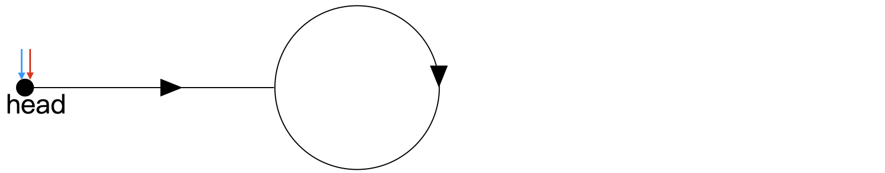
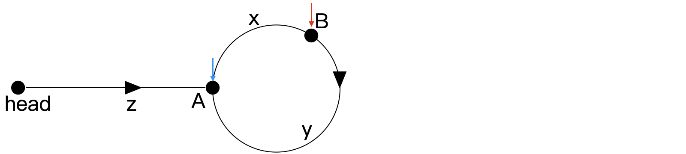
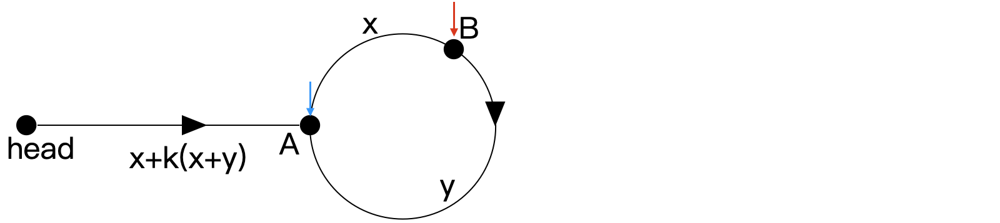
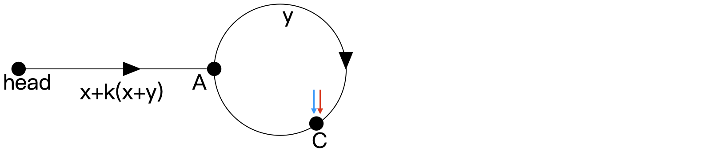
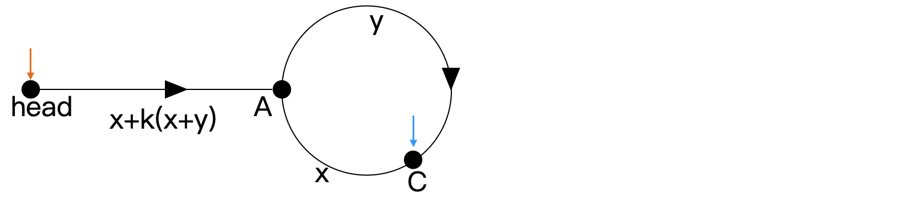

# 环形链表

```java
给定一个链表的头节点  head ，返回链表开始入环的第一个节点。 如果链表无环，则返回 null。

如果链表中有某个节点，可以通过连续跟踪 next 指针再次到达，则链表中存在环。 为了表示给定链表中的环，评测系统内部使用整数 pos 来表示链表尾连接到链表中的位置（索引从 0 开始）。如果 pos 是 -1，则在该链表中没有环。注意：pos 不作为参数进行传递，仅仅是为了标识链表的实际情况。

不允许修改 链表。

 

示例 1：


输入：head = [3,2,0,-4], pos = 1
输出：返回索引为 1 的链表节点
解释：链表中有一个环，其尾部连接到第二个节点。
示例 2：


输入：head = [1,2], pos = 0
输出：返回索引为 0 的链表节点
解释：链表中有一个环，其尾部连接到第一个节点。
示例 3：


输入：head = [1], pos = -1
输出：返回 null
解释：链表中没有环。
 

提示：

链表中节点的数目范围在范围 [0, 104] 内
-105 <= Node.val <= 105
pos 的值为 -1 或者链表中的一个有效索引
 

进阶：你是否可以使用 O(1) 空间解决此题？
```

```java
// 思路一：哈希
// 思路二：快慢指针（能想到的都是神人）
public class Solution {
    public ListNode detectCycle(ListNode head) {
        ListNode slow = head;
        ListNode fast = head;

        // 此处如果用 while (fast != slow)，则在一开始时就违背了条件
        // 也可用 do while, 但以下代码更符合 repeat until (重复直到) 的思考习惯
        while (true) {
            // 指向空节点，说明无环。
            if (fast == null || fast.next == null)
                return null;

            // fast 和 slow 异速前进
            fast = fast.next.next;
            slow = slow.next;

            if (fast == slow) break; // fast 和 slow 相遇
        }

        // ptr 和 slow 同速前进，直至相遇在入口
        ListNode ptr = head;
        while (ptr != slow) {
            ptr = ptr.next;
            slow = slow.next;
        }

        return ptr; // 返回入口节点
    }
}
```

## 思路二解释

- 重画链表如下所示，线上有若干个节点。记蓝色慢指针为 slow，红色快指针为 fast。初始时 slow 和 fast 均在头节点处。
  

- 使 slow 和 fast 同时前进，fast 的速度是 slow 的两倍。当 slow 抵达环的入口处时，fast 一定在环上，如下所示。
  

- 其中：
  - head 和 A 的距离为 z
  - 弧 AB (沿箭头方向) 的长度为 x
  - 同理，弧 BA 的长度为 y
- 可得：
  - slow 走过的步数为 z
  - 设 fast 已经走过了 k 个环，k≥0，对应的步数为 z+k(x+y)+x

- 以上两个步数中，后者为前者的两倍，即 2z=z+k(x+y)+x
- 化简可得 z=x+k(x+y)，替换如下所示。
  

- 此时因为 fast 比 slow 快 1 个单位的速度，且y 为整数，所以再经过 y 个单位的时间即可追上 slow。

- 即 slow 再走 y 步，fast 再走 2y 步。设相遇在 C 点，位置如下所示，可得弧 AC 长度为 y。
  

- 因为此前 x+y 为环长，所以弧 CA 的长度为 x。
- 此时我们另用一橙色指针 ptr (pointer) 指向 head，如下所示。并使 ptr 和 slow 保持 1 个单位的速度前进，在经过 z=x+k(x+y) 步后，可在 A 处相遇。
  

- 再考虑链表无环的情况，fast 在追到 slow 之前就会指向空节点，退出循环即可。

