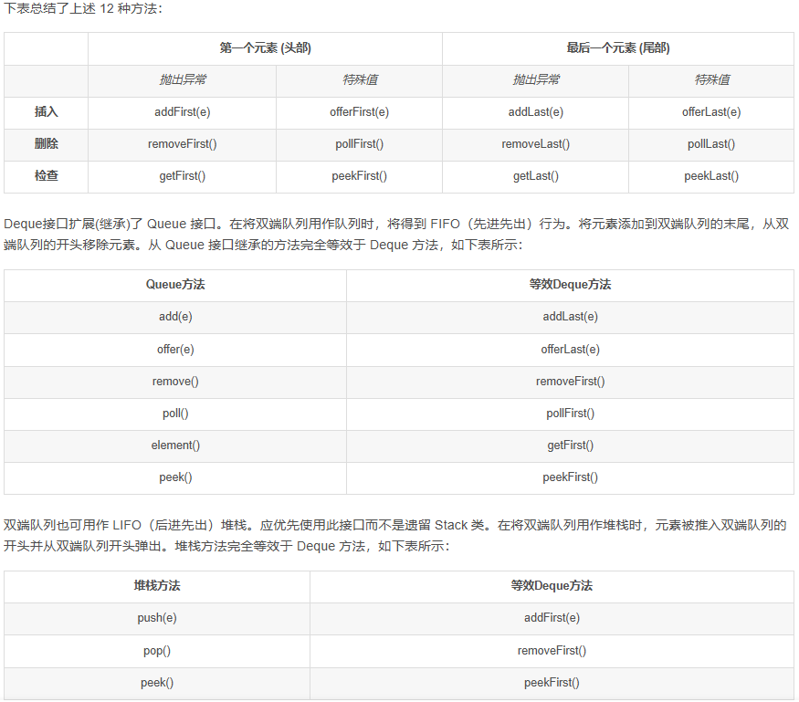

# 滑动窗口最大值

```java
给你一个整数数组 nums，有一个大小为 k 的滑动窗口从数组的最左侧移动到数组的最右侧。你只可以看到在滑动窗口内的 k 个数字。滑动窗口每次只向右移动一位。

返回 滑动窗口中的最大值 。

 

示例 1：

输入：nums = [1,3,-1,-3,5,3,6,7], k = 3
输出：[3,3,5,5,6,7]
解释：
滑动窗口的位置                最大值
---------------               -----
[1  3  -1] -3  5  3  6  7       3
 1 [3  -1  -3] 5  3  6  7       3
 1  3 [-1  -3  5] 3  6  7       5
 1  3  -1 [-3  5  3] 6  7       5
 1  3  -1  -3 [5  3  6] 7       6
 1  3  -1  -3  5 [3  6  7]      7
示例 2：

输入：nums = [1], k = 1
输出：[1]
 

提示：

1 <= nums.length <= 105
-104 <= nums[i] <= 104
1 <= k <= nums.length
```

## 队列

- 普通队列：一端进一端出
  
- 双端队列：两端都可进出
- 堆栈

```java
// 普通队列(一端进另一端出):
Queue queue = new LinkedList()或
Deque deque = new LinkedList()
// 双端队列(两端都可进出)
Deque deque = new LinkedList()
// 堆栈
Deque deque = new LinkedList()

// deque 相当于一个多功能接口
```

  

```java
// 思路：单调队列
class Solution {
    public int[] maxSlidingWindow(int[] nums, int k) {
        int[] ans = new int[nums.length - k + 1];
        int p = 0;
        if (k == 1) return nums;
        Deque <Integer> deque = new LinkedList <> ();
        for (int i = 0; i < k - 1; i++) {
            while (!deque.isEmpty() && nums[deque.peekLast()] < nums[i]) {
                deque.removeLast();
            }
            deque.addLast(i);
        }
        for (int i = k - 1; i < nums.length; i++) {
            
            while (!deque.isEmpty() && nums[deque.peekLast()] < nums[i]) { 
                deque.removeLast();
            }  
            deque.addLast(i);
            while (deque.peekFirst() <= i - k) {
                deque.removeFirst();
            }
            ans[p++] = nums[deque.peekFirst()];
        }

        return ans;
    }
}
```

- 当滑动窗口向右移动时，我们需要把一个新的元素放入队列中。为了保持队列的性质，我们会不断地将新的元素与队尾的元素相比较，如果前者大于等于后者，那么队尾的元素就可以被永久地移除，我们将其弹出队列。我们需要不断地进行此项操作，直到队列为空或者新的元素小于队尾的元素。

- 由于队列中下标对应的元素是严格单调递减的，因此此时队首下标对应的元素就是滑动窗口中的最大值。但与方法一中相同的是，此时的最大值可能在滑动窗口左边界的左侧，并且随着窗口向右移动，它永远不可能出现在滑动窗口中了。因此我们还需要不断从队首弹出元素，直到队首元素在窗口中为止。
  