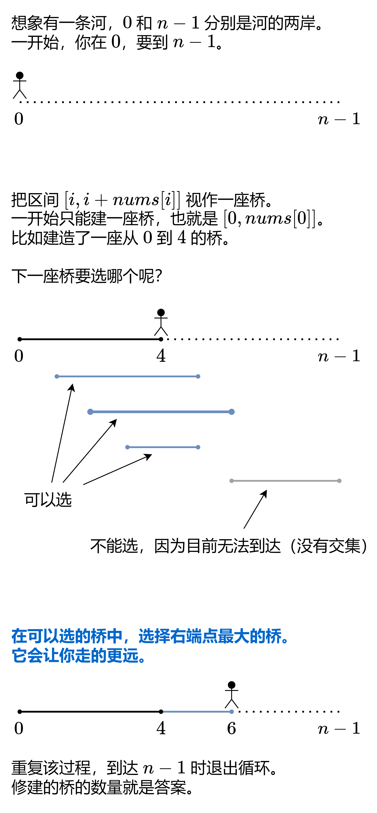

# 跳跃游戏Ⅱ

```java
给定一个长度为 n 的 0 索引整数数组 nums。初始位置为 nums[0]。

每个元素 nums[i] 表示从索引 i 向前跳转的最大长度。换句话说，如果你在 nums[i] 处，你可以跳转到任意 nums[i + j] 处:

0 <= j <= nums[i] 
i + j < n
返回到达 nums[n - 1] 的最小跳跃次数。生成的测试用例可以到达 nums[n - 1]。

 

示例 1:

输入: nums = [2,3,1,1,4]
输出: 2
解释: 跳到最后一个位置的最小跳跃数是 2。
     从下标为 0 跳到下标为 1 的位置，跳 1 步，然后跳 3 步到达数组的最后一个位置。
示例 2:

输入: nums = [2,3,0,1,4]
输出: 2
 

提示:

1 <= nums.length <= 104
0 <= nums[i] <= 1000
题目保证可以到达 nums[n-1]
```

  

```java
// 思路：造桥，永远选择右端点最大的桥
class Solution {
    public int jump(int[] nums) {
        int ans = 0;
        int curRight = 0; // 已建造的桥的右端点
        int nextRight = 0; // 下一座桥的右端点的最大值
        for (int i = 0; i < nums.length - 1; i++) {
            // 遍历的过程中，记录下一座桥的最远点
            nextRight = Math.max(nextRight, i + nums[i]);
            if (i == curRight) { // 无路可走，必须建桥
                curRight = nextRight; // 建桥后，最远可以到达 next_right
                ans++;
            }
        }
        return ans;
    }
}

// 只需要遍历到n-2就可以，不要去考虑n-1
// 因为遍历n-2的时候已经在计算n-2+nums[n-2]了，即此时已经在讨论下一座桥的最远点，即到达终点的桥
```
