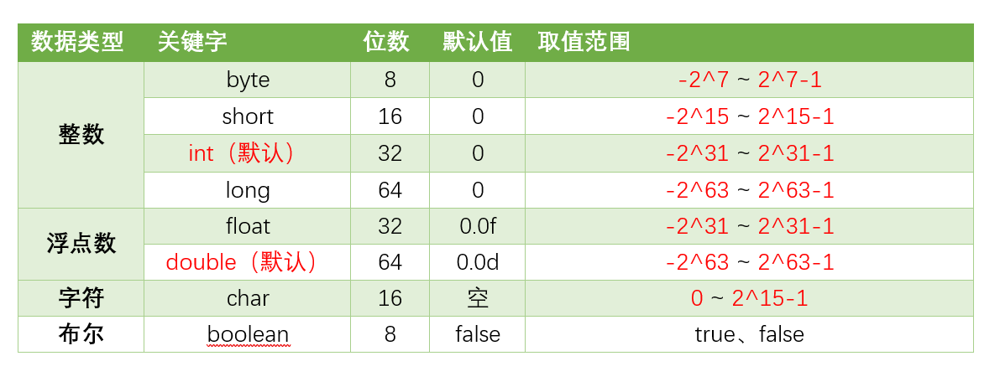

# 数据类型

- Java的数据类型只有两大类：8大基本数据类型与引用数据类型。其中基本数据类型又被称为值类型
  - 基本数据类型：6种数字类型（byte/short/int/long/float/double）、1种字符型（char）、1种布尔型（boolean）
  - 引用数据类型：类（Class）、接口（Interface）、数组（Array）
  - 除了以上的基本数据类型和引用数据类型，还有一些其他相关的数据类型，例如字符串类型String、枚举类型Enum，它们都是基于引用数据类型来实现的

## 八种基本数据类型

  

## 数据类型的转换方式有哪些

- 自动类型转换（隐式转换）：目标类型范围大于源类型
- 强制类型转换（显式转换）：目标类型范围小于源类型（可能会导致数据丢失或溢出）
- 字符串转换：将字符串类型转换为其他类型，如`Integer.ParseInt()`，`Integer.ParseDouble()`
- 数值之间的转换：数值类型之间互转，通过类型的包装类实现

## 类型转换会出现什么问题吗

- 数据丢失
- 数据溢出
- 精度损失
- 类型不匹配

## 为什么用 bigDemical 不用 double

- double 执行的是二进制浮点运算，存在丢失精度的问题

## 装箱与拆箱是什么

- 装箱（Boxing）和拆箱（Unboxing）是将基本数据类型和对应的包装类之间进行转换的过程。

### 自动装箱的弊端

- 循环操作时会创建多余的对象，影响性能

## Java 为什么要有 Integer

- 将 int 类型包装成 Object 对象，将数据和处理这些数据的方法结合在一起
- Java 中绝大部分方法都用来处理类类型对象，如 ArrayList 只能存储类，int 存不进 list
  
- Integer 可以用于泛型、基本类型与引用类型（String）的转换、集合中的应用

## Integer 相比 int 有什么优点

- int 是数据类型，不需要实例化就可以直接用，而 Integer 是引用类型，需要实例化，需要**为对象分配内存**，**在性能方面，基本数据类型的操作通常比相应的引用类型快**
- 存在自动装箱和拆箱
- 空指针异常：Integer 必须通过实例化对象来赋值，若直接对未初始化的 Integer 变量进行操作会出现空指针异常，**因为它默认被赋予 null 值，而 null 值无法自动装箱**

## 那为什么还要保留 int 类型

- 包装类是引用类型，**对象的引用和对象本身是分开存储的**，而对于基本类型数据，变量对应的内存块直接存储数据本身，所以基本类型数据的读写效率会更加高效

`基本类型的变量名与值都存放在方法栈当中`
`引用类型所声明的变量放在方法栈，对象本身放在堆内存中`

- 64位 JVM 上，一个 Integer 对象占16字节内存，一个 int 类型占4字节内存

- int 的存储效率和读写效率都更加高效

## 说一下 Integer 的缓存

- Integer 的静态缓存池，当通过 `Integer,valueOf(int)` 创建整数对象时（-128 ~ 127），会直接复用缓存池中的现有对象

### int

- 两个Int类型变量用“==”比较的是值的大小

### Integer

- 将Int值赋给Integer变量，系统会自动将这个Int值封装成一个Integer对象。比如：`Integer a = 100`；实际上的操作是：`Integer a = Integer.valueOf(100)`

### Integer.valueOf()

- 这里Integer.valueOf()，当Int值的范围在-128-127之间时，会通过一个IntegerCache缓存来创建Integer对象；当Int值不在该范围时，直接调用new Integer()来创建对象

```java
    public static Integer valueOf(int i) {
        return i >= -128 && i <= Integer.IntegerCache.high ? Integer.IntegerCache.cache[i + 128] : new Integer(i);
    }
```

- Integer a = 100; Integer b = 100; a==b结果为true，因为这两个Integer变量引用的是**缓存中的同一个Integer对象** ；
- Integer c = 200; Integer d = 200; a==b结果为false，因为a和b是**通过new Integer() 创建的两个不同对象**。

```java
public class Main {
    public static void main(String[] args) {
        Integer a = 100;
        Integer b = 100;
        Integer c = 200;
        Integer d = 200;
        System.out.println(a == b);//true
        System.out.println(c == d);//false
    }
}

```

### new Integer()

- new Integer()每次都会创建新的对象，==比较的是两个对象的内存地址

```java
public class Main {
    public static void main(String[] args) {
        Integer a = new Integer(100);
        Integer b = new Integer(100);
        System.out.println(a == b);//false
    }
}
```

- 与int比较：不管是new创建的Integer对象，还是通过直接赋值Int值创建的Integer对象，它们与Int类型变量通过“==”进行比较时都会**自动拆箱变成Int类型，所以Integer对象和Int变量比较的是内容大小**。

```java
public class Main {
    public static void main(String[] args) {
        Integer a = 49;
        int b = 49;
        Integer c = Integer.valueOf(49);
        Integer d = new Integer(49);
        System.out.println(a == b);//true
        System.out.println(a == c);//true
        System.out.println(b == c);//true
        System.out.println(c == d);//false
    }
}
```