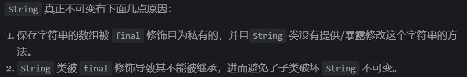
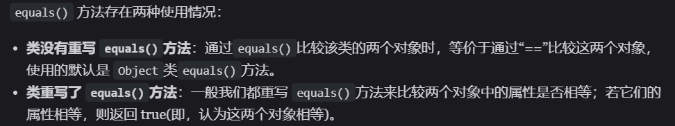
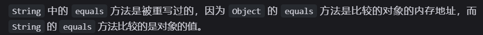
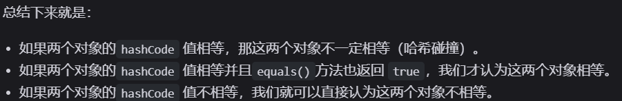
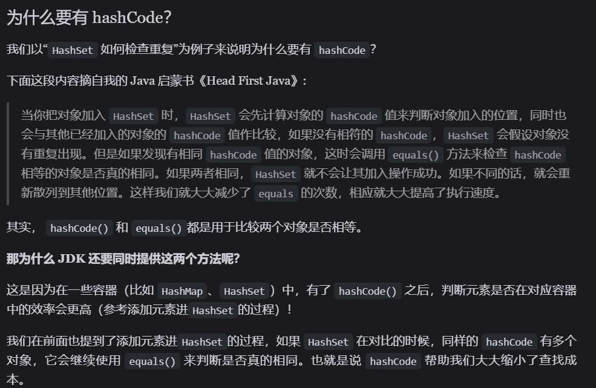
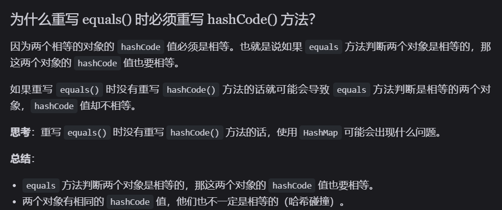
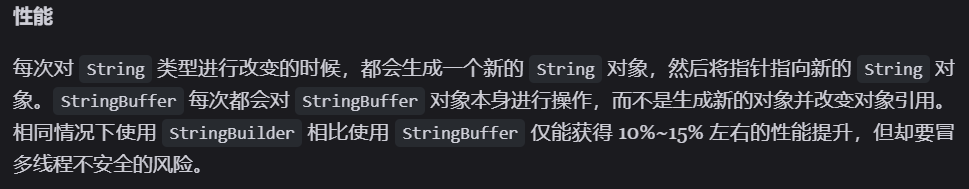

# 面试题

## String 为什么不可变

- 首先，不是因为`String`被`final`修饰了就不可变了，因为我们知道被 final 关键字修饰的**类**不能被**继承**，修饰的**方法**不能被**重写**，修饰的变量是**基本数据类型**则值不能改变，修饰的变量是**引用类型**则不能再指向其他对象

```java
public final class String implements java.io.Serializable, Comparable<String>, CharSequence {
    private final char value[];
  //...
}
```

- 此处修饰的是引用类型，说明`value`不能指向其他对象，但`value`内部的值是可以改变的

  

## equals 和 hashcode 方法实现原理

### equals

  

  

### hashcode : 获取哈希码

  

### equals & hashcode

  


  

## String StringBuilder StringBuffer 的区别

||String|StringBuilder|StringBuffer|
|--|--|--|--|
|可变性|不可变|可变|可变|
|线程安全性|安全（对象不可变，理解为常量）|不安全|安全（加锁）|
|适用场景|操作少量数据|单线程操作字符串缓冲区下大量数据|多线程操作字符串缓冲区下大量数据|

  
