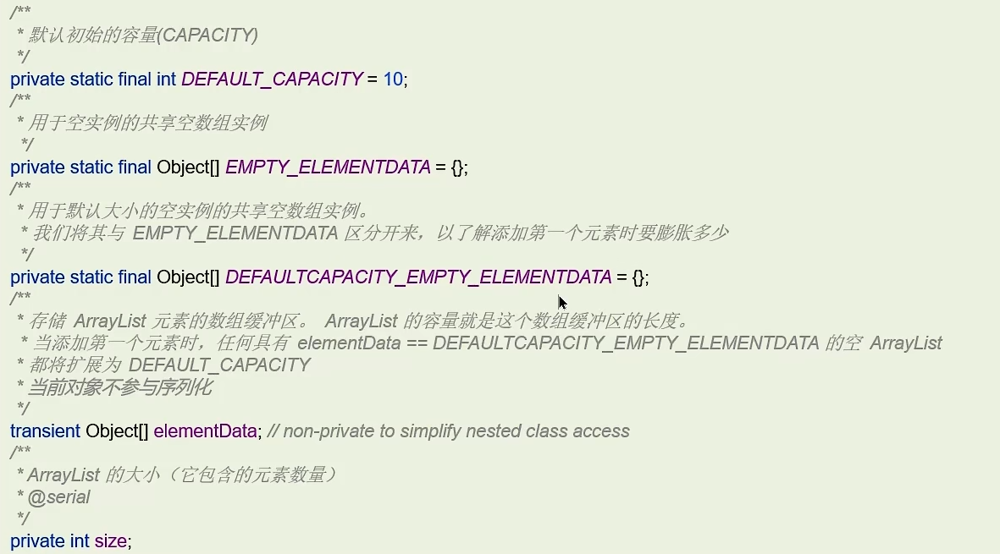
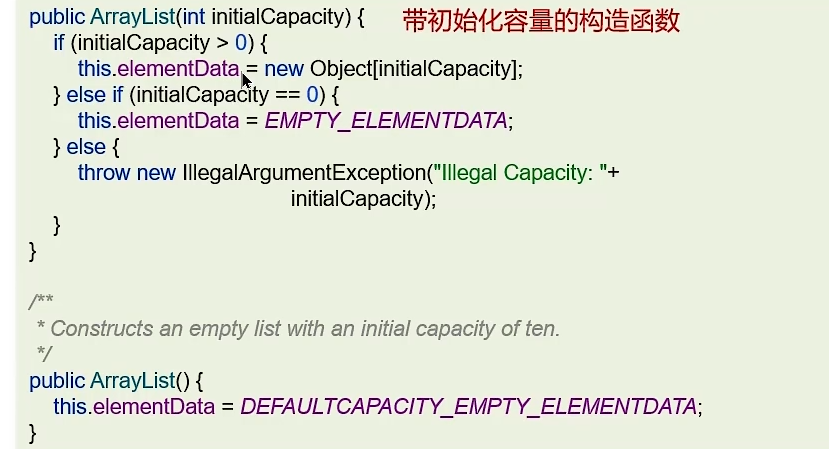
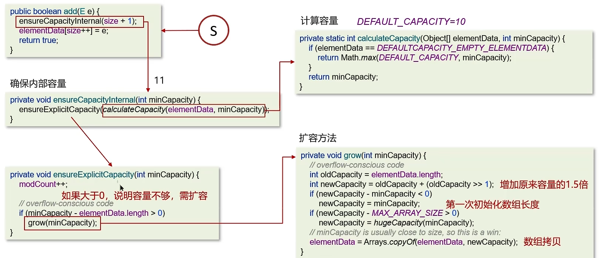
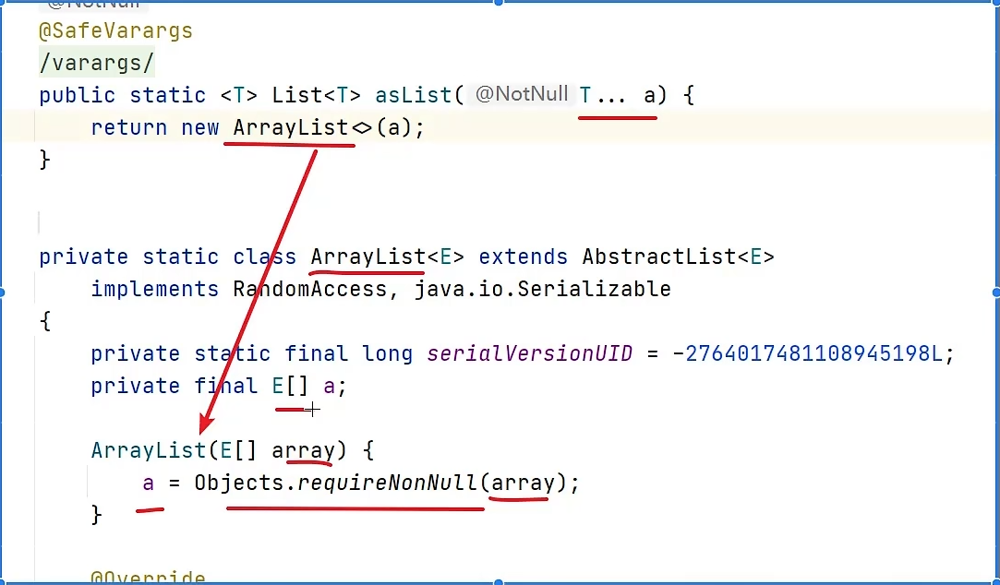
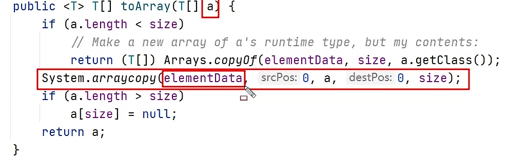
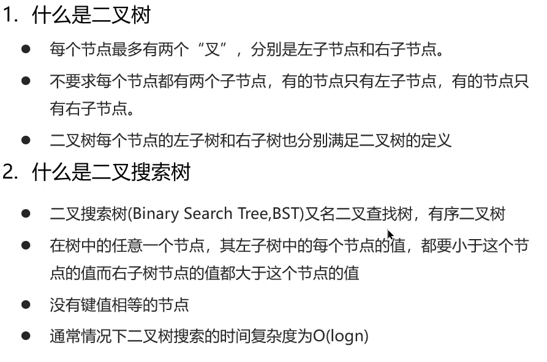
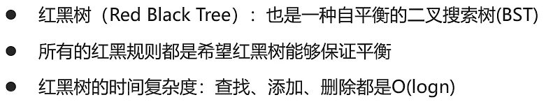
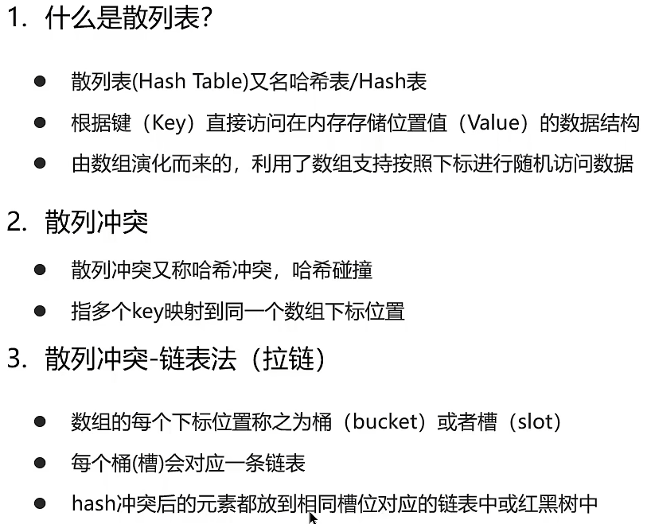

# ArrayList源码

## 成员变量

  

## 构造方法

  

## 添加与扩容

  

- 第1次添加数据：扩容
- 第2~10次添加数据：不扩容
- 第11次添加数据：扩容

## 数组转list：Arrays.asList

  

## list转数组：list.toArray

  

## 二叉树

  

## 红黑树

 

## 散列表

  

