# 面试题

## 数组相关

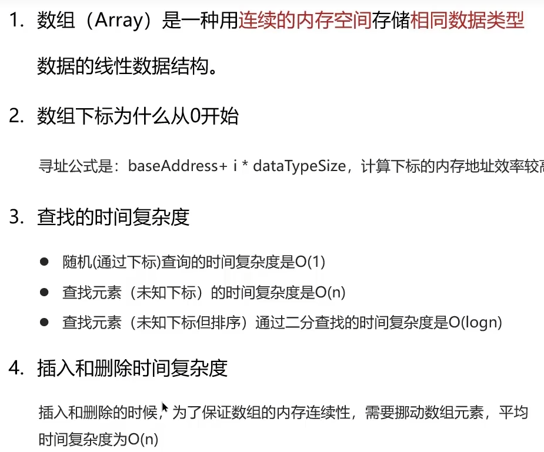  

- 数组下标从1开始的话，寻址公式中的 i 变为 i - 1 多了一次减法计算，效率低

## ArrayList 的底层实现原理

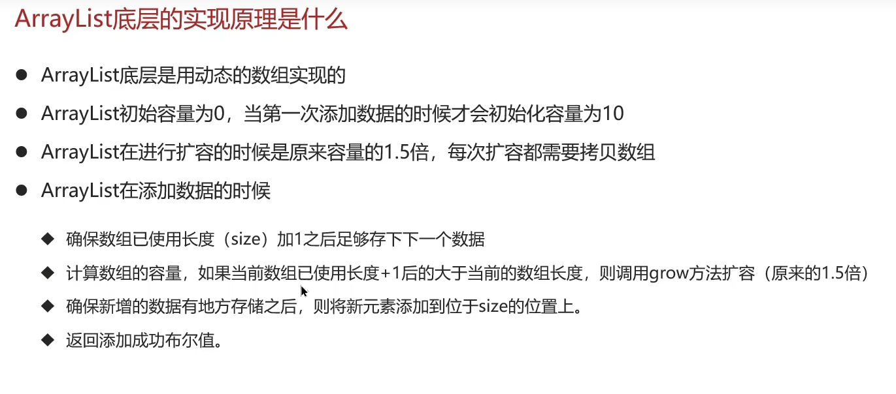  

## ArrayList list = new ArrayList(10) 中的list扩容几次

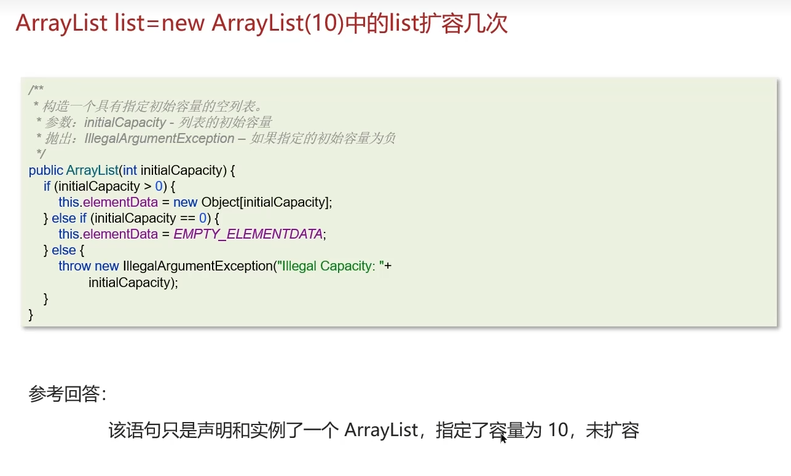  

## 如何实现数组和List之间的交换

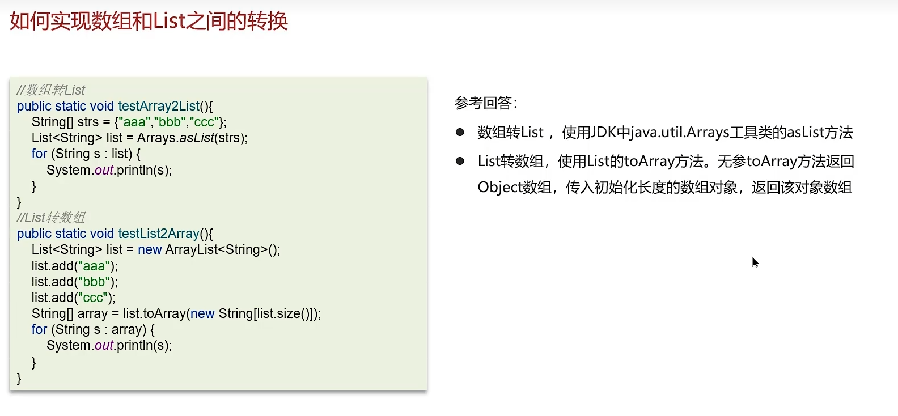  

### 修改原内容，转换后的内容是否受影响？

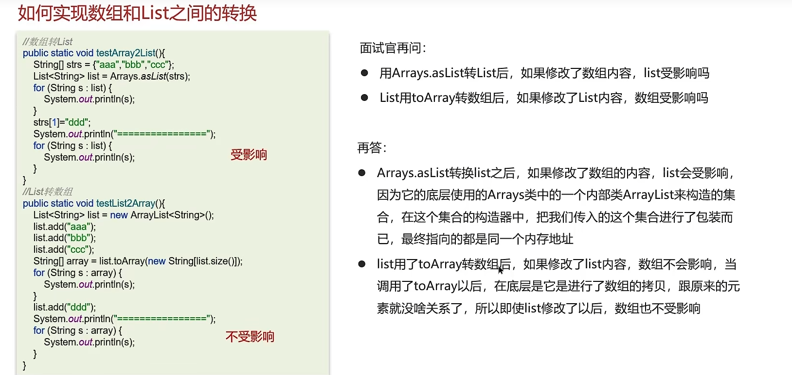  

## 单向链表双向链表的区别？操作数据的时间复杂度？

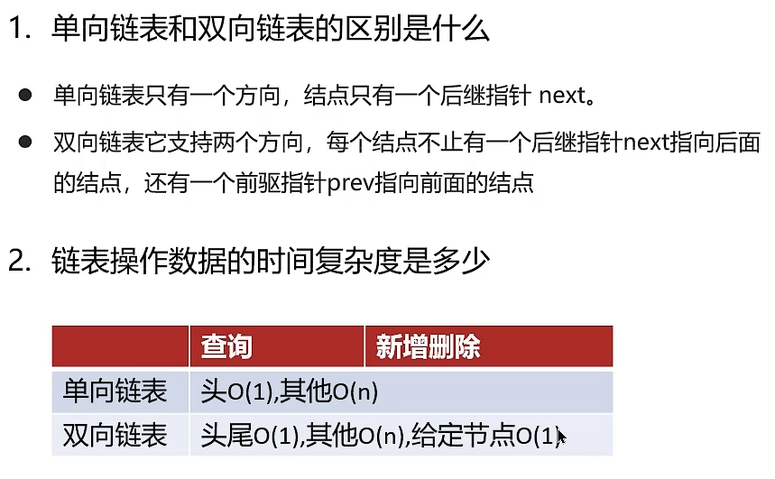  

## ArrayList 和 LinkedList 的区别是什么

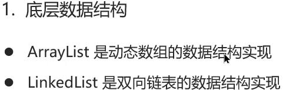  

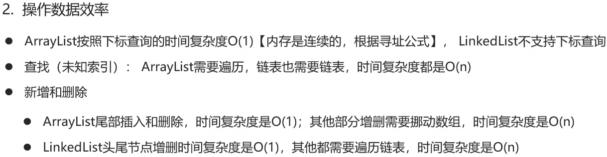  

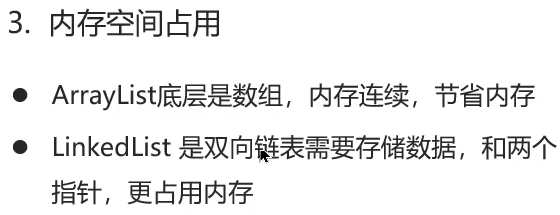  

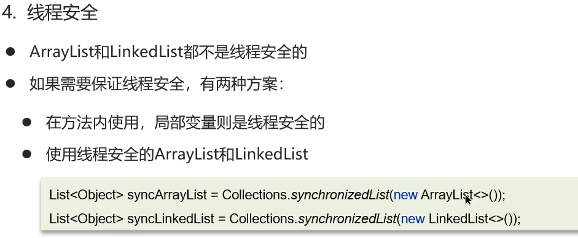  

## HashMap 的实现原理

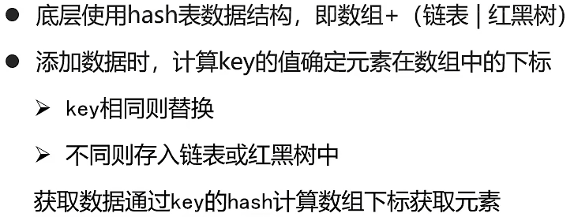  

## HashMap 的jdk1.7和jdk1.8的区别

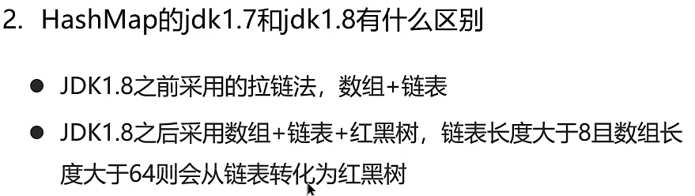  

## HashMap 的put方法的具体流程

  

## HashMap 的扩容机制

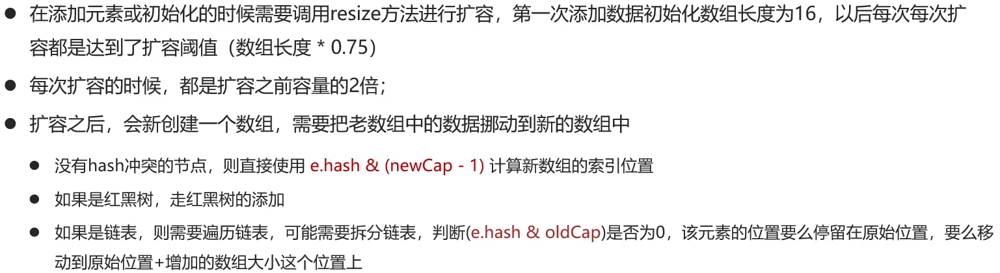  

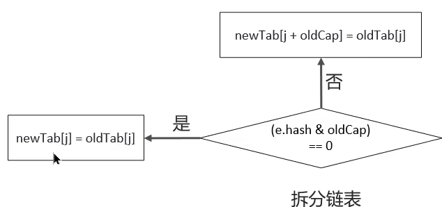  

## HashMap 寻址算法

  

## 为什么 HashMap 的数组长度一定是 2 的 n 次幂

  
