# 面试题

## 什么是 AQS

  

- AQS是多线程同步器，它是JUC包中的多个组件的底层实现。比如说像lock、CountDownlatch、Semaphore。都是用到了AQS。
- 从本质上来说AQS提供了两种锁的机制，分别是排他锁和共享锁。所谓排他锁，就是存在多个线程去竞争同一共享资源的时候。同一个时刻只允许一个线程去访问这样一共享资源。也就是说多个线程中只能有一个线程去获得这样一个锁的资源。比如lock中的ReentrantLock 可重入锁，他的一个实现就是用到了中AQS的一个排他锁的功能。共享锁，也称为读锁。就是在同一个时刻允许多个线程同时获得这样一个锁的资源。比如CountDownlatch以及Semaphore都用到了AQS中的共享锁的功能。
- 那么AQS作为互斥锁来说它的整个设计体系中需要解决三个核心的问题。第一个互斥变量的设计以及如何保证多线程同时更新互斥变量的时候，线程的安全性。第二个未竞争到锁资源的线程的等待。以及竞争到锁的资源释放的锁之后的一个唤醒。第三个锁，竞争的公平性和非公平性。AQS采用了一个int类型的互斥变量。State，用来记录锁竞争的一个状态。0表示当前没有任何线程竞争到锁资源。而大于等于1表示已经有线程正在持有锁资源。一个线程来获得锁资源的时候首先会判断state是否等于零。也就是说它是无锁状态。如果是，则把这个state更新成1表示占用到锁。而这个过程中，如果多个线程同时去做这样一个操作。就会导致线程安全性问题。
- 因此AQS采用了CAS机制去保证state复制变量更新的一个原子性。为获得到锁的线程通过unsafe类中的park方法去进行阻塞。把阻塞的线程按照先进先出的原则？去加入到一个双向链表的一个结构中。当获得锁资源的线程在释放锁之后会从这样一个双向链表的头部去唤醒下一个等待的线程，再去竞争锁。
- 最后，关于锁竞争的公平性和非公平性的问题，AQS的处理方法是在竞争锁资源的时候。公平锁需要去判断双向链表中是否有阻塞的线程。如果有，则需要去排队等待，而非公平锁。锁的处理方式是不管双向列表中是否存在 等待竞争锁的线程，那么他都会直接去尝试更改互斥变量state去竞争锁,假设在一个临界点获得锁的线程释放锁。此时state等于零，而当前的这个线程抢占锁的时候。正好可以把state修改成1，那么这个时候就表示他可以拿到锁。而这个过程是非公平的

## 有哪些类是基于 AQS 实现的

- `ReentrantLock`
- 并发工具类

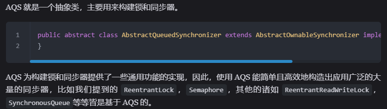  

## AQS 解决什么问题

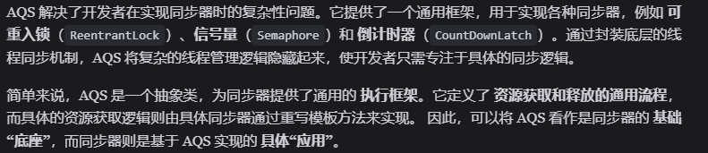  

- 提供通用框架，用于实现各种同步器
- 定义了资源获取和释放的通用流程

## AQS 同步队列的基本结构

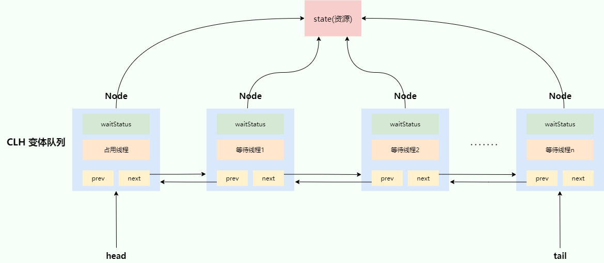  

### AQS 自身

#### state

```java
// 共享变量，使用volatile修饰保证线程可见性
private volatile int state;
```

- AQS 使用 int 成员变量 `state` 表示同步状态
- `state` 变量由 `volatile` 修饰，用于展示当前临界资源的获取情况
- 这个值是和 `monitor` 中的计数器有点像，支持可重入

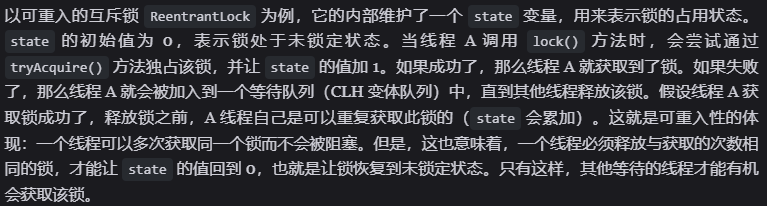  

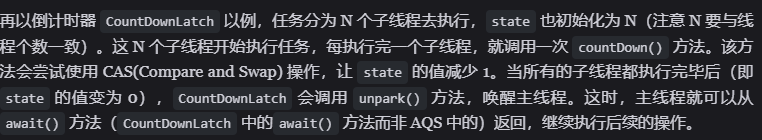  

#### AQS 的 CLH 队列

- AQS 中的 CLH 队列是 CLH 锁队列的变体
- 通过内置的 **FIFO 线程等待/等待队列** 来完成获取资源线程的排队工作。

##### 原版 CLH 锁队列

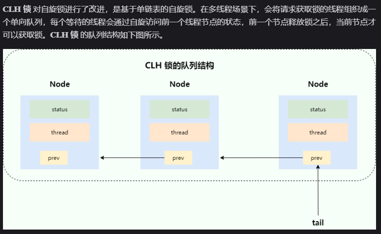  

##### AQS 中的队列

- 变成了双向队列
- 不需要一直自旋，自旋获取锁失败了就阻塞
- 因为是双向队列，所以前驱节点对应的线程释放锁之后，可以主动唤醒后面的线程

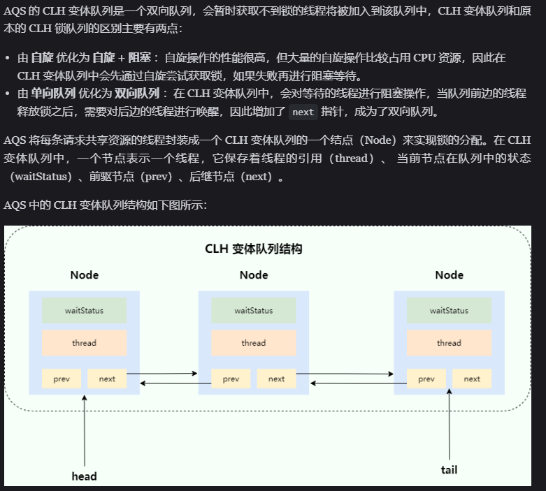  

### 内部类 Node

#### 内部结构

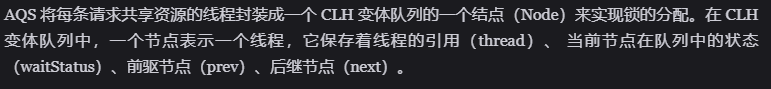  

#### waitStatus，用 volatile 修饰

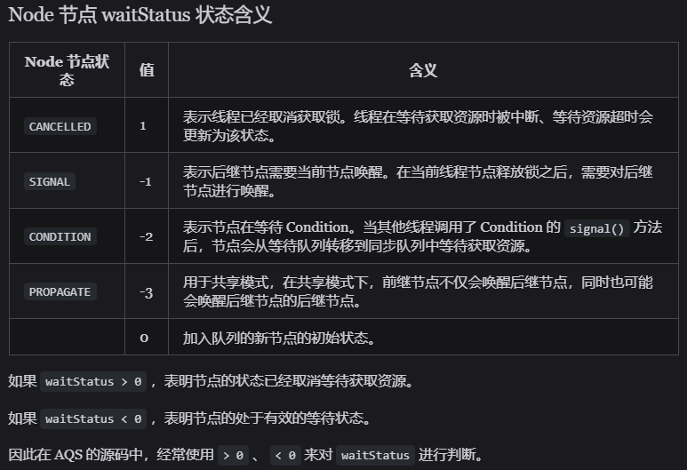  

- 何为等待队列何为同步队列？<https://blog.csdn.net/zx48822821/article/details/86768484>

## ReentrantLock 底层如何基于 AQS 实现

- Lock接口的实现类，基本都是通过聚合了一个队列同步器的子类完成线程访问控制的

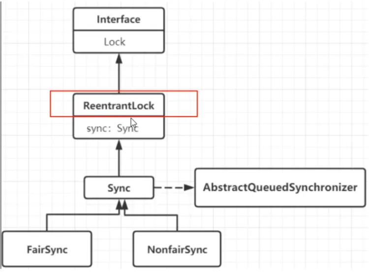  

### 创建锁

- 默认为非公平锁（效率高）

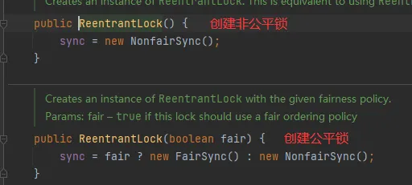  

### 加锁 & 解锁

- 见 ReentrantLock.md

## AQS 是如何保证线程安全的

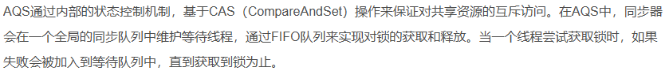  

## 为什么要设置前一个节点 waitStatus 为 -1 而不是当前节点

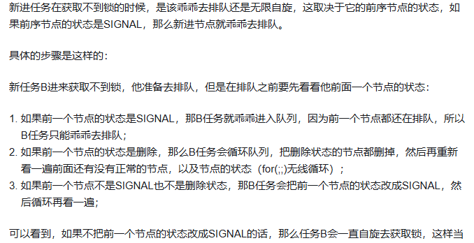  

## AQS 中为什么需要一个虚拟 head 结点

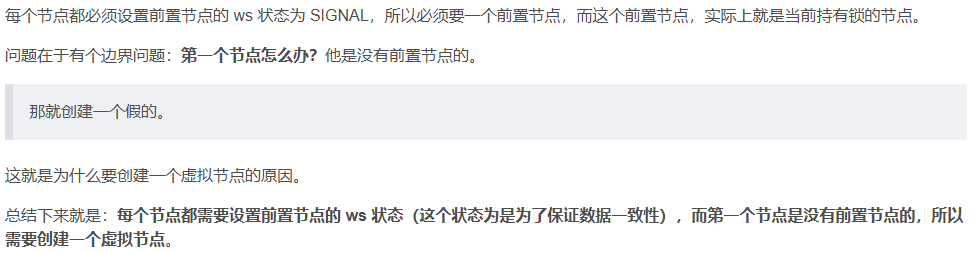  

## 为什么要自旋

- 主要是通过这种方式来减小开销

  
