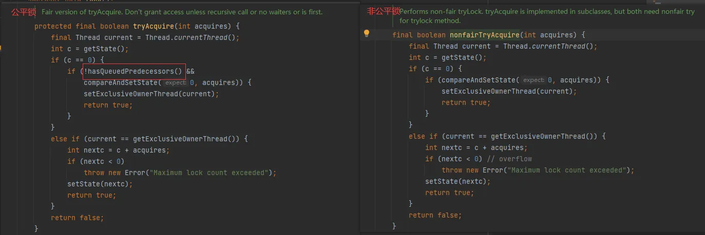
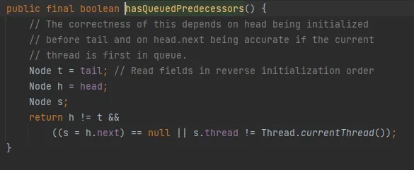
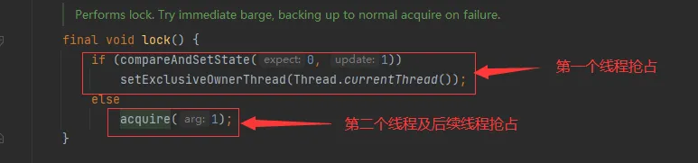
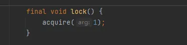
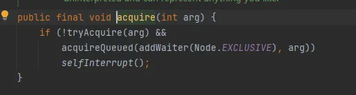
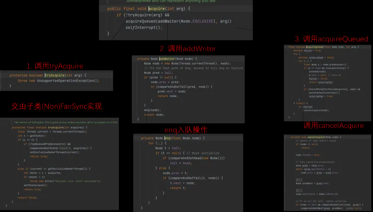
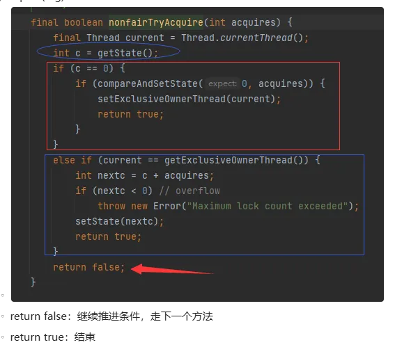
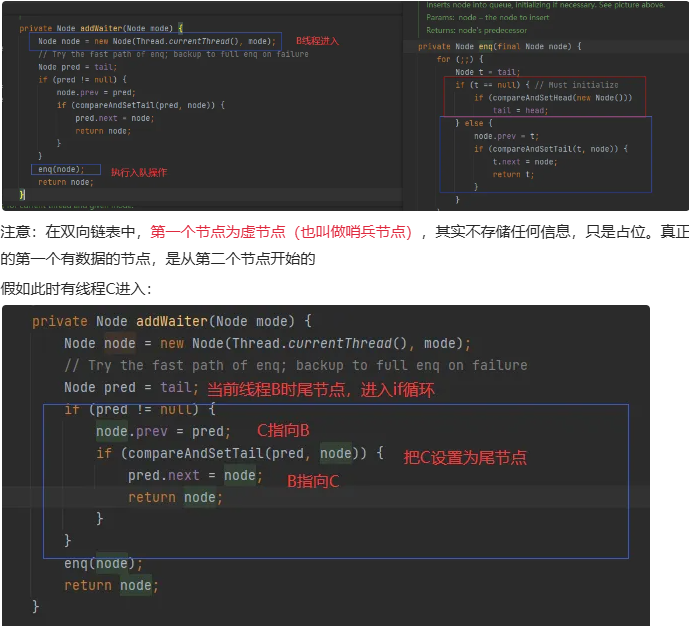
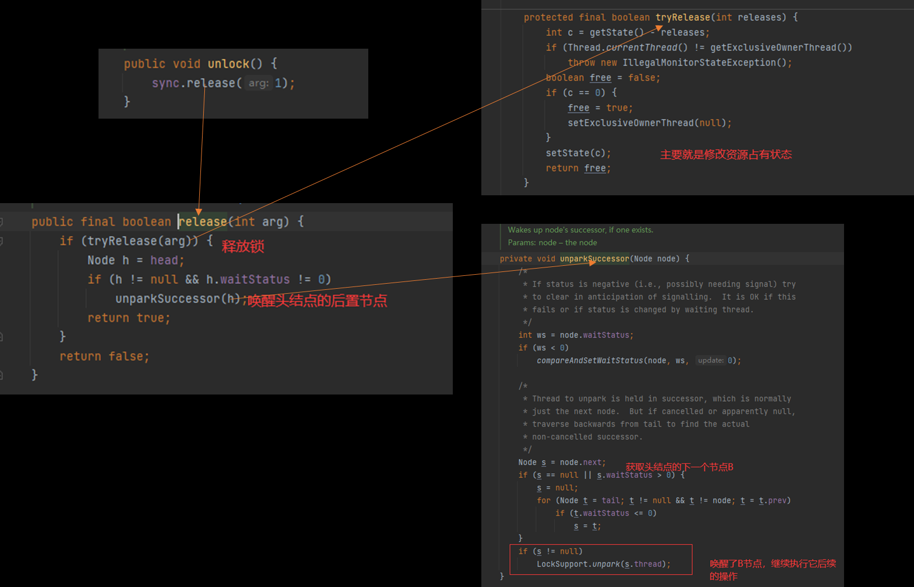

# 面试题

## 什么是 AQS

  

## 有哪些类是基于 AQS 实现的

- `ReentrantLock`
- 并发工具类

  

## AQS 解决什么问题

  

- 提供通用框架，用于实现各种同步器
- 定义了资源获取和释放的通用流程

## AQS 同步队列的基本结构

  

### AQS 自身

#### state

```java
// 共享变量，使用volatile修饰保证线程可见性
private volatile int state;
```

- AQS 使用 int 成员变量 `state` 表示同步状态
- `state` 变量由 `volatile` 修饰，用于展示当前临界资源的获取情况
- 这个值是和 `monitor` 中的计数器有点像，支持可重入

  

  

#### AQS 的 CLH 队列

- AQS 中的 CLH 队列是 CLH 锁队列的变体
- 通过内置的 **FIFO 线程等待/等待队列** 来完成获取资源线程的排队工作。

##### 原版 CLH 锁队列

  

##### AQS 中的队列

- 变成了双向队列
- 不需要一直自旋，自旋获取锁失败了就阻塞
- 因为是双向队列，所以前驱节点对应的线程释放锁之后，可以主动唤醒后面的线程

  

### 内部类 Node

#### 内部结构

  

#### waitStatus，用 volatile 修饰

  

- 何为等待队列何为同步队列？<https://blog.csdn.net/zx48822821/article/details/86768484>

## ReentrantLock 底层如何基于 AQS 实现

- Lock接口的实现类，基本都是通过聚合了一个队列同步器的子类完成线程访问控制的

  

### 创建锁

- 默认为非公平锁（效率高）

  

### 加锁

- 公平锁需要判断是否需要排队

  

  

  

  

  

  

#### lock()

  

  

#### acquire()

  

- 调用 tryAcquire ，尝试获得锁

  

- 调用 addwaiter ，通过enq入队

  

- 调用 acquireQueued ，坐稳队列

```java
final boolean acquireQueued(final Node node, int arg) {
        boolean failed = true;
        try {
            boolean interrupted = false;
            for (;;) {//死循环
                final Node p = node.predecessor();//获得该node的前置节点
                /**
                * 如果前置节点是head，表示之前的节点就是正在运行的线程，表示是第一个排队的
（一般讲队列中第一个是正在处理的，可以想象买票的过程，第一个人是正在买票(处理中)，第二个才是真正排队的人）；
那么再去tryAcquire尝试获取锁，如果获取成功，说明此时前置线程已经运行结束，则将head设置为当前节点返回
                *
                *
                **/
                if (p == head && tryAcquire(arg)) {
                    setHead(node);
                    p.next = null; // help GC，将前置节点移出队列，这样就没有指针指向它，可以被gc回收
                    failed = false;
                    return interrupted;//返回false表示不能被打断，意思是没有被挂起，也就是获得到了锁
                }
                /**shouldParkAfterFailedAcquire将前置node设置为需要被挂起，
                    注意这里的waitStatus是针对当前节点来说的，
                    即是前置node的ws指的是下一个节点的状态**/
                if (shouldParkAfterFailedAcquire(p, node) &&
                    parkAndCheckInterrupt())//挂起线程 park()
                    interrupted = true;
            }
        } finally {
            if (failed)
                cancelAcquire(node);//如果失败取消尝试获取锁(从上面的代码看只有进入p == head && tryAcquire(arg)这个逻辑是才会触发，这个时候前置节点正好在当前节点入队的时候执行完，当前节点正好获得锁，具体的代码以后分析)
        }
    }
//看到因为是死循环，所以当执行到parkAndCheckInterrupt()时，当前线程被挂起，等到某一天被unpark继续执行，这个时候已经是对头的第二个节点了，那么就会进入if (p == head && tryAcquire(arg))逻辑获取到锁并结束循环
```

### 解锁

  

- 释放锁（修改资源的占有状态，即修改 `state` 的值）
- 唤醒头节点的后置节点（获取下一个节点，唤醒）
