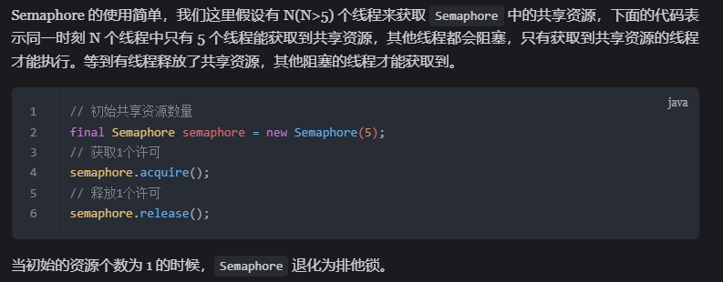
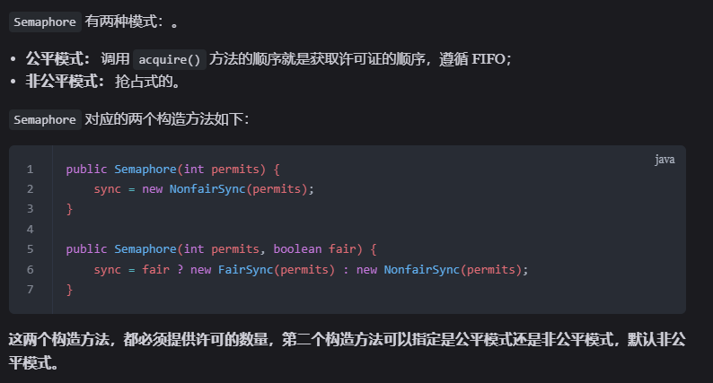
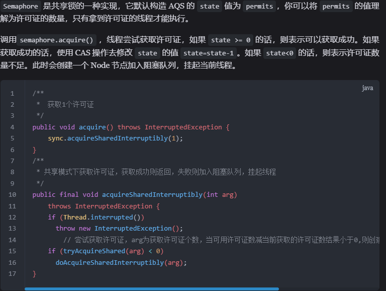
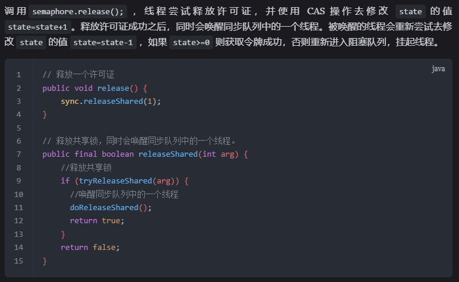
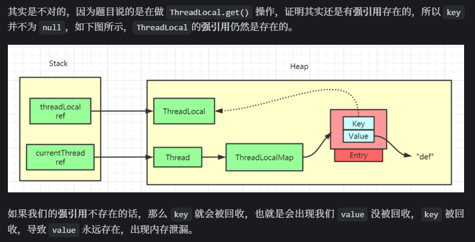
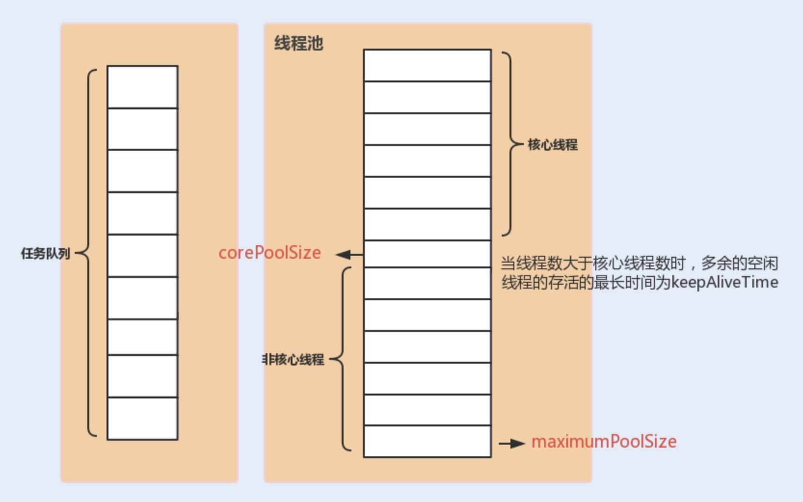
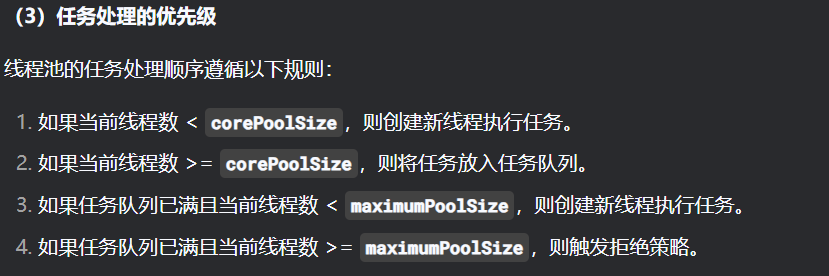

# 面试题

## 并发工具类

### Semaphore

#### 是什么

信号量，是一种共享锁，用来控制同时访问特定资源的线程数量

#### 有什么用

  

#### 底层是如何基于 AQS 实现的

##### 构造器是如何定义的

  

##### acquire

1. 获取许可证
2. 获取成功，CAS修改state
3. 获取失败，加入阻塞队列，挂起线程

  

##### release

1. 释放许可证
2. 释放成功，CAS修改state，唤醒下一个线程

  

### CountDownLatch

#### 是什么

#### 有什么用

#### 底层是如何基于 AQS 实现的

##### 构造器如何定义

##### await

##### countdown

### ThreadLocal

#### ThreadLocal 原理

`ThreadLocal` 是 `Java` 中用于实现线程本地存储的工具类，它为**每个线程提供了一个独立的变量副本**，从而避免了多线程环境下的竞争条件。

#### ThreadLocal内存泄漏问题

  

- threadLocal的key是弱引用，gc之后，key变为null，但是value是强引用，会出现key为null但是value不为null的情况，value的生命周期和该thread同步，就会导致内存泄漏

## 线程池

### 核心线程，非核心线程，核心参数相关问题

`corePoolSize` : 任务队列未达到队列容量时，最大可以同时运行的线程数量。
`maximumPoolSize` : 任务队列中存放的任务达到队列容量的时候，当前可以同时运行的线程数量变为最大线程数
  

  
