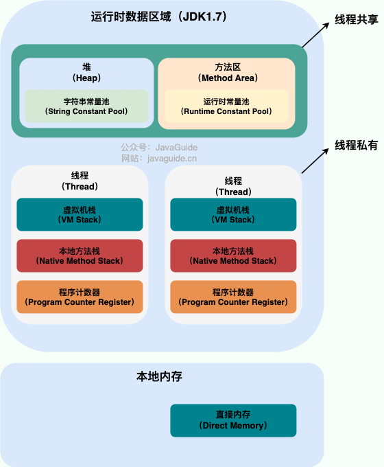
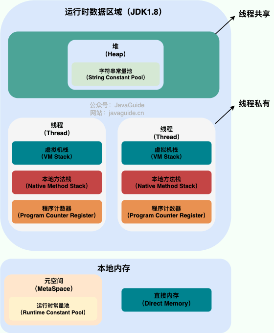
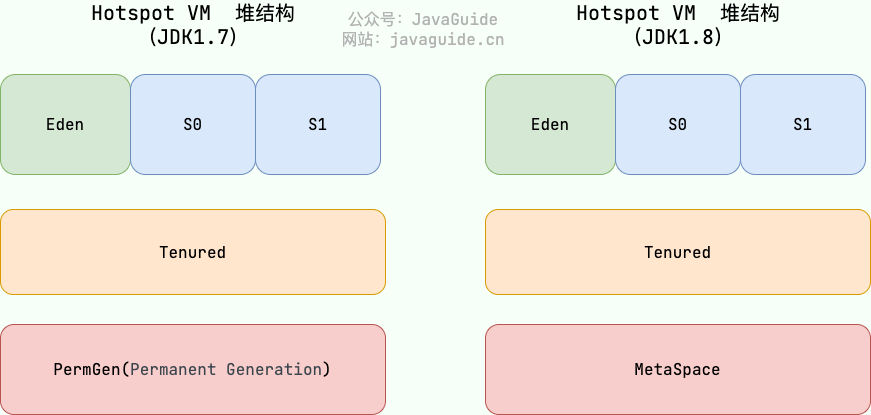

# 内存结构

  

  

## 线程私有

- 程序计数器
- 虚拟机栈（jvm栈）
- 本地方法栈（native方法）

  - **虚拟机栈**为虚拟机运行**java方法**提供服务，**本地方法栈**为虚拟机运行**native方法**提供服务

## 线程共享

### 堆

- 新生代区
- 老生代区
- 元空间（永久代）

### 方法区

- 运行时常量池
- 字符串常量池：避免字符串的重复创建
  - JDK1.7之前，字符串常量池放在方法区中
  - JDK1.7，**字符串常量池放在堆中**，因为堆的GC效率更高，可以更高效及时的回收字符串的内存，方法区（永久代）的垃圾回收效率太低了

### 直接内存

## 一些说明

总结：JVM 内存模型是什么？

（1）JVM 内存模型共分为5个区：Java虚拟机栈、本地方法栈、堆、程序计数器、方法区（元空间）

（2）各个区各自的作用：

a.本地方法栈：用于管理本地方法的调用，里面并没有我们写的代码逻辑，其由native修饰，由 C 语言实现。

b.程序计数器：它是一块很小的内存空间，主要用来记录各个线程执行的字节码的地址，例如，分支、循环、线程恢复等都依赖于计数器。

c.方法区（Java8叫元空间）：用于存放已被虚拟机加载的类信息，常量，静态变量等数据。

d.Java 虚拟机栈：用于存储局部变量表、操作数栈、动态链接、方法出口等信息。（栈里面存的是地址，实际指向的是堆里面的对象）

- 针对值传递，虚拟机栈存的是值

- 针对引用传递，虚拟机栈存的是地址

e.堆：Java 虚拟机中内存最大的一块，是被所有线程共享的，几乎所有的对象实例都在这里分配内存；

（3）线程私有、公有

a.线程私有：每个线程在开辟、运行的过程中会单独创建这样的一份内存，有多少个线程可能有多少个内存

Java虚拟机栈、本地方法栈、程序计数器是线程私有的

b.线程全局共享的

堆和方法区

（4）栈虽然方法运行完毕了之后被清空了，但是堆上面的还没有被清空，所以引出了GC（垃圾回收），不能立马删除，因为不知道是否还有其它的也是引用了当前的地址来访问的
