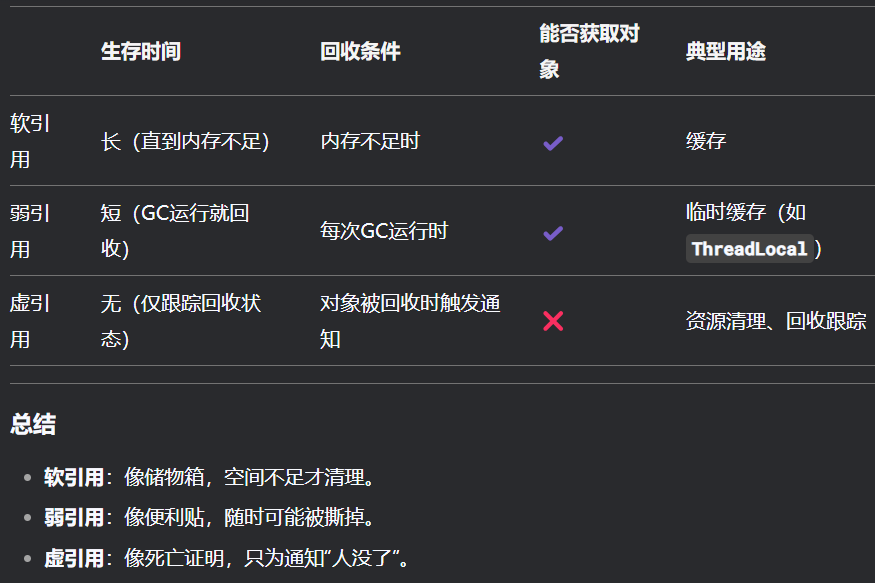
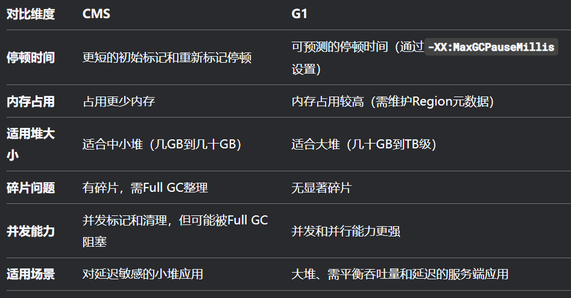

# 垃圾回收

## 内存分配与回收原则

- 对象优先在eden区进行分配，第一次minor GC后，存入survivor空间，如果survivor的空间也不够存储，则通过**分配担保机制**将新生代的对象提前转移到老年代

- 大对象直接存入老年代，避免将大对象放入新生代，减少新生代垃圾回收的频率与成本
- 长期存活的对象直接进入老年代，对象在eden中熬过一次minor GC，进入survivor，年龄+1，在survivor中每熬过一次minor GC，年龄+1，达到一定阈值后进入老年代

### 主要进行GC的区域

- 部分收集（Partial Collection）
  - 新生代收集（Minor GC / Young GC）：只对新生代进行垃圾收集
  - 老年代收集（Major GC / Old GC）：只对老年代进行垃圾收集
  - 混合收集（Mixed GC）：对整个新生代和部分老年代进行垃圾收集

- 整堆收集（Full Collection）：收集整个java堆和方法区

### 分配担保机制

- 确保在Minor GC之前老年代本身还有容纳新生代中所有对象的剩余空间

## 死亡对象判断方法

- 引用计数法：每个对象有一个计数器，该对象被引用则计数器+1，引用结束（引用失效）后计数器-1，计数器为0则表示这个对象不会再被使用，但是这个方法存在一个问题，就是无法解决两个对象之间循环引用的问题
- 可达性分析算法：通过一系列可以当作 GC root 的对象作为起点，从这些节点开始向下搜索，与可以达到的被引用节点构成链，如果一个对象到GC root没有任何链相连则说明该对象不可用，需要被回收

### 引用类型总结

- 强引用：即便没有内存，宁愿报OOM也不能将其回收
- 软引用：如果内存足够，则垃圾回收器不回收该对象，如果没有内存，就将其回收，回收后，将该引用加入到一个与之相关的引用队列当中
- 弱引用：不管内存是否足够，垃圾回收器检测到该对象就进行回收，回收后将该引用加入到引用队列中
- 虚引用：形同虚设，随时都可以被回收

  

## 判断常量是否废弃

- 如果一个常量没有被引用，则该常量是废弃的

## 判断一个类是否是无用的类

- 该类所有的实例都已被回收
- 加载该类的classLoader被回收
- 该类对应的`java.lang.Class`对象没有被任何地方引用

## 垃圾收集算法

### 标记-清除

### 复制

### 标记-整理

### 分代收集

- 对于新生代，采用复制算法，因为新生代每次GC都有大量的对象死去，复制存活的对象，开销不大
- 对于老年代，对象的存活率都是很高的，采用标记清除或者标记整理的方法

## 垃圾收集器

### CMS

- Concurrent Mark Sweep

1. 初始标记：停顿，找到可以当作GC root的对象
2. 并发标记：并发执行标记线程和用户线程，标记被引用的对象
3. 重新标记：停顿，由于并发标记过程中，用户程序运行可能导致标记产生变动，因此需要进一步重新标记被引用的对象（修正引用）
4. 并发清除：GC线程对未被标记的对象进行垃圾回收（标记-清除）

### G1

- Garbage First

1. 初始标记：同CMS
2. 并发标记：同CMS
3. 最终标记：停顿，处理并发标记结束后残留的少量未处理的引用变更
4. 筛选回收：停顿，根据标记结果，回收价值高的区域，将存活对象复制到新区域

  
s