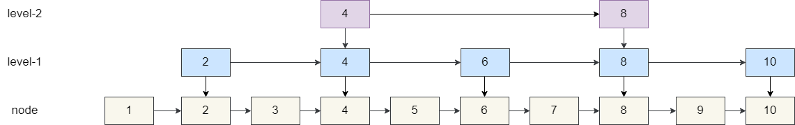

# Redis

## 5种基本数据类型

### String

- 底层数据结构：SDS，simple dynamic string 简单动态字符串
- 保存文本数据和二进制数据，获取字符串长度的复杂度为O(1)

### List

- 底层数据结构：LinkedList，ZipList，QuickList
- 双向链表，支持反向查找和遍历

### Hash

- 底层数据结构：Dict，ZipList

### Set

- 底层数据结构：Dict，IntSet
- 类似于HashSet

### Sorted Set （Zset）

- 底层数据结构：ZipList，SkipList
- 和Set相比，增加了一个权重参数score，使集合能按照score有序排列

## 为什么用跳表实现有序集合

  

- 平衡树 vs 跳表：平衡树的每一次插入/删除操作后都需要进行旋转来保证绝对的平衡，这个过程的开销很大
- 红黑树 vs 跳表：红黑树的实现比跳表复杂，并且在按照区间查询数据方面，红黑树的效率不如跳表

## Redis 性能优化

- 使用批量操作来集中处理请求，减少网络传输
- 存在大量key集中过期的问题，如果大量key全都过期，客户端的请求需要等待清理过期key的任务执行完成，因为清理任务的线程是主线程，这会导致客户端响应变慢
  - 解决方式
    - 1. 给key设置随机过期时间，防止都在同一时间过期需要被处理
    - 2. 开启lazy-free（惰性删除），让redis采用异步方式延迟释放过期key占用的内存，不占主线程

### bigkey

- 大key会消耗很多的内存空间和带宽，还会对性能产生很大的影响，甚至会造成阻塞
- 解决方案：
  - 分割大key，将一个大key分为多个小key（如二次哈希）
  - 手动清理
  - 采用合适的数据结构
  - 惰性删除

### hotkey

- 热key是访问次数很高的key
- 解决热key方案：
  - 读写分离，主节点处理写请求，多个从节点处理读请求
  - 使用Redis集群，将不同热key分摊到不同的Redis节点上，缓解压力
  - 二级缓存：采用多级缓存的方式，比如把hotkey在本地内存中也存一份，有访问请求时先命中本地缓存，命中失败再去找Redis，拦住一大部分请求

## Redis 生产问题

### 缓存穿透

- 大量请求的key是不合理的，**这种key在Redis中没有，在数据库中也没有**，那么这些key会直接穿透缓存，打在数据库上，对数据库造成很大的压力

- 解决办法：
  - 缓存无效key（不推荐）：检测到无效key时直接将其缓存到Redis当中，这种方式可以解决大量不合理key的变化不大的情况，如果黑客攻击的大量key都不一样，那会导致Redis当中存入大量无效key，所以只能将这些key设置一个较短的过期时间
  - 布隆过滤器（推荐）：布隆过滤器通过一个较大的bit位数组来保存数据，只要redis或数据库当中存在该数据，就将key通过多种哈希函数计算，修改对应bit位的值为1，那么当key尝试访问时，可以通过布隆过滤器进行判断，如果不存在则直接抛出异常。**但因为可能存在哈希冲突，布隆过滤器不能保证百分之百的准确（它说存在不一定存在，它说不存在一定不存在）**
  - 接口限流：对于异常的用户接口/ip，直接进行限流

### 缓存击穿

- 请求的key对应热点数据，该数据存**在于数据库中但不在Redis中**（多半是因为Redis中的数据过期），导致大量的数据直接打在数据库上，导致数据库被打崩溃宕机

- 解决办法：
  - 将数据设置为永不过期（不建议）
  - 提前预热，针对热点数据，存入Redis中时根据场景需求提前设置过期时间（推荐）
  - 加锁（看情况）：缓存失效后，设置一个互斥锁，使仅有一个线程去查询数据并更新缓存

### 缓存雪崩

- 缓存在同一时间大面积失效，导致大量请求直接打在数据库上，把数据库打崩溃

- 解决办法：
  - 针对Redis服务出问题的情况：
    - 采用Redis集群，这样一个节点崩了剩下的还能工作
    - 采用多级缓存（如本地缓存+Redis缓存），这样Redis崩了还可以去访问本地缓存获取数据
  - 针对缓存大面积过期的问题：
    - 设置为永不过期
    - 提前预热
    - 将不同key设置随机过期时间

  
