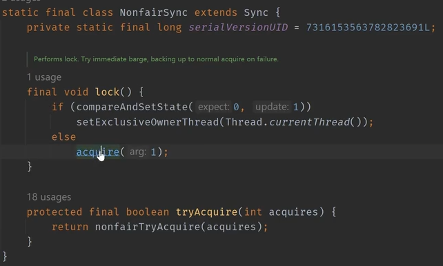
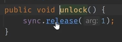

# 源码分析

## 加锁

  

```java
// acquire
public final void acquire(int arg) {
    if (!tryAcquire(arg) &&
        acquireQueued(addWaiter(Node.EXCLUSIVE), arg))
        selfInterrupt();
}

// tryAcquire（公平锁）
protected final boolean tryAcquire(int acquires) {
    final Thread current = Thread.currentThread();
    // 获取线程后，要更改资源的state
    int c = getState();
    // 判断是否为0，为0说明资源可获取
    if (c == 0) { 
        // 多一个判断是否有前序结点，然后再尝试CAS
        if (!hasQueuedPredecessors() &&
            compareAndSetState(0, acquires)) {
            // 将当前拿到锁的线程切换为当前线程
            setExclusiveOwnerThread(current);
            return true;
        }
    }
    else if (current == getExclusiveOwnerThread()) {
        // 可重入锁
        int nextc = c + acquires;
        if (nextc < 0)
            throw new Error("Maximum lock count exceeded");
        // 已经拿到锁了，再加一次锁后设置state
        setState(nextc);
        return true;
    }
    return false;
}

// tryAcquire（非公平锁）
final boolean nonfairTryAcquire(int acquires) {
    final Thread current = Thread.currentThread();
    int c = getState();
    if (c == 0) {
        if (compareAndSetState(0, acquires)) {
            setExclusiveOwnerThread(current);
            return true;
        }
    }
    else if (current == getExclusiveOwnerThread()) {
        int nextc = c + acquires;
        if (nextc < 0) // overflow
            throw new Error("Maximum lock count exceeded");
        setState(nextc);
        return true;
    }
    return false;
}

// addWaiter：添加到队列的逻辑
private Node addWaiter(Node mode) {
    // 构造一个结点
    Node node = new Node(Thread.currentThread(), mode);
    // 找到原有队列的尾结点，尝试将node接上去
    Node pred = tail;
    if (pred != null) {
        node.prev = pred;
        if (compareAndSetTail(pred, node)) {
            pred.next = node;
            return node;
        }
    }
    // 尾结点是空说明头结点为空，队列为空，需要创建头结点然后入队
    enq(node);
    return node;
}

// enq：
private Node enq(Node node) {
    // 设成死循环，方便在初始化头结点之后进入下一次循环，将node加入该队列，node成为新的队尾（用CAS的方式设置队尾）
    // 在addWaiter中被调用时，理论上是循环两次：第一次初始化头结点，第二次加入node
    for (;;) {
        Node t = tail;
        if (t != null) {
            node.prev = t;
            if (compareAndSetTail(t, node)) {
                t.next = node;
                return t;
            }
        } else { // 队列为空
            // 初始化一个头结点
            if (compareAndSetHead(new Node())) {
                tail = head;
            }
        }
    }
}

// acquireQueued：通过CAS锁，通过addWaiter进入队列后进行后续操作（执行or挂起？）
final boolean acquireQueued(final Node node, int arg) {
    // 挂起失败标志
    boolean failed = true;
    try {
        boolean interrupted = false;
        // 自旋
        for (;;) {
            // 获取前驱结点
            final Node p = node.predecessor();
            // 如果前驱结点是头结点并且可以获得锁，那就说明node结点的线程可以执行了
            if (p == head && tryAcquire(arg)) {
                // 将node设为新的头结点&哨兵结点，断开node -> p
                setHead(node);
                // 此时node的前驱结点为p，p已经没用了，断开p -> node
                p.next = null; // help GC，等待p被垃圾回收
                // CAS成功，竞争到锁
                failed = false;
                return interrupted;
            }
            // 获取锁失败的情况
            if (shouldParkAfterFailedAcquire(p, node) &&
                parkAndCheckInterrupt())
                interrupted = true;
        }
    } finally {
        if (failed) 
            /*
             * 处理当前取消节点的状态；
             * 将当前取消节点的前置非取消节点和后置非取消节点"链接"起来；
             * 如果前置节点释放了锁，那么当前取消节点承担起后续节点的唤醒职责。
             * 如果该结点在队尾，直接扔掉
             */
            cancelAcquire(node);
    }
}

// setHead：该结点的线程获得锁了，可以开始执行，该结点就会变为新的头结点
// 即成为新的哨兵结点
private void setHead(Node node) {
    // 新的头结点
    head = node;
    // 因为是哨兵结点所以thread设为null即可
    node.thread = null;
    // 因为是头结点所以没有前序结点了
    node.prev = null;
}

// shouldParkAfterFailedAcquire：获取锁失败之后是否应该阻塞？
private static boolean shouldParkAfterFailedAcquire(Node pred, Node node) {
    // pred：前驱；node：当前结点
    // 获取前驱结点的ws状态
    int ws = pred.waitStatus;
    // 正常状态，正常阻塞
    if (ws == Node.SIGNAL)
        /*
         * This node has already set status asking a release
         * to signal it, so it can safely park.
         */
        return true;
    // CANCELLED，干掉这个前驱结点（跳过）
    if (ws > 0) {
        /*
         * Predecessor was cancelled. Skip over predecessors and
         * indicate retry.
         */
        // node.prev不断往前指，直到指向的ws不大于0
        /*
         * 等价于
         * node.prev = pred.prev;
         * pred = pred.prev;
         */
        do {
            node.prev = pred = pred.prev;
        } while (pred.waitStatus > 0);
        // 更新pred.next
        pred.next = node;
    } else {
        /*
         * waitStatus must be 0 or PROPAGATE.  Indicate that we
         * need a signal, but don't park yet.  Caller will need to
         * retry to make sure it cannot acquire before parking.
         */
        
        // 前驱结点ws设为-1，保证这种状态才能正常阻塞
        pred.compareAndSetWaitStatus(ws, Node.SIGNAL);
    }
    return false;
}

// parkAndCheckInterrupt：挂起操作
private final boolean parkAndCheckInterrupt() {
    // 挂起线程
    LockSupport.park(this);
    return Thread.interrupted();
}
```

## 解锁

  

```java
// release：释放锁
public final boolean release(int arg) {
    if (tryRelease(arg)) {
        Node h = head;
        // 拿到头结点的ws，如果是-1，则是可以没有问题的结点，可以执行释放流程
        if (h != null && h.waitStatus != 0)
            unparkSuccessor(h);
        return true;
    }
    return false;
}

// tryRelease：尝试释放的判断条件，即判断state是否为0
protected final boolean tryRelease(int releases) {
    int c = getState() - releases;
    // 如果线程不一样直接抛出异常
    if (Thread.currentThread() != getExclusiveOwnerThread())
        throw new IllegalMonitorStateException();
    boolean free = false;
    // c = 0说明释放完了
    if (c == 0) {
        free = true;
        // 设置当前持有锁的线程为null
        setExclusiveOwnerThread(null);
    }
    // 如果不是0，则设置新的state值（存在可重入锁的情况）
    setState(c);
    // 看看是否完全释放完毕
    return free;
}

// unparkSuccessor：释放该锁
private void unparkSuccessor(Node node) {
    /*
     * If status is negative (i.e., possibly needing signal) try
     * to clear in anticipation of signalling.  It is OK if this
     * fails or if status is changed by waiting thread.
     */
    int ws = node.waitStatus;
    // 这个结点对应线程要释放锁了，ws置0即可
    if (ws < 0)
        node.compareAndSetWaitStatus(ws, 0);
    /*
     * Thread to unpark is held in successor, which is normally
     * just the next node.  But if cancelled or apparently null,
     * traverse backwards from tail to find the actual
     * non-cancelled successor.
     */
    // 指向node的下一个结点，如果下一个结点正常就直接唤醒，无需阻塞
    // 否则置为null，再通过遍历寻找唤醒的结点
    Node s = node.next;
    if (s == null || s.waitStatus > 0) {
        s = null;
        // 从后往前遍历，寻找最靠近队头的可以被唤醒的锁
        for (Node p = tail; p != node && p != null; p = p.prev)
            if (p.waitStatus <= 0)
                s = p;
    }
    if (s != null)
        // 唤醒
        LockSupport.unpark(s.thread);
}
```
