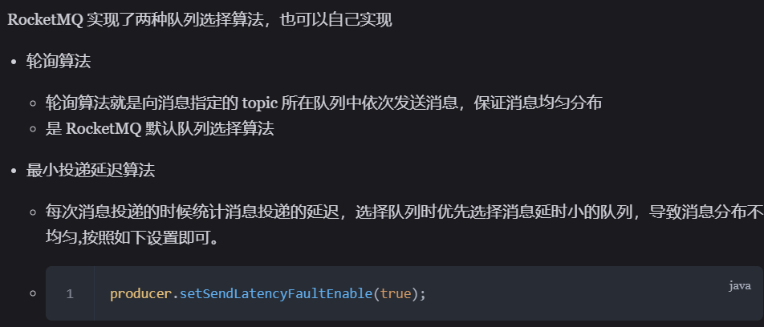
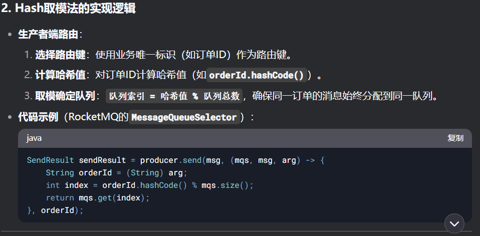

# RocketMQ

## RocketMQ 的消息模型

- RocketMQ中主要采用的是一个主题模型，生产者将消息发送到topic中，一个topic中有多个队列，生产者可以指定队列发送消息
- 一个消费者组中可以有多个消费者，一个消费者组中的每个消费者消费一条队列，维护一个消费位置（偏移量），一条消息队列可以被不同的消费者组消费
- 一个主题中设有多个队列，是为了提高并发能力，让一个消费者组的多个消费者可以并发消费
- 队列数>=一个消费者组中的消费者数

## 默认的两种队列选择方法

  

## 顺序消费

- RocketMQ在主题上是无序的，在队列上是有序的
- 顺序分为**普通顺序**和**严格顺序**，**普通顺序**意为消费者通过同一个消息队列获取的消息是有序的，不同消息队列收到的消息则是无序的；而**严格顺序**指消费者在所有情况下收到的消息都是有序的，即使在异常情况下也要保证消息的有序性。
- **严格顺序**会付出巨大的代价，只要broker崩了一台机器，那整个集群都不可用了，因此更倾向于MQ可以接受短暂的乱序，即使用**普通顺序**

### 保证顺序的方法

- 若要保证顺序，则要让同一语义的消息进入同一个消息队列（此时不能遵循默认的轮询策略），可以通过哈希取模，来保证同一个订单在同一个队列里
  

## 重复消费

- 存在一种可能，就是在处理信息时出现了网络波动或其他各种各样的异常，导致消费者处理完这条消息之后没有成功返给消息队列处理成功的消息，这会导致生产者可能重发这条消息，使得消费者重复处理（比如说同一笔订单算了两次）

- 解决方案：对消费者实现幂等，即对同一条消息的处理结果，处理多少次结果都不变，有两种模式来实现：
  - 1. 将消息的唯一标识（比如订单id）作为Key存入Redis，通过SETNX命令实现原子性检查，查看是否存在，如果存在说明已经处理过相同id的消息，可以跳过这条消息
  - 2. 为数据库表中添加唯一标识对应记录，获取信息时先找到有没有这条记录，有的话说明该信息已被消费，可以跳过
  - 两种方法可以结合使用

## 消息积压

- 有时候消息量太大，会影响效率和性能，消息队列的峰值太大会导致消息积压在队列中，思考两个角度：生产者生产消息太快/消费者消费信息太慢
- 解决方法
  - 给生产者限流降级，降低其生产消息的速度
  - 增加消费者实例（需要同步增加消息队列的个数）

## 延时消息

## 事务消息
