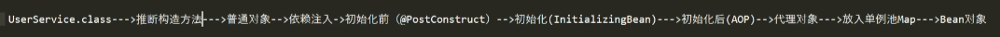
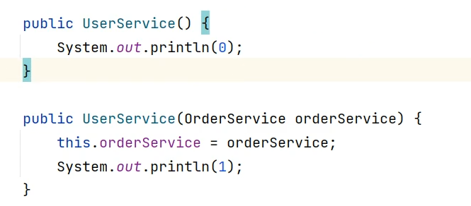

# Spring

## Bean生命周期相关的理解

  


针对一个类（UserService.class）

1.推断构造方法：

  

- 若只有一种构造方法，则通过该方法实例化

- 若有不少于两种构造方法，则默认通过无参构造实例化，若存在被@AutoWired注解的构造方法，则优先用该构造方法

- 如果不少于两种构造方法并且没有定义无参构造，则会报错

选择有参构造：需要在map中找到orderService对象

- 先ByType：在map中找匹配OrderService类型的bean对象，如果没有的话则需要创建OrderService的bean

- 再ByName：如果ByType匹配到多个，在ByType的多个结果中找匹配orderService名字的对象，如果匹配不到就会报错

2.实例化对象：此时的对象是普通对象

3.依赖注入：在普通对象中有@AutoWired/@Resource注解的字段，根据查找注入值

4.初始化前：赋值携带@PostConstruct注解的字段

5.初始化：InitializingBean

6.初始化后：AOP，代理模式

- 如果不需要AOP，会直接将普通对象放到单例池map（IOC），作为创造成功的Bean对象
- 如果需要AOP，会创建代理对象放入单例池map，作为创建成功的Bean对象

## AOP代理问题

```java
public class UserService {

    @Autowired
    private OrderService orderService;

    public void test() {
        System.out.println(orderService);
    }
}

public class Aspect {

    @Before("execution(UserService.test)")
    public void before(JoinPoint joinPoint) {
        System.out.println("before");
    }
}

main：
UserService userService;
userService.test();

// UserService当中含有AOP代理，如果调用userService.test()方法，orderService的值是怎么样的？
```

涉及到AOP，所以此时初始化的userService，为代理对象，通过父子类的思想创建

```java
class UserServiceProxy extends UserService {

    public void test() {
        // 1.@before增强逻辑
        // 2.调用test方法
    }
}
// 分析：此时的如果通过super.test()调用父类的test方法，依然没有orderService的值
// 因为此时的这个对象是代理对象，代理对象是在AOP之后新实例化出来的，没有经过依赖注入这一步，因此orderService为空值

// 实际上的代理对象：
class UserServiceProxy extends UserService {

    UserService target;

    public void test() {
        // 1.@before增强逻辑
        // 2.调用test方法
        target.test();
    }
}
// 分析：此时的target其实是实例化的普通对象，普通对象经过依赖注入，就有了orderService的值
// userService普通对象，赋值给target属性
```

代理对象创建总结：

- 创建代理类（UserServiceProxy）
- 创建代理对象
- 给代理对象的target属性赋值，值为普通对象
- 加入单例池map

## spring事务

- 有注解（@Transactional等）的方法，必须通过调用代理的方式让注解发挥作用
- 如果在方法内调用，相当于只调用了一个通过构造方法创建的普通对象，注解尚未注入
