# 面试题

## 乐观锁和悲观锁的区别

  

  

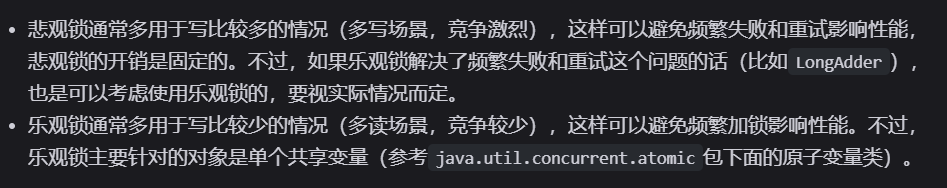  

## 公平锁与非公平锁

  

### 公平锁性能差的原因

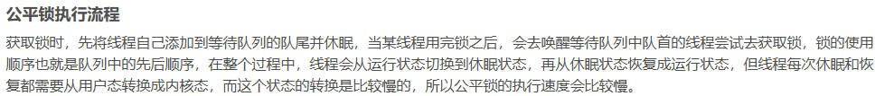  

## synchronized 主要解决的问题

  

## synchronized 底层原理

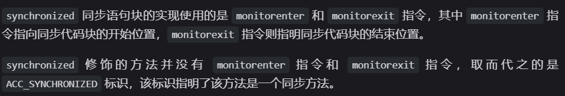  

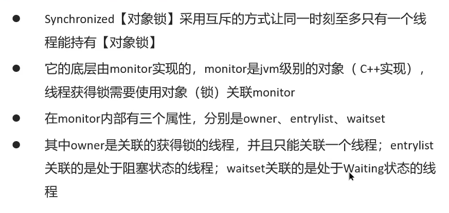  

  

## synchronized 底层如何实现加锁、解锁、可重入锁

### 加锁

- 当执行 `monitorenter` 指令时，线程试图获取锁也就是获取 对象监视器 `monitor` 的持有权。
- 在执行 `monitorenter` 时，会尝试获取对象的锁，如果锁的计数器为 `0` 则表示锁可以被获取，获取后将锁计数器设为 `1` 也就是加 `1`。
- 如果获取对象锁失败，那当前线程就要阻塞等待，直到锁被另外一个线程释放为止。

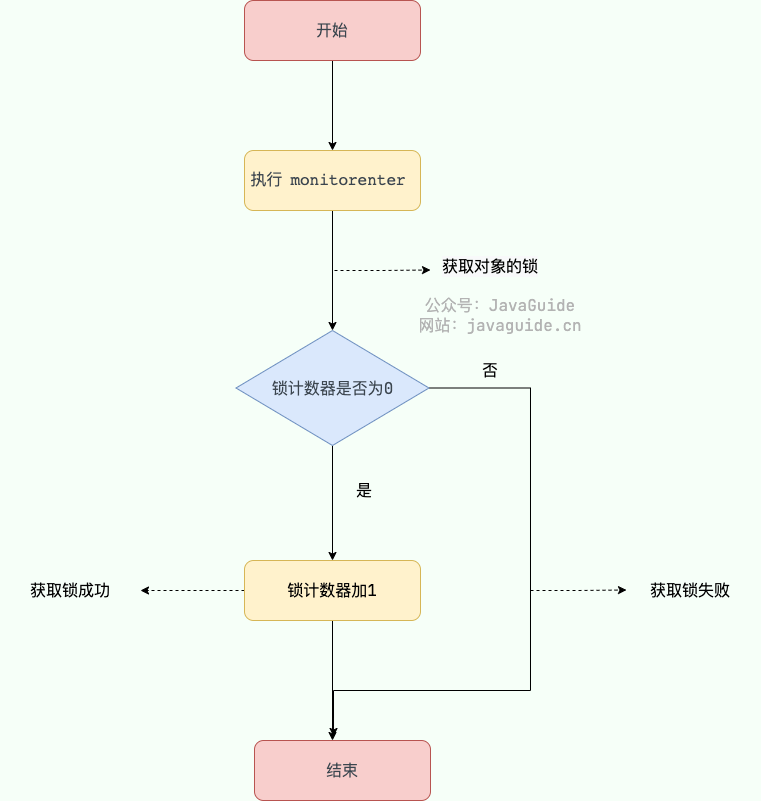  

### 解锁

- 对象锁的的拥有者线程才可以执行 `monitorexit` 指令来释放锁。在执行 `monitorexit` 指令后，将锁计数器设为 `0`，表明锁被释放，其他线程可以尝试获取锁。

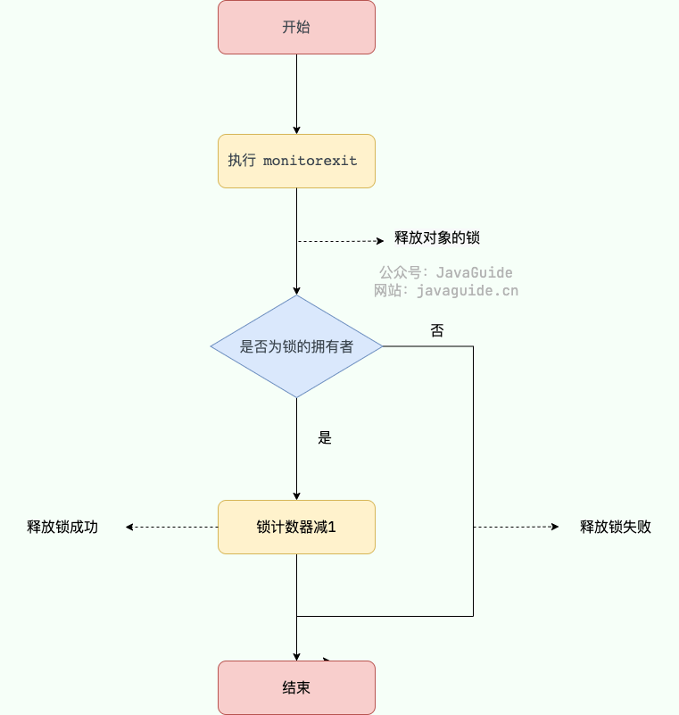  

### 可重入锁

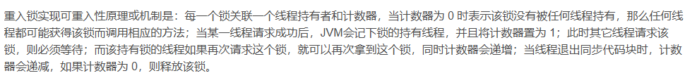  

## monitor 对象保存在锁对象的什么地方，二者是如何关联的

- `monitor` 对象锁就是重量级锁，保存在锁对象的对象头中的 `Mark Word` 字段中，该字段的锁标志位为 `10` ,其中指针指向的是 `monitor` 对象的起始地址

  

## 重量级锁优化-自旋锁、轻量级锁、偏向锁是如何实现的

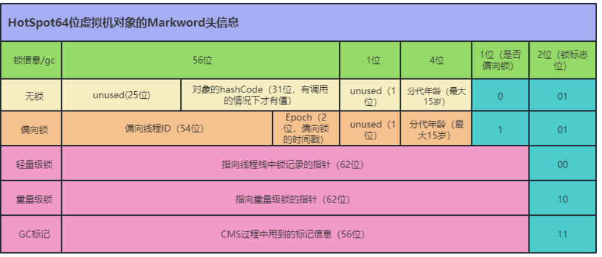  

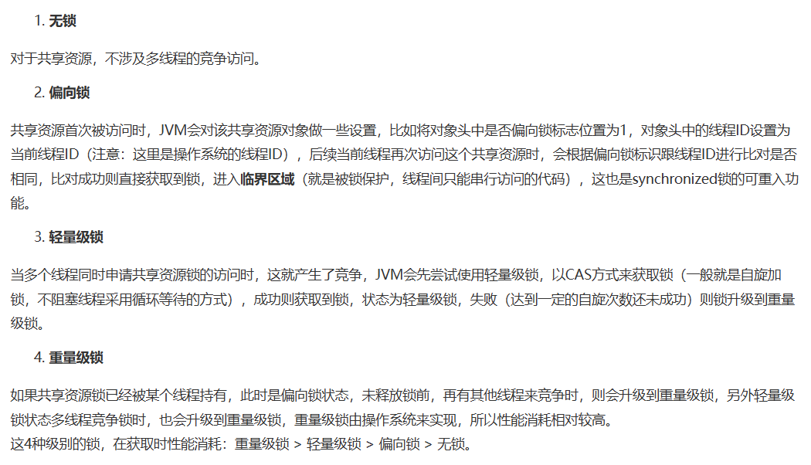  

### 锁升级

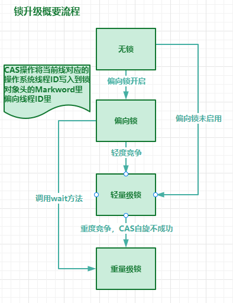  

## CAS 与 synchronized 的区别

- `CAS` 是基于乐观锁的思想，`synchronized` 是基于悲观锁的思想

## CAS 底层是如何实现的

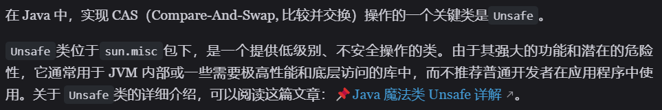  

  

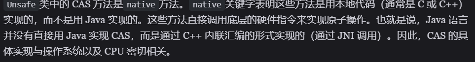  

  

- **锁总线是通过LOCK#信号实现的，锁缓存是通过缓存一致性协议实现的**

## CAS 不等于自旋锁

  

## CAS 的缺点

### ABA 问题：怎么产生？如何解决？

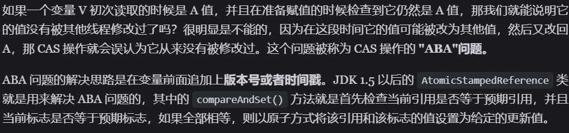  

### 循环时间长，开销大

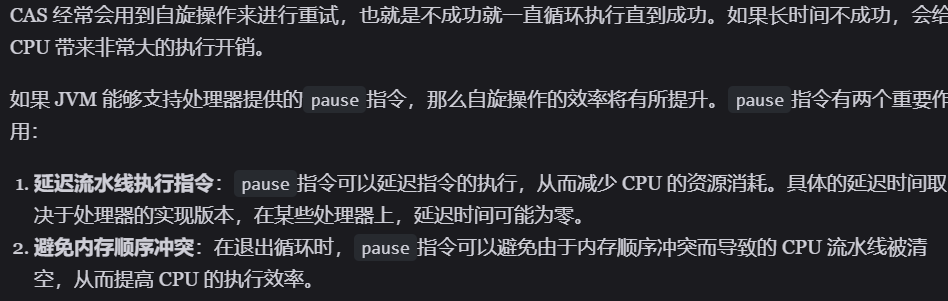  

### 只能保证一个共享变量的原子操作

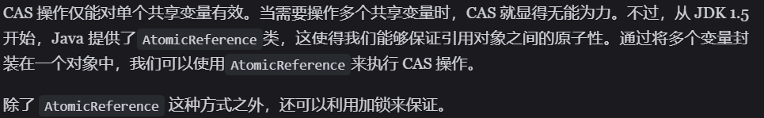  

## ReentrantLock 和 Synchronized 的区别

  

- 二者都是可重入锁
- `synchronized` 依赖于 JVM 而 `ReentrantLock` 依赖于 API
- `ReentrantLock` 增加了高级功能

  
