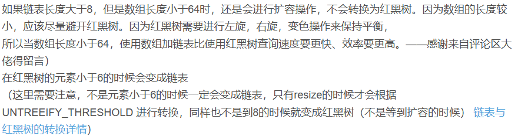
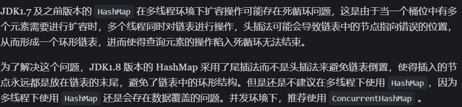
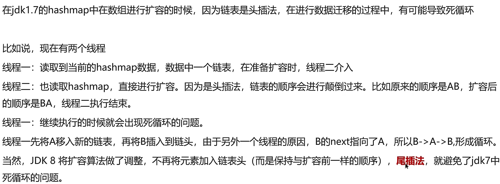
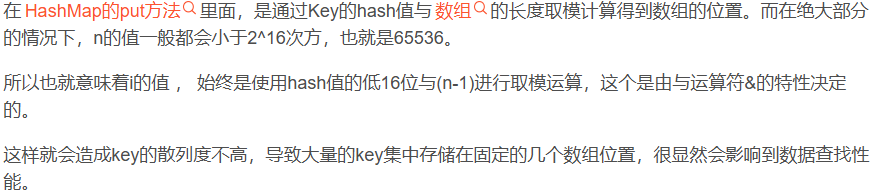
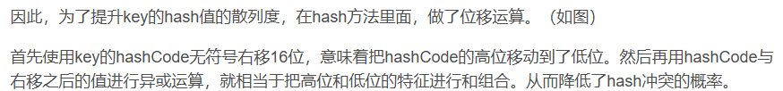
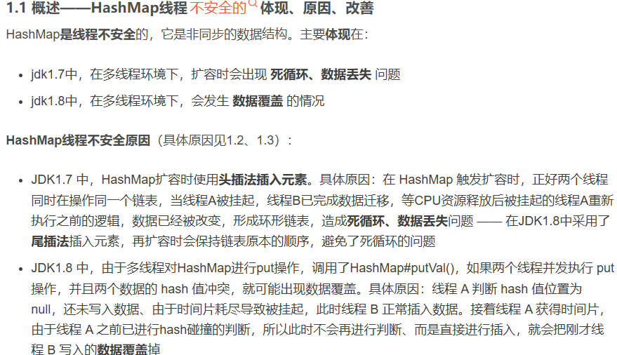
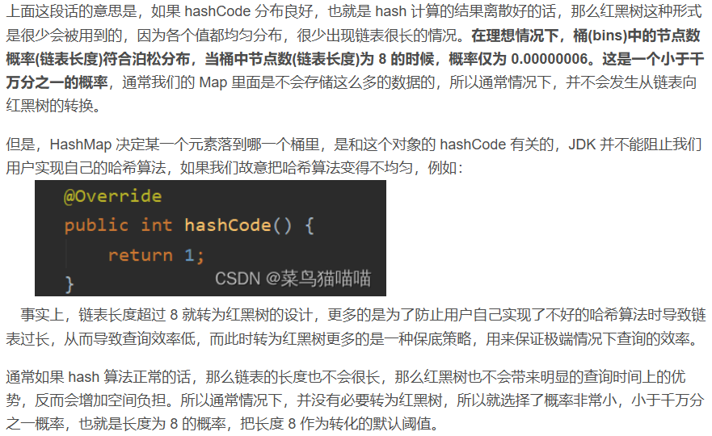
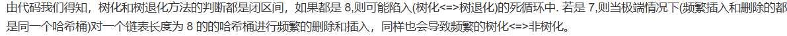
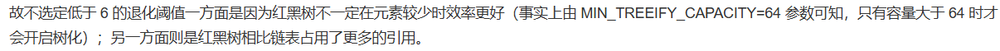

# 面试题

## 数组相关

  

- 数组下标从1开始的话，寻址公式中的 i 变为 i - 1 多了一次减法计算，效率低

## ArrayList 的底层实现原理

  

## ArrayList list = new ArrayList(10) 中的list扩容几次

  

## ArrayList 存放的数据类型

```java
ArrayList 中可以存储任何类型的对象
可以存放引用类型的数据
可以存放 null 值。
不过，不建议向ArrayList 中添加 null 值， 
null 值无意义，会让代码难以维护比如忘记做判空处理就会导致空指针异常
```

## 如何实现数组和List之间的交换

  

### 修改原内容，转换后的内容是否受影响？

  

## 单向链表双向链表的区别？操作数据的时间复杂度？

  

## ArrayList 和 LinkedList 的区别是什么

  

  

  

  

## CopyOnWriteArrayList 实现原理

  

- CopyOnWriteArrayList在读数据时不上锁，在增、删、改时上锁
- 适用于读多写少的并发场景

## HashMap 的实现原理

  

## HashMap 的jdk1.7和jdk1.8的区别

  

  


## HashMap 的put方法的具体流程

  

## HashMap 的扩容机制

  

  

## HashMap 寻址算法

  

## 为什么 HashMap 的数组长度一定是 2 的 n 次幂

  

## HashMap 在1.7情况下的多线程死循环问题

  

  

## HashMap 中的 hash 方法为什么要右移16位异或

- 之所以要对hashCode无符号右移16位并且异或，核心目的是为了让hash值的散列度更高，尽可能减少hash表的hash冲突，从而提升数据查找的性能
  
  

## HashMap 1.8产生线程不安全的原因

  

## HashMap 元素是否可以为 null

- HashMap对象的key、value值均可为null
- HashTable、ConcurrentHashMap是线程安全的，对象的key、value值均不可为null

(多线程安全的数据结构都不支持值为null)
  

## HashMap 链表转红黑树的阈值为什么是8

- 红黑树本身会占内存，链表长度不长的时候，转成红黑树的优势也不大

  

## 红黑树退化成链表的阈值为什么是6

  

  

## HashMap 为什么用 String 作为 key

  

## HashMap 和 HashTable 的区别

| |HashMap | HashTable（基本被淘汰） |
|--|--|--|
|线程安全|不安全|安全（经过 synchronize 修饰）|
|效率|高|低|
|对 null key 和 null value 的支持|支持（可以有1个 null 键多个 null 值）|不支持|
|初始容量（不指定容量）|16|11|
|初始容量（指定容量）|扩充为2的幂次|给定容量|
|每次扩容|变为原来2倍|变为原来2*n+1|
|底层数据结构|存在链表和红黑树转换机制|无类似机制|
|哈希函数实现|通过扰动处理减少冲突|直接用 hashCode() 值|

## HashSet 特点、数据结构、构造方法、add方法

  

  

## HashSet 和 HashMap 是如何去重的

- `HashSet` 和 `HashMap` 都是通过 `equals()` 方法和 `hashcode()` 方法来去重的

  

## 为什么要有 ConcurrentHashMap

- `HashMap` 不支持多线程并发，而 `ConcurrentHashMap` 支持

## ConcurrentHashMap 的结构

  

  

## ConcurrentHashMap 并发度

  

## 为什么 ConcurrentHashMap 中的 key 不能为 null

  

  

## 为什么 ConcurrentHashMap1.8 用 lock 锁而不是 sync 锁？

## 各种集合的时间复杂度

  
