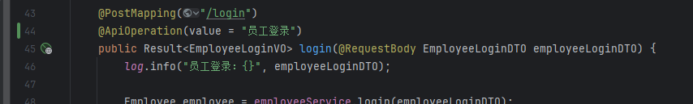

# Day 1

## 通过md5加密的方式

```java
    //通过md5进行加密处理
    password = DigestUtils.md5DigestAsHex(password.getBytes());
```

## swagger

### swagger 生成接口文档

```java

// 在WebMvcConfiguration 配置文件中
    /**
     * 通过knife4j生成接口文档
     * @return
     */
    @Bean
    public Docket docket() {
        ApiInfo apiInfo = new ApiInfoBuilder()
                .title("苍穹外卖项目接口文档")
                .version("2.0")
                .description("苍穹外卖项目接口文档")
                .build();
        Docket docket = new Docket(DocumentationType.SWAGGER_2)
                .apiInfo(apiInfo)
                .select()
                // 扫描到的包（此处是一个controller包）
                .apis(RequestHandlerSelectors.basePackage("com.sky.controller"))
                .paths(PathSelectors.any())
                .build();
        return docket;
    }

    /**
     * 设置静态资源映射
     * @param registry
     */
    protected void addResourceHandlers(ResourceHandlerRegistry registry) {
        // 在 /doc.html 路径显示接口文档
        registry.addResourceHandler("/doc.html").addResourceLocations("classpath:/META-INF/resources/");
        registry.addResourceHandler("/webjars/**").addResourceLocations("classpath:/META-INF/resources/webjars/");
    }
```

- localhost:8080/doc.html
  

### swagger 相关注解

- 注解会体现在生成的接口文档当中

|注解|说明|
|--|--|
|@Api|用在类上，例如Controller，表示对类的说明|
|@ApiModel|用在类上，例如entity、DTO、VO|
|@ApiModelProperty|用在属性上，描述属性信息|
|@ApiOperation|用在方法上，说明方法的用途|

#### @Api

  

#### @ApiModel @ApiModelProperty

  

#### @ApiOperation

  
