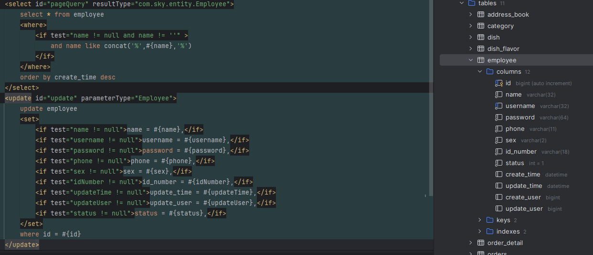

# Day 2

## MVC 三层架构

  

## 实体类

|命名|全称|用途|
|--|--|--|
|entity（DO）|Data Object|数据对象|
|DTO|Data Transfer Object|数据传输对象（前后端传输）|
|VO|View Object|视图对象（前端展示）|

## 开发新功能：新增员工

### 控制层

```java
    /*
    从前端接收请求的参数，因此是DTO
    通过注入的employService服务转到业务层，在service层当中处理具体的业务
    */
    @PostMapping
    @ApiOperation("新增员工")
    public Result save(@RequestBody EmployeeDTO employeeDTO){
        log.info("新增员工：{}", employeeDTO);
        employeeService.save(employeeDTO);
        return Result.success();
    }
```

### 业务层

```java
    /*
    BeanUtils.copyProperties：将DTO的属性直接拷贝到entity，DTO中没有的属性再用set单独定义
    通过注入的employMapper服务转到持久层，在持久层中访问数据库
    */
    @Override
    public void save(EmployeeDTO employeeDTO){
        Employee employee = new Employee();

        // 对象属性拷贝
        // 从DTO拷贝到实体（属性名必须一致）
        BeanUtils.copyProperties(employeeDTO, employee);

        // 设置账号的状态，默认正常状态，1表示正常，0表示锁定
        employee.setStatus(StatusConstant.ENABLE);

        // 设置密码，默认为123456
        // employee.setPassword(DigestUtils.md5DigestAsHex("123456".getBytes()));
        employee.setPassword(DigestUtils.md5DigestAsHex(PasswordConstant.DEFAULT_PASSWORD.getBytes()));

        // 设置当前记录的创建时间和修改时间
        employee.setCreateTime(LocalDateTime.now());
        employee.setUpdateTime(LocalDateTime.now());

        // 设置当前记录创建人id和修改人id
        employee.setCreateUser(BaseContext.getCurrentId());
        employee.setUpdateUser(BaseContext.getCurrentId());

        employeeMapper.insert(employee);
    }
```

### 持久层

```java
    // 通过mybatis访问
    @Insert("insert into employee (name, username, password, phone, sex, id_number, create_time, update_time, create_user, update_user, status) " +
            "values " +
            "(#{name}, #{username}, #{password}, #{phone}, #{sex}, #{idNumber}, #{createTime}, #{updateTime}, #{createUser}, #{updateUser}, #{status})")
    void insert(Employee employee);
```

### 捕获业务异常

```使该报错被捕获，而不是在数据库层面报错```

```java
    @ExceptionHandler
    public Result exceptionHandler(SQLIntegrityConstraintViolationException ex){
        // Duplicate entry '2' for key 'employee.idx_username'
        String message = ex.getMessage();
        if(message.contains("Duplicate entry")){
            String[] spilt = message.split(" ");
            String username = spilt[2];
            String msg = username + MessageConstant.ALREADY_EXISTS;
            return Result.error(msg);
        }else{
            return Result.error(MessageConstant.UNKNOWN_ERROR);
        }
    }
```

### ThreadLocal

**ThreadLocal为每个线程提供一份存储空间，具有线程隔离的效果，只有在县城内才能获取到对应的
值，线程外则不能访问**

```java
/*
通过这些用法可以传递同一线程里的变量
*/
public class BaseContext {

    public static ThreadLocal<Long> threadLocal = new ThreadLocal<>();

    public static void setCurrentId(Long id) {
        threadLocal.set(id);
    }

    public static Long getCurrentId() {
        return threadLocal.get();
    }

    public static void removeCurrentId() {
        threadLocal.remove();
    }

}
```

## PutMapping, PostMapping, GetMapping

|注解|含义|是否带泛型|
|--|--|--|
|PutMapping|修改数据|不用带泛型|
|PostMapping|增加数据|不用带泛型|
|GetMapping|获取数据|需要带泛型接收数据|

## 一些 mybatis 的语法

  

- 语句与 sql 中的表项保持一致