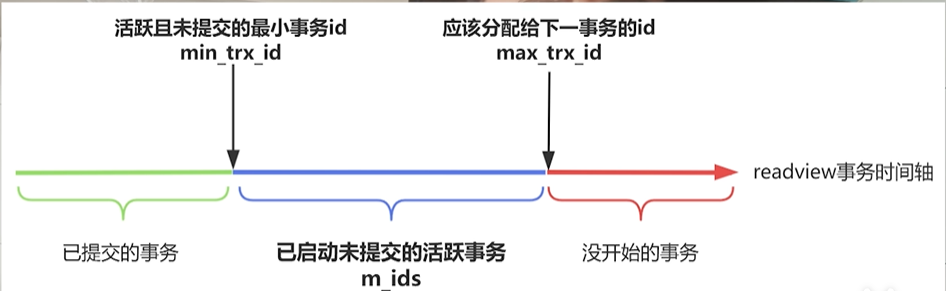

# MySQL

## 索引

### 为什么要用索引？

- 就像查字典一样，要先翻目录再去找数据，索引就是空间换时间的思想。索引是一种快速查找的数据结构，可以加快sql执行的速度，查询的时候不需要全表扫描。

### 索引用什么数据结构？

- B+树

- 查询的时候根据key去查对应的value，时间复杂度O(1)，常见的快速搜索数据的结构有哈希表，二叉排序树，平衡二叉树，红黑树，b树，b+树

- hash表很快，但是无法做范围查询，也没办法排序

- 二叉排序树的左子树小于根，右子树大于根，通过中序遍历就是顺序的数据，可以排序或范围查询，但是二叉排序树顺序插入的时候，会退化为链表，性能很差

- 为了避免二叉排序树极端情况下退化成链表，平衡二叉树通过旋转二叉排序树来降低树的高度使其平衡，左右子树高度差不大于1，但是由于平衡二叉树追求完美的平衡，频繁的左旋右旋去保持平衡，如果应用于数据库中，插入删除元素都要去频繁的旋转，会带来大量的磁盘IO，降低性能

- 红黑二叉树追求的不是追对的平衡，就可以减少磁盘IO，但是它还是二叉树，应用于数据库如果存大量的数据，就会导致树高非常高。树高会直接影响排序树的查询性能，需要多次的磁盘IO去查询，所以红黑二叉树其实适合存储少量数据的内存操作（这也就是hashmap链表树化的原理，一个树不会有太多节点，太多节点的时候已经扩容了，扩容之后树的结点会有分散）

- 所以尝试B树，B树是一种多路平衡排序树，B树一个节点可以有很多个孩子，解决了树高的问题，但是B树的节点又存数据又存索引，导致B树一个结点存不了多少索引，树高就会比较高，并且B树做范围查询的时候需要回溯整个树结构，效率很低，会有很多随机IO

- 所以尝试B+树，B+树在B树的基础上只有叶子结点存数据，非叶子节点只存索引值，B+树单个节点能存的索引值就更多，树的高度就更低了，查询性能更好。B+树的数据只存在叶子节点，并且数据之间是由双向链表连接，范围查询只需要遍历链表就可以了。

### B+树怎么存储数据？索引用法

- mysql索引从存储结构划分主要是两种：聚集索引和非聚集索引。聚集索引就是索引和数据一起存，非聚集索引是索引和数据分开存。主键索引就是聚集索引，它的非叶子节点都是索引值（主键id），叶子节点保存全部索引值和对应的行数据，而且主键在 B + 树中的存储特点，决定了主键应该自增插入，如果不自增，会导致页分裂，带来性能问题。

- MySQL 中的唯一索引、普通索引、前缀索引这些，就是二级索引，也叫非聚集索引。这种索引的非叶子节点存储索引值，叶子节点存储索引值和对应的主键 id，所以查询时，需要先根据索引列查出对应的主键 id，再根据主键 id 去查主键索引，进而查出对应的行数据，这个过程就叫回表。回表会降低查询效率，所以很多 SQL 优化就是要避免回表。

  - 不过查二级索引不一定会回表，如果只查 id，二级索引树的叶子节点就有 id，直接查二级索引树就行，没必要回表，以此提高性能。
  - 一个索引包含所有需要查询的字段值时，也可以不回表，这种情况叫覆盖索引，所以减少回表查询就要尽可能做到覆盖索引。
  - 如果一个索引列有多个字段，能大大增加覆盖索引的概率，这种索引就是联合索引。所谓联合索引，就是针对表中的多个字段创建的索引，比如对姓名、年龄两个字段建立联合索引，索引列就是姓名和年龄，树的叶子节点还挂了 id。要是执行 “select id, 姓名，年龄 where 姓名等于某个值” 这样的查询，就可以走联合索引，直接查到 id、姓名、年龄，避免回表，提升性能。所以减少回表查询的方式之一就是创建联合索引，而且要尽量避免使用 select *，因为 select * 会查询所有列数据，很容易触发回表。

  - 提到联合索引，就得讲一下最左前缀匹配法则。联合索引有多个索引列，排序时会根据索引列的顺序进行，查找时也会从左到右依次匹配。比如建立联合索引 ABC，MySQL 底层建 B + 树时，会先根据 A 排序，再根据 B 排序，最后根据 C 排序，所以查询时得先从 A 开始查。如果 A 不存在，那 B、C 就是乱序的；同样，如果 A、B 不存在，C 也一定是乱序的，没办法跳过前面的索引列去匹配，必须从左到右依次使用索引列匹配。这是因为，建一个联合索引（A、B、C）其实是建了三个索引（A）（A、B）（A、B、C）

  - 举几个例子，建立联合索引 ABC，查询条件是 “where a 等于 1 and b 等于 2”，显然会走索引，因为最左边的 A 和 B 都有；查询条件是 “where b 等于 2 and a 等于 1”，也会走索引，只要有 A 和 B 就行，书写顺序无所谓，MySQL 的优化器会自动把索引列重排序；查询条件是 “where a 等于 1 and c 等于 2”，会走部分索引，A 会走索引，但 C 的部分无法走索引，因为按照索引顺序，C 的左边是 B，查询时没有 B，C 就是乱序的；查询条件是 “where b 等于 1 and c 等于 2”，则完全不会走索引，因为 A 在最左边，B、C 的有序是建立在 A 有序的基础上，没有 A，就无法通过索引查找。

### 索引失效情况

- 联合索引不满足最左匹配原则
- select *
- 索引列参与运算
- 索引列使用函数
  - 索引列进行运算或者函数运算时也会让索引失效，因为 B + 树存的是索引值，一旦计算或使用函数，就无法确定它在 B + 树中的位置了
- 错误的like使用（模糊查询）
  - 模糊查询场景中，“name like ' 王 %'” 这种百分号在后面的尾部模糊查询，索引是生效的，因为索引从左往右匹配，“王” 是存在的，可以根据 “王” 去匹配；但如果是 “where name like '% 王 '” 这种头部模糊查询，索引就失效了，因为前面的数据缺失，从左往右匹配时没有起始数据，没办法搜索匹配。
- 隐式转换
  - 隐式类型转换会触发 cast 函数做转换，这就间接调用了函数
- or
  - 用 or 的时候，如果一边有索引、一边没索引，也完全没办法走索引，因为不能同时做索引扫描和全表扫描，所以会直接退化成全表扫描
- 两列做比较
  - 即便两列都有索引也无法走索引（本质是参与运算）
- order by + 非索引
- not in / not exist
  - not运算本质查询不存在的数据，但是索引本质是定位到需要的数据而不是查询所有数据，那优化器就会认为全表扫描更快
- IN 的值太多，优化器认为全表扫描更快
- mysql自己抽风
  - 本质上用索引还是全表扫描，mysql是通过计算两种方式的cpu+IO时间哪个更短决定的（比如查询热销商品订单，命中率很高，mysql可能认为全表扫描成本更低）

### 索引是否越多越好

- 不是，索引就像字典里的目录，要是加过多索引，目录会越来越多，占用的空间也越来越大，要是目录占用的空间都赶上正文了，那正文的意义就不大了，所以索引并不是越多越好。而且索引会降低增删改的性能，因为增删改数据时，还得同时更新对应的索引，所以索引既不是越多越好，也不是万能的。

- 那怎么加索引比较好呢？数据量比较大且查询频繁的表适合加索引；经常出现在 where、group by、order by 子句中的列适合建索引；增删改频繁的表就不适合加索引；区分度比较高的列也适合做索引，比如身份证号，而像性别这种区分度很低的列就不适合加索引，因为 B + 树里全是一边男、一边女的情况，加索引也提高不了效率。对于比较长的字符串，可以使用前缀索引；还要尽量多用联合索引，不用单列索引，因为联合索引很多时候能实现覆盖索引，避免回表，从而提升效率。另外，要注意一张表的索引不能太多，最多不要超过五个，不然会大大降低插入和删除的效率。

### 如何去优化查询

- 可以打开 MySQL 的慢查询日志，它会记录执行时间超过阈值的所有查询语句，这样就能找到需要优化的查询
- 使用 explain 执行计划对 MySQL 查询进行分析，查看查询是否走了索引、走了什么索引，然后针对性地做优化就行。

## 事务

- 事务就是一系列 SQL 语句构成一个逻辑上的整体，要么全部成功，要么全部失败。事务需要满足原子性（atomicity）、持久性（durability）、隔离性（isolation）、一致性（consistency），前三个实现了一致性就实现了

### 事务的原子性

- 把一系列操作变成不可分割的整体，不会出现一个成功一个失败的中间状态，这就是事务的原子性。原子性可以通过 undo log 回滚日志来实现，比如多个连续操作里有一个失败了，就能通过 undo log 把前面的操作全部回滚。

### 事务的持久性

- 可要是事务提交后数据库崩溃了，数据丢失了怎么办？这就需要保证事务的持久性，只要事务一提交，不管发生什么，数据库的修改都不能丢失。持久性是通过 redo log 实现的，每次事务提交后，都会把修改写入 redo log，即便 MySQL 数据没持久化到磁盘，也能通过读取 redo log 恢复数据，所以 redo log 保证了事务的持久性，也让 MySQL 有了崩溃恢复的能力。

### 事务的隔离性

- 脏读：一个事务读取到了另一个事务没提交的数据。比如事务 A 把商品库存从零改成 1，事务 B 读到是 1 就准备扣减库存，结果事务 A 回滚了，库存又变回 0，那事务 B 扣减库存的操作就会出问题

- 不可重复读：同一个事务中前后两次读取的数据不一致，比如事务 A 第一次读某个值是 1，事务 B 把这个值改成 2 并提交，事务 A 第二次读就变成 2 了。

- 幻读：幻读则是数据条数的增减，比如事务 A 查询 id 大于 100 的数据有 10 条，事务 B 又插入了 20 条符合条件的数据，事务 A 再查就变成 30 条了。幻读和不可重复读有点像，但不可重复读强调的是多次读取数据值不一样，幻读强调的是数据条数的增减。

### 事务的隔离级别

- 要解决这些并发问题，就得靠事务的隔离级别，数据库提供了四种隔离级别：读未提交、读已提交、可重复读、串行化。

- 读未提交是最低的隔离级别，每个事务都能看到其他事务未提交的数据，它解决不了脏读、不可重复读、幻读的问题，实际中根本不会用。

- 读已提交则是每个事务只能读到其他事务已经提交的数据，这样能解决脏读问题，因为其他事务没提交的数据读不到，但解决不了不可重复读和幻读的问题。

- 可重复读是 MySQL 的默认隔离级别，在这种隔离级别下，第一次读的时候会生成一份数据快照，生成快照后，其他事务的修改对当前事务来说是不可见的，因为每次都读这个快照，所以能保证同一个事务内两次读到的数据一样，解决了不可重复读的问题，但还是解决不了幻读的问题。

- 串行化是 MySQL 最高的隔离级别，它要求事务不能并发执行，只能一个接一个顺序执行，既然无法并发，那些并发问题自然就不存在了，不过串行化的性能很差，并发量高的时候可能会导致大量超时和锁竞争问题，通常也不会用。

- 事务的隔离级别越高，越能保证数据的一致性和完整性，但执行效率越低；隔离级别越低，执行效率越高，可数据的一致性就越差。那这四种隔离级别怎么实现呢？见mvcc

## MVCC

- 并发事务下会出现脏读、不可重复读、幻读问题。要解决脏读，就得用读已提交隔离级别，保证一个事务只能读到其他事务已提交的数据，没提交的就不让它读；

- 要解决不可重复读，就得用可重复读隔离级别，让一个事务第一次读取后，后面每次读的数据都和第一次一样。维护数据的多个版本，每个事务修改一次就生成一个新版本，让不同事务读不同版本。比如在 read committed（读已提交） 隔离级别下，让事务读已提交的数据版本，就能避免脏读；在可重复读隔离级别下，让事务每次读同一个版本的数据，就能避免不可重复读。

  - 就是把修改的数据版本记录到 undo log 日志里，然后给表加个隐藏的回滚指针字段，这个回滚指针指向 undo log 日志，再用回滚指针把历史版本串联成一个列表，想读哪个历史版本，沿着列表找就行。为了让一个事务查数据时，知道该读哪个版本，需要给每个事务分配自增的事务 ID，通过对比事务 ID 大小，能知道事务创建的早晚，再记录哪些事务提交、哪些没提交，让提交早的事务看不到提交晚的数据就行。所以还得给表加个隐藏字段，记录修改数据的事务 ID，谁修改的就记谁的 ID。

  - 除此之外，还需要一个read view，它有四个重要字段：creator_trx_id（创建当前 read view 的事务 ID）、m_ids（创建 read view 前，数据库活跃且未提交的所有事务 ID）、min_trx_id（创建 read view 时，数据库活跃且未提交的最小事务 ID）、max_trx_id（创建 read view 时，下一个新建事务该分配的 ID）。read view 的本质就是描绘了创建当前事务时，各种事务 ID 的一个数轴，通过对比数据版本的 transaction id 在数轴上的位置，就能知道这个数据版本对当前事务是否可见。

      

  - （分析数轴）如果数据的 transaction id 小于 read view 里的 min transaction id，说明这个数据版本在创建 read view 前就生成了，对当前事务一定可见；如果数据的 transaction id 大于 read view 的 max transaction id，说明这个数据版本是创建 read view 后才由某个事务生成的，对当前事务一定不可见；如果数据的 transaction id 在 read view 的 min 和 max transaction id 之间，就得看情况了 —— 要是这个 transaction id 在 m_ids 列表里，说明生成这个数据版本的事务还没提交，不可见；要是不在 m_ids 列表里，说明那个事务已经提交了，就可见。

  - 总结一下，MVCC 每次修改数据，会把修改的事务 ID 记录到隐藏字段，生成一个版本记录到 undo log 版本链里，回滚指针指向版本链，再通过对比 read view 和数据版本的事务 ID，判断数据版本对当前事务是否可见。说白了就是，undo log 记录数据版本，read view 判断可见性，这就是 MVCC 的核心逻辑。

### 通过MVCC实现隔离级别

- 读未提交，不用特意实现，多个并发事务同时执行，天然就是读未提交的状态

- 串行化通过加锁就行，只有拿到锁的事务才能执行，事务就串行化了。

- 可重复读：第一次 select 时生成一个 read view，之后每次读都复用这个 read view。因为生成 read view 时，哪些数据版本可见已经固定了，后续用同一个 read view 判断可见性，每次读的都是同一批数据版本，所以可重复读就是通过复用 read view 加 MVCC 机制实现的。

- 读已提交：本质是每次 select 都会生成一个新的 read view，每次读都用新的 read view，这样就能读到最新提交的数据版本了。

重点说说可重复读和读已提交。可重复读怎么实现每次读相同数据？它会在不过为了避免幻读，可重复读还会加锁，这个等会儿再说。

### 解决幻读问题

- 现在又有个问题，MySQL 默认隔离级别是可重复读，它能解决脏读和不可重复读，但幻读怎么解决？串行化能解决幻读，可性能太差不推荐，所以只能在可重复读隔离级别下想办法，这里分两种情况：快照读和当前读。

  - 先看快照读，在可重复读隔离级别下，执行普通 select 语句时，会通过 MVCC 读同一个数据版本，这就是快照读。普通 select 通过快照读避免加锁，每次都读快照，别的事务做了啥都读不到，只要读不到就不会幻读。但是不能永远读不到，比如开启事务后，别人插入了 id 为 1 的数据，快照读不到，以为 id 为 1 的数据不存在，就想插入，那就会出问题，因为插入这种操作必须读最新数据才能判断能不能插，这就是当前读。像执行 select for update、select in share mode，或者增删改操作，都必须读最新数据，这就是当前读。

  - 那当前读下，其他事务插入数据还是会产生幻读，所以执行当前读时，MySQL 会用间隙锁锁住数据和数据之间的间隙，加锁后别人就不能插、不能改了，只要不让别人操作，就不会幻读。举个例子，执行 “select 字段 from 表 where id> 100 for update”，这是当前读会加锁，MySQL 会锁住 id 等于 100 的数据，不让其他事务修改，还会锁住 100 到正无穷的区间，不让插入 id 大于 100 的数据，这样就不会幻读了。所以在可重复读隔离级别下，是通过 MVCC 快照读加当前读加锁的方式避免幻读的。

  - 但这样也不能完全避免幻读。MVCC 加锁只能避免大多数幻读，极端情况还是会出现，比如先快照读再当前读的时候。举个例子，事务 A 用普通 select 查 id=1 的数据，因为是快照读，没查到；然后事务 B 插入 id=1 的数据并提交（这个时候A没有当前读，所以没加锁）；事务 A 再用普通 select 查，还是快照读，依然没查到；可要是事务 A 用 select for update 当前读去查，就能查到 id=1 的数据，这就出现幻读了。

  - 再举个更诡异的例子，系统里用户名不允许重复，给用户名加了唯一索引。一般会先查用户名是否存在，不存在才让添加。事务 A 查用户名为 “AA” 的数据，快照读没查到；然后事务 B 插入 “AA” 并提交；事务 A 再插 “AA”，插不进去，提示已存在；可事务 A 再用普通 select 查 “AA”，还是快照读，依然没查到 —— 明明查不到，却插不进去，这就是幻读。更奇怪的是，事务 A 还能直接 update “AA” 的数据，改完之后再查就能查到了，这也是先快照读再当前读产生的幻读。（以上两个例子都是由于有另一个事务插入数据产生的幻读）

  - 那怎么解决这种幻读呢？其实根本是要保证，在一个事务操作某张表数据时，不让另一个事务新增或删除这张表的数据。在可重复读隔离级别下，要么给表加表锁，要么给数据加行锁。比如用 select for update，如果 where 条件里没有索引列，就会加表锁，加了表锁后，其他事务插入数据就会阻塞，不让插就不会有幻读；如果 where 条件里有索引列，就会加行锁，比如 “select 字段 from 表 where id>5 and id <10”，会用间隙锁锁住 5 和 10 这两条记录，还会锁住 5 到 10 之间的间隙，6、7、8、9 也不能插，只要不让插，就不会幻读。

## 日志

### undo log

- 基于MySQL的事务，事务有原子性这个特性，执行一系列SQL要么全成功，要么全失败，要是后面的SQL失败了，已经执行的操作也得回滚。每修改一次，就把原始数据保存下来，再用回滚指针把不同版本串起来，这就是undo log版本链。事务执行时修改数据，MySQL会把旧数据记录到undo log里，事务正常提交就结束，要是因为异常或者手动回滚，就通过undo log找旧版本数据回滚，所以undo log能保证事务的原子性。

### redo log

- MySQL数据存在磁盘上，但每次从磁盘读写数据太慢了。和写业务代码时加缓存、CPU用三级缓存一个道理，MySQL也设计了缓冲池，叫Buffer Pool。MySQL存数据是以页为单位的，一个页16KB，每查询一条数据，会把硬盘上对应页的数据加载到Buffer Pool里。

- 查一条数据把这一条放缓存不就行了，为啥要把整个数据页读进来？这是因为操作系统里的空间局部性原理，一个内存位置被访问后，未来附近的内存位置很可能也会被访问，比如代码里常用的数组，访问了第一个位置，大概率会访问后面的；还有管理系统分页展示数据，看完一页会点下一页，刷抖音、小红书也是连续翻页。所以MySQL一次把一个页的数据放入Buffer Pool，对取连续数据来说命中率更高。后续取数据先从Buffer Pool里找，没有再去磁盘读；写数据也先写入Buffer Pool，不立刻刷盘，而是把修改的页标记为脏页，之后由后台线程在合适的时候把脏页刷盘。

- Buffer Pool在内存里，数据没立刻刷盘，要是MySQL挂了，数据不就丢了？这时候redo log就派上用场了。MySQL每次对磁盘页做修改，都会把修改记录到redo log里，事务提交后就刷盘。要是Buffer Pool里的数据没刷盘就宕机了，就能读redo log恢复数据，所以redo log能保证事务的持久性，让MySQL实现崩溃恢复。

- 为啥修改Buffer Pool后不直接刷盘，反而写redo log再刷redo log呢？因为Buffer Pool刷盘是随机IO，得找到对应的磁盘页修改，磁盘操作本身就慢，随机IO就更慢了；而redo log只记录磁盘位置和对应的修改，刷盘时只要往日志文件后面追加就行，这是顺序IO，磁头往一个方向移动就好，不用找磁盘页，速度快。而且redo log记录的是数据页的物理修改，不是直接记录数据，只要redo log刷盘了，就算MySQL崩溃也能恢复数据，事务持久性就有保障了。（后续刷数据页到磁盘阶段：Buffer Pool 里的数据最终还是要刷回磁盘，此时刷盘依然是 随机 IO（因为数据页物理位置分散）。但此时事务已经提交了（因为 redo log 已经写完），刷数据页可以异步延迟执行（不影响事务的 “即时可见性”）。）

- 不过redo log也不是直接写入磁盘的，它有自己的缓存，叫redo log buffer，redo log会先写入这个缓存，之后再统一刷盘到磁盘。MySQL里有个`innodb_flush_log_at_trx_commit`参数控制redo log的刷盘时间，参数为0时，事务提交只把redo log放到缓存，不刷盘，很危险（在缓存，mysql宕机数据就丢失）；为1时，事务提交会把redo log刷入磁盘，刷盘完成才告诉客户端执行成功，这样只要事务完成，就算MySQL崩溃，数据也不会丢，一般建议设为1；为2时，事务提交会把redo log写入操作系统的文件缓存（page cache），操作系统再在某个时间把数据真正写入磁盘，只要操作系统不崩溃能保证持久性，可电脑突然断电数据还是会丢。

### bin log

- 做数据库备份恢复、主从复制，能用redo log吗？删除数据后老板能用redo log恢复吗？不行。因为redo log是循环写的，日志空间大小固定，写满了就从头开始写，边写边擦除，只能记录事务提交后没被刷盘的数据，已经刷盘的会慢慢从redo log里擦掉。它是事务级的数据记录，不是数据库级的，只能恢复因断电或数据库故障导致Buffer Pool里没刷盘的数据，没法做数据库全量恢复。

- 那要做备份恢复、主从同步该用啥呢？其实只要对MySQL做了变更，不管是数据增删改还是表结构调整，都会记录一个日志，就是bin log。redo log是循环写，bin log是追加写，记录的是全量日志，所以更适合备份恢复和主从复制。另外，redo log是物理日志，记录数据页上的修改；bin log是逻辑日志，记录的内容类似SQL语句本身。和redo log一样，bin log也有对应的缓存，叫bin log cache，事务执行时会先把bin log日志写到这个缓存里，事务提交时再刷到磁盘。

### 两阶段提交

- 事务提交后，redo log和bin log都要刷盘，要是一个刷盘成功，另一个失败，两份日志就不一致了，该怎么办？为了解决这个问题，MySQL把redo log的写入拆成了prepare和commit两个步骤，这就是常说的两阶段提交。整个执行流程是这样的：第一步开始事务，第二步更新数据，第三步写入redo log，此时redo log处于prepare阶段，然后事务提交时写入bin log，最后把redo log设置为commit阶段。

- 要是写入redo log异常，也就是prepare阶段出问题，那redo log和bin log都没成功，直接回滚事务，事务相当于没提交

- 要是写入bin log异常，MySQL通过redo log恢复时，发现redo log在prepare阶段且没有对应的bin log日志，也会回滚事务

- 要是把redo log设为commit阶段时异常，MySQL会发现redo log在prepare阶段但能找到对应的bin log日志，就认为两者一致，数据完整，直接提交事务。所以两阶段提交最终还是看bin log，只要bin log刷盘了，就能提交事务。

## SQL执行过程

- 你妈让你去买西红柿，这得经历哪几步？
- 第一步，你妈得先联系到你，再把买西红柿的指令传给你。

  - 对应到执行 SQL 上，就是你得先连上数据库，通过网络把 SQL 传过去，数据库才能帮你执行，这就涉及到了连接器。连接器负责客户端和数据库的连接，主要有三步：第一步通过 TCP 三次握手和数据库建立连接，第二步校验客户端的用户名和密码，不对就报错，第三步做权限校验，看当前用户有没有访问这个数据库的权限。

- 现在你接到买西红柿的指令了，下一步是直接去买吗？肯定不是啊，你得先看看家里有没有剩的西红柿，有就不用买了，没有再去买。

  - 这对应到 MySQL 里，就是第二个环节 —— MySQL 每次查询出结果，都会以 SQL 语句为 key、查询到的数据为 value 存到缓存里。所以 MySQL 每次收到查询 SQL，都会先去缓存里看看这条 SQL 是不是执行过，要是执行过相同的 SQL，直接从缓存拿数据就行，不用重复执行。

  - 为什么需要查询缓存？根据操作系统程序的时间局部性原理（与前面的空间局部性原理区分） —— 当某段代码或某条指令被执行，或者某块内存地址被访问时，它们很可能会被再次执行或访问。因为代码里常有大量循环、递归操作，导致某段指令重复执行，SQL 也一样，执行过的 SQL 未来有可能再次执行，这就是做 SQL 缓存的原因。

  - 但是 MySQL 8.0 却把查询缓存去掉了，为啥？因为表的数据一旦变化，之前 SQL 执行的结果可能就不一样了，这时候就得删除缓存；而且很多时候 SQL 的 where 条件会变，哪怕条件只差一点，也走不了缓存，导致查询缓存的命中率其实不高，所以 MySQL 8.0 就把它去掉了。

- 当你发现家里没有西红柿，下一步就要分析自己想不想吃西红柿 —— 不想吃就告诉你妈，想吃就琢磨吃多少、买多少。

  - 这对应到 MySQL 里，就是解析器的工作。解析器主要做三件事：第一步是词法分析，拆分 SQL 里的关键字，比如把 select、from、where 这些拆出来；第二步是语法分析，判断 SQL 语法对不对，不对就报错，对了就构建语法树，有了语法树，后面拿表名、字段名就方便了；第三步是检查表和字段是否存在，不存在的话肯定要报错。

- 等你知道要买西红柿，也知道买多少了，接下来就得做计划 —— 去哪里买、坐什么交通工具去，这样才能知道怎么买最快、最好。

  - 这对应到 MySQL 里，就是优化器的环节。优化器会给 SQL 制定执行计划，确定怎么执行最快，比如是走索引还是全表扫描，走索引的话选哪个索引最好。

- 计划做好了，比如你确定坐车去最近的菜市场买西红柿，接下来就要真正行动了 —— 坐车过去，和卖西红柿的大妈沟通，最后拿到西红柿。

  - 这对应到 MySQL 里，就是执行器的工作。执行器会和存储引擎交互，执行 SQL，然后从存储引擎中拿到数据返回给客户端。

- 总结一下 SQL 的执行流程：第一步是连接器负责客户端和数据库连接，第二步是查询缓存，检查之前是否执行过相同 SQL，对应你查看家里有没有西红柿，不过 MySQL 8.0 已经去掉了这个环节；第三步是解析器，判断 SQL 语法是否正确、明确 SQL 要做什么；第四步是优化器，给 SQL 制定最优执行计划；第五步是执行器，实际执行 SQL 并返回数据。

### SQL 执行顺序vs编写顺序

- SQL 实际执行顺序和编写顺序完全不一样。写 SQL 时是 “select 字段 from 某张表 where 条件 group by 分组 having 分组后筛选 order by 排序 limit 限制条数”，但实际执行时，是先执行 from 找到对应的表，再执行 where 对全表数据筛选，接着用筛选结果做 group by 分组，然后通过 having 对分组后的数据再次筛选，之后执行 select 获取对应字段，再用 order by 排序，最后用 limit 限制返回条数。
