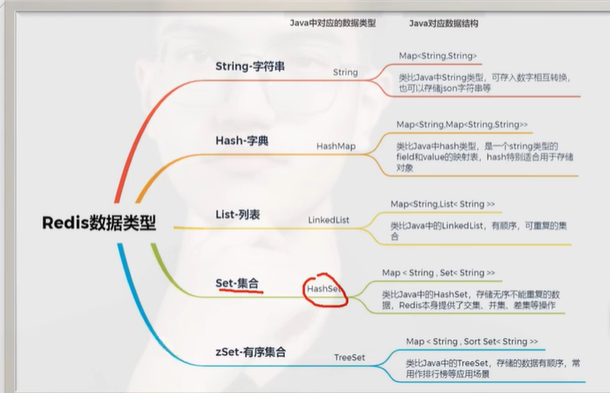

# Redis

## Redis五种数据结构

- String：最常用的是缓存对象，这没什么好说的；第二，可以用 setnx 实现分布式锁；第三，能实现共享 session，用户登录时生成一个 token，以 token 为 key、用户信息为 value，设置过期时间存到 Redis 里，用户一段时间没访问系统就过期失效，需要重新登录，只要用户一访问，就通过拦截器给 token 续期，这就是共享 session；第四，String 的原子性自增操作能做计数器，比如记录网页访问量、视频播放次数，以网页路径或视频 ID 为 key，次数为 value，访问一次就自增一次，实现记录器的效果；第五，还能做计数器限流，针对 IP 或接口限流，以 IP 或接口路径为 key，访问次数为 value，访问一次自增一次，当达到阈值比如每分钟超过 120 次就拒绝请求，但这种计数器限流有个问题，在两个分钟的交界处会允许两倍流量，比如第 60 秒来 120 个请求，第 61 秒又来 120 个请求，计数器限流是拦不住的。

- Hash：哈希结构，它可以理解为能存多组 KV 的 String。首先，哈希结构能存对象，如果要分开存储对象的不同字段，或者精细修改某个对象的某个属性，用哈希非常合适；第二，能做购物车，以用户 ID 为 key，商品 ID 为 field，商品数据为 value 来构建购物车；第三，还能做动态配置管理，不过只能做简单的，比如功能开关、动态参数管理，以某个配置名称为 key，功能为 field，true 或 false 为 value，相当于把 Redis 当成简单的配置中心，但 Redis 基于内存，没那么可靠，配置发布变更也没有权限管控，比较危险，最好用 Nacos 或阿波罗这种专业配置中心，要是系统不想引入太重的组件，只用 Redis 做简单配置也完全可以；第四，能做多维数据统计，比如记录不同地区的视频访问量，以视频 ID 为 key，地区为 field，访问次数为 value，访问一次自增一次，就能实现不同地区视频访问量的记录。

- List：它其实是个双端队列，有序可重复，既能当先进先出的队列用，又能当后进先出的栈用。首先，List 可以实现简单的消息队列，消息生产者用 LPUSH 把消息推到 List 里，消息消费者用 BRPOP 阻塞式读取数据，要保证消息不重复处理、保证幂等性，就给消息分配唯一 ID，消费者保存处理过的消息 ID 避免重复消费。用 List 做简单消息队列整体能用，但没办法做消息持久化、死信队列，也不能让多个消费者消费同一条消息，要是系统小、不想引入重的 MQ，用 List 做消息队列能满足基本需求；如果 Redis 版本高，能用 Stream，它是 Redis 高版本专门做消息队列的工具，功能更丰富，更像完整的消息队列，不过也是内存式的，没办法做持久化，和正式 MQ 比还有点缺陷，但整体好很多，不想引入重 MQ 的话，完全可以用 Stream 或 List；第二，List 还能做简单的实时消息流，比如以用户 ID 为 key，消息 ID 为 value 存入 List，有人发帖子或朋友圈就放到对应用户 ID 的 List 里，用户打开朋友圈时，从 List 读取数据显示到页面。

- Set，它是无序无重复的集合。首先，Set 能做抽奖系统，把奖品 ID 放到 Set 集合里，不允许重复中奖就用 SPOP 随机移出一个元素当奖品，允许重复中奖就用 SRANDMEMBER 随机获取一个元素当奖品；因为 Set 无序无重复，还能方便做数据去重；而且 SISMEMBER 查询命令的时间复杂度是 O (1)，做白名单判断数据是否在白名单里也非常不错；Set 还能做点赞，以帖子或朋友圈 ID 为 key，点赞用户 ID 为 value 存入 Set，谁点赞就放入对应 Set 集合；另外，Set 支持交集、并集、差集操作，适合做共同好友、共同兴趣，比如以用户 ID 为 key、好友 ID 为 value 存入 Set，求交集就能获取共同好友，以用户 ID 为 key、兴趣标签为 value 存入 Set，不同用户求交集就能计算共同兴趣。

- ZSet，它的特点是有序无重复，每个元素都有一个 score 用于排序，适合需要排序的场景。首先，最常用的是做排行榜，比如积分排行榜、步数排行榜，以积分为 score，用户 ID 为 value 存入 ZSet，用 ZRANGE 能从小到大获取 Top N，用 ZREVRANGE 能从大到小获取 Top N；第二，ZSet 适合做滑动窗口限流，比如针对 IP 限流，以用户 IP 为 key，请求时间戳为 score，请求 ID 为 value 存入 ZSet，能统计一分钟内某个 IP 的请求次数，超过阈值就限流；第三，ZSet 能保存用户浏览记录，以用户 ID 为 key，时间戳为 score，帖子为 member 存入 ZSet，能按时间范围快速做分页查询；第四，ZSet 还能实现在线用户列表，以用户活跃时间戳为 score，用户 ID 为 value 存入 ZSet，能按登录时间排序、查询，还能实现用户提前下线的功能。

  

## 缓存击穿、穿透、雪崩

### 缓存击穿

- 有一个高并发访问的 key 突然过期失效了，那大量的请求就会去访问数据库，给数据库带来非常大的压力，甚至把数据库直接压垮。缓存击穿有很多种解决方案，有的公司甚至直接搞了一个中间件或者框架来解决这个问题。

  - 第一种常规的互斥锁方案，其实就是加分布式锁。多个请求同时访问时，拿到锁的请求才能够去访问数据库、更新缓存，拿不到锁的请求就阻塞等待。这里还要再做一个双重检测锁的机制，等锁释放之后，其他请求拿到锁，先检查一下缓存中有没有数据，有数据就直接返回。总之，就是保证对于同一个key只能有一个请求去访问数据库、更新缓存。这种互斥锁的方案数据一致性比较强，但因为有阻塞等待，性能就没那么好。

  - 于是就有了第二种方案，叫逻辑过期。它设置缓存为永不过期，然后在数据内部维护一个过期时间。请求来了之后拿到数据，判断数据内部的这个过期时间是否过期，要是过期了，就去拿锁，拿到锁的线程开启一个新线程异步更新缓存，其他所有请求直接返回旧数据就行。这种方案数据一致性比较差，但不用阻塞等待，性能更好。

  - 第三种是中间件或者框架类的解决方案，比如快手内部有一个 RPC 服务叫 Cache Setter，它通过一致性哈希，让查询同一个 key 的请求都路由到同一个 Cache Setter。Cache Setter 内部维护了一个 ConcurrentHashMap，这个 map 的 value 是一个 CountDownLatch。当出现缓存 miss（查不到）的情况，就从 map 中拿出一个 CountDownLatch 尝试获取，拿不到就说明当前是第一个 key miss 的请求，然后给 map 中放一个 CountDownLatch，接着去更新缓存。后续的请求过来，会从 map 中拿到这个 CountDownLatch，然后被 await 方法阻塞住。当第一个请求更新完缓存之后，调用 CountDownLatch 的 countDown 方法，其他线程就解除阻塞了，之后就能直接从缓存中拿数据。这种方案和互斥锁方案很像，只不过它不是通过分布式锁阻塞请求，而是通过一致性哈希和 map 中的 CountDownLatch 阻塞相同 key 的请求，保证只有一个请求能访问数据库，还避免了使用复杂且性能开销更大的分布式锁，分布式锁还有锁阻塞、锁丢失等问题。

  - 除了 Cache Setter 这种方案，还有某东的 Jd Hot Key 方案，它通过检测出热点 key，然后直接把这个热点 key 放到本地缓存中，以此来解决缓存击穿问题。

### 缓存穿透

- 缓存穿透就是说请求的数据在数据库和缓存中都不存在，那么请求就会直接去访问数据库，对数据库造成很大的压力，甚至把数据库直接压垮。

  - 解决缓存穿透，首先要对非法的请求参数做好校验，直接拦截一些非法请求，比如对异常用户或者异常 IP 做限流，或者设置一个黑名单，尽量在网关或者请求检查这一步就把这些非法请求拦住

  - 然后是缓存空值，对于数据库查不到的 key，缓存一个空数据，并且设置一个比较短的过期时间，避免后面数据库中增加了该数据，却因为缓存空值导致查不到。

  - 但如果每个请求查询的 key 都不一样，缓存空值就失效了，这个时候就要用布隆过滤器。写数据库的时候，同时往布隆过滤器里写数据，请求来的时候，通过布隆过滤器快速判断数据是否存在。

    - 布隆过滤器的原理：把数据经过多个哈希函数计算，得到多个哈希值，然后把这些哈希值映射到一个 BitMap 里，把对应的位置置为 1。请求来的时候，对请求的数据用同样的多个哈希函数计算，然后看这些哈希值对应的 BitMap 位置上是不是 1，是 1 就说明数据可能存在，是 0 就说明数据库中一定没有。不过布隆过滤器的缺点也很大，一个是有误判的可能，另一个是不支持删除操作，数据库对数据做了删除，布隆过滤器没办法同步这个删除操作，所以会有问题。

    - 布隆过滤器特点是：说存在的可能存在，说不存在的一定不存在

    - 要降低误判的概率，本质上是降低两个数据经过若干hash函数后得到的一系列结果依然相同的概率。可以通过增加bitMap位数长度和增加hash函数个数来实现。

### 缓存雪崩

- 缓存雪崩是说在同一个时间有大量的 key 同时失效了，或者 Redis 干脆宕机了，导致大量请求去访问数据库，进而导致数据库宕机。

  - 大量 key 同时过期的情况

    - 第一种解决方案是在固定的过期时间上再加上一个随机数，让这些数据不会在同一个时间同时过期，这样就能一定程度上避免大量 key 批量过期的情况。

    - 第二种方案针对那些几乎不太变化的数据，比如城市信息这类数据，不设置过期时间，只要不设置过期时间，就不会出现同时过期的情况，如果要修改这些数据，异步删除或者更新缓存就行。

    - 第三种方案是针对能够预知到的热点数据做缓存预热，保证在业务高峰的时候这些数据不会过期。

  - 针对Redis 宕机、内存不够导致大量热点数据被淘汰，或者缓存中进入大量冷数据导致热点数据被淘汰，又或者是机房被洪水淹了这种不可抗力导致的缓存雪崩问题，该怎么解决呢？

    - 针对 Redis 宕机，就要做好 Redis 高可用，该做主从的做主从，该上集群的上集群，做好多机房容灾，比如同城双活、异地多活这些。然后针对不可控的意外情况，要做兜底措施，万一真的发生缓存雪崩，做好服务的降级、限流、熔断这些保护措施，避免缓存雪崩导致服务被打垮。（1.redis集群 2.多级缓存，本地缓存+redis缓存）

## Redis数据持久化是怎么做的？

- RDB（快照持久化）：在指定时间间隔内将内存中的全量数据通过二进制序列化的方式，将快照写入磁盘

  - RDB的过程中，主进程会先fork一个子进程进行备份，子进程会将redis内存里的数据写到一个临时的RDB文件，然后用这个文件去替换掉旧的RDB文件。在这个过程中主进程不参与IO，主进程会继续处理客户端的请求，主进程会通过COW机制从内存拷贝一个副本来处理新的写操作，等RDB结束，根据该内存副本更新内存。

  - 用户通过save x y的方式主动配置RDB的频率，表示在x秒后如果至少有y个key发生了变化就自动触发bgsave（异步）命令创建快照执行RDB；用户也可以通过save命令手动触发同步保存操作，但是这会阻塞RDB主线程

  - RDB的特点是性能高、速度快、文件紧凑，因为存的是快照，是二进制序列化文件，但是可能会丢失数据，因为基于配置触发RDB，中间是存在时间间隔的，如果在这个过程中出现了宕机，那就会导致这段时间写入的数据丢失

- AOF：将每条写入redis的命令写入到一个日志文件中，redis重启的时候通过回放AOF日志的所有写入指令来重新构建整个数据集

  - AOF过程中，针对客户端的写命令，Redis会将写命令写入一个AOF缓冲区中，缓冲区周期性将数据写到操作系统内核缓冲区，操作系统刷盘到AOF日志文件中，周期性基于用户配置，
    - 可以配置为always：每次执行完写命令就去刷盘AOF，保证数据不丢失但是性能低；
    - NO：每次执行完写命令，先把这个命令写到操作系统内核缓冲区，Redis不做主动刷盘，操作系统自己决定在某个时间刷盘，性能高但容易丢失数据；
    - EverySec：先写到内核缓冲区，每隔一秒刷盘（折中）。
  - 刷盘后，AOF日志通过自身的重写，对日志进行瘦身（仅保留有效命令，删掉冗余命令，如几条针对同一个key的写命令，仅保留最后一条）。Redis重启后，通过加载AOF日志文件来恢复数据，重上往下执行命令

  - AOF的特点是数据更加可靠，保存的是命令，可以回放写操作，但是因为保存的都是set命令，相比于RDB的二进制文件，AOF的日志文件就比较大，此外AOF的恢复速度较慢，因为它需要逐个读取日志中的写命令。

- 兼顾RDB数据恢复快+AOF数据不容易丢失的方案：混合持久化方案，做RDB重写的时候把当前内存里的数据以RDB方式写入到AOF文件中，把后面的新命令以AOF的形式写道AOF文件中，重写后的二级制文件前半段是RDB数据，后半段是AOF命令。

## Redis集群介绍一下

- 主从集群：主节点对外提供读写操作，并将数据同步到从节点，从节点对外进行读操作，主节点挂了之后，可以手动部署从节点成为新的主节点，其他的从节点（包括重启后的原主节点）都会变为新主节点的从节点，将主从节点部署在不同服务器上可以提高redis的可用性和读性能。不提供自动容错、恢复功能。

  - 主从复制：主节点将RDB文件传给从节点使其同步大部分数据，同步过程中的新写入数据会存入主节点的缓冲区中，RDB同步结束后将缓冲区数据同步到从节点，通过这种方式实现redis读写分离，提升数据查询效率。

  - 增量复制：主从在完成全量数据的复制后，主节点会和从节点维护一个tcp长连接，后续主节点收到的新增数据就会基于这个长连接异步发送给所有的从节点

- 哨兵集群：哨兵sentinel用来监听redis主从集群，监控主从节点的状态，一旦master节点出现故障，会自动从剩下的从节点中选举出新的master节点，并且继续监视挂掉的节点，当挂掉的节点重新上线，哨兵将其设置为新的从节点。解决了故障转移问题

  - 哨兵会和主节点维持一个心跳，通过发送ping命令，主节点是否回应来判断主节点是否故障

  - 如果一个哨兵节点认为master节点出现故障，称为主观下线，当半数以上哨兵确认后，该结点为客观下线触发选举。

  - 脑裂：由于网络问题，部分哨兵无法和主节点通信，导致触发了故障转移机制，选举了新的主节点，此时redis存在两个主节点，两个主节点都有数据的写，导致数据不一致。

  - 哨兵个数确定：至少设置3个哨兵，否则一旦一个哨兵宕机，故障转移机制无法完成，并且哨兵数量应为奇数，确保在出现故障或脑裂情况时，哨兵可以继续进行决策

- 分片集群（redis cluster）：分片集群是多主多从的结构，实现redis的分布式存储，每个节点存储不同的数据，实现分片功能。引入slot槽，存key时，redis会根据key去计算得到slot的值，找到对应节点进行数据读写，解决了在线扩容、故障转移问题

  - 针对key，对key进行CRC16算法，再对16384取模，得到slot的值。没有直接按节点个数取余是因为，按节点个数取余，一旦有节点宕机，算法会变的很紊乱，也会影响后续数据的分布。

  - 但是redis cluster中的多个主从架构的从节点是冷备节点，不提供分担读写操作的压力，并且客户端的实现会更加复杂，对redis批量操作会有一定限制

## Redis分布式锁

- redis setnx指令实现互斥，加锁就需要解锁，解锁就需要判断释放的是否是当前线程的锁，避免释放错锁，先判断再释放，判断+释放是两步操作，需要保证原子性，因此通过LUA脚本来实现原子性。setnx指令不需要放到lua脚本里，是因为setnx是单个命令，redis在执行命令的时候是单线程的，天然保证了原子性。一个线程拿到锁之后如果挂了就无法释放锁，因此需要给锁设置一个过期时间，即便线程挂了也能释放锁。如果线程任务没有执行完，锁超时自动释放了，这个时候有其他线程来拿锁就不行了，因此引入了看门狗机制，保证业务执行期间锁不会自动释放，如果业务线程挂了，看门狗线程一直在给锁续期，锁还是无法释放，因此需要将看门狗线程设置为一个守护线程，守护线程的生命周期依赖于业务线程，如果业务线程挂了，JVM会自动终止守护线程。

- 可重入：分布式锁也需要实现锁的可重入，设计可重入锁有几个方案

  - 通过redis的哈希结构，要锁的东西为key，线程id拼uuid为field，重入次数为value，重入一次就加一次，value就可以充当锁计数器，这也是redission的实现方案（redission底层用的是哈希结构，是hsetnx，不是setnx）。用线程id拼uuid是因为在集群环境下，线程id是可能重复的，需要拼接uuid保证唯一性

  - 在redis采用的是String结构，并且在服务内部维护一个concurrentHashMap，Map中的value作为锁计数器，重入一次加一次

- 锁阻塞：当线程没有拿到锁，选择等待一会儿重新抢锁，而不是直接返回失败。分布式锁同reentrantLock，也可以通过不断自旋的方式重新抢锁。

  - 但redission底层不是这么实现的，它使用的是redis的订阅发布机制，没抢到锁的线程会订阅一下锁，然后阻塞住，抢到锁的线程会在执行完任务后发布一条消息，之前订阅的线程就能收到消，被重新唤醒去抢锁，这一次没抢到锁的线程又继续订阅，重复上述过程。为避免抢不到锁无限等待，这个过程会设置一个超时的时间来进行控制。

- 主从架构带来的锁丢失问题：如果redis一主多从，当setnx写到主节点，主节点还未来得及将数据同步到从节点就挂了，那某一个从节点会变成新的主节点，新的主节点没有锁的数据，但是服务器认为加锁成功了。

  - 解决方式：redission有一个联锁机制，联锁要求redis集群部署多主/多主多从，每次加锁需要给所有的主节点都加上锁才算加锁成功。但是如果一个主节点网络延迟很大加锁很慢，或者主节点挂了一直加锁失败，就会导致整体加锁失败，失败概率更高，失败后还要回滚所有redis主节点的数据，性能很差。因此redis官方提出了一种红锁（red lock）机制，要求redis部署多个主节点，但只要求半数以上的主节点加锁成功。因为当某个线程加锁做到半数以上节点加锁成功，其他线程就不可能做到半数以上加锁成功。

  - 红锁的局限性：red lock对加锁时间有很严格的要求，某个节点如果一定时间内加不上锁就不等了，但是不同节点的系统时钟有可能出现不一致，就还是有可能出现问题，并且java中的gc会暂停线程，导致看门狗无法对锁进行续期，锁就会过期，红锁此时认为加锁失败。而且红锁需要部署多个主节点、运维复杂、保证多主节点的数据一直性。因此红锁其实并不常用。

## 如何保证缓存的数据一致性？

### 缓存更新策略

- 第一种是 Cache-Aside 旁路缓存，我们平时业务中用 Redis 基本都是这种策略。旁路缓存的逻辑是，读数据时先从缓存里读，读不到再从数据库读，然后把数据写入缓存；写数据先写数据库，再写缓存。旁路缓存的特点是业务代码既要操作缓存又要操作数据库，以数据库的数据为主，缓存只是暂时存储数据。

- 第二种是 Read-Through（读穿）和 Write-Through（写穿）模式，它们的设计思想是不直接操作数据库，只操作缓存，让缓存自身去和数据库交互。读穿就是每次读数据都读缓存，有数据就直接返回，没数据的话缓存会自己从数据库读数据并写入缓存，之后我们只需要操作缓存，读写数据库的工作都由缓存中间件完成；写穿则是每次写数据直接写缓存，缓存自己去更新数据库，同样我们只操作缓存，读写数据库交给缓存处理。

- 第三种是 Write-Back（写回），也有叫异步写缓存的。写回和读穿、写穿的思路类似，也是只操作缓存，让缓存自身操作数据库，但不同的是，写回是批量、异步地把缓存更新写入数据库。也就是说，写操作只更新缓存，之后由后台线程异步、批量地把缓存里的更新同步到数据库。这种策略很适合写多读少的场景，但因为是异步写数据库，要是突然宕机，会有数据丢失的风险。

- 无论是读穿、写穿还是写回，目前我们业务中用的缓存，像 Redis、Memcached，或是其他大厂自研的缓存中间件，都没有提供缓存自身和数据库交互的功能。

### 保存数据一致性

#### 加分布式锁

- 只要更新数据库和更新缓存不是原子操作，在并发环境下有其他线程介入，就会出现不一致。要是能保证这两个操作的原子性，就能实现强一致性。这时候可能会想到加锁，比如加分布式锁，只有拿到锁的线程才能更新数据库和缓存，这样确实能保证强一致性，但代价是不能并发写了，写操作多的时候会有性能问题，而且分布式锁本身也有很多难以解决的问题。

另一种思路：不加锁，用删除缓存替代更新缓存

- 既然加锁影响性能，那有没有更好的方案？不更新缓存，而是删除缓存。为什么选删除缓存而不是更新缓存呢？因为删除缓存的代价肯定比更新缓存低。缓存里的数据大多需要多表联查、聚合计算之后才能写入，这个过程比直接删除麻烦多了；而且要是更新了缓存之后，数据一直没被访问，之后又更新了数据库，还得再更新一次缓存，特别费劲。所以缓存最好是在查询的时候再写，更新数据库的时候直接删除缓存就行。

#### 删除缓存 + 更新数据库 -> 延迟双删

- 那试试先删除缓存再更新数据库的操作：请求一删除缓存，请求二读缓存没读到，就去读数据库拿到值 B，然后请求一更新数据库为 A，接着请求二把缓存写成 B，最后缓存和数据库还是不一致。这时候可以试试延迟双删，就是先删除缓存，更新数据库，然后线程等一会儿再删一次缓存。

  - 为啥要等一会儿？是为了让其他线程能在这段时间里完成读数据库、写缓存的操作，之后再把缓存删掉，避免不一致。可问题是，延迟多久合适呢？这得考虑当时的网络情况、服务器负载、数据库负载等因素，没有固定答案，所以这个方案也不是绝对可靠。

#### 更新数据库 + 删除缓存

- 那再换个思路，先更新数据库再删除缓存。请求一读缓存发现数据过期没读到，就去读数据库拿到值 A，这时候请求二过来更新数据库为 B，然后请求二删除缓存，之后请求一写缓存为 A，缓存和数据库还是不一致。

  - 不过这种情况的概率非常低，得满足两个条件：一是缓存刚好过期，同时又要更新数据；二是请求二更新完数据库、删除缓存之后，请求一才写入缓存，也就是写缓存的速度慢于更新数据库加删除缓存的速度，这种情况概率很小（请求一写缓存的时间大概率会更短，所以新写的缓存会被请求二删除掉）。所以这种操作在绝大多数情况下是可行的。

- 可新的问题又来了，如果更新数据库成功了，但删除缓存失败了，缓存和数据库还是会不一致。所以必须保证删除缓存的操作能成功，怎么实现呢？

  - 可以把删除缓存的操作放到 MQ 里，让 MQ 异步删除缓存，要是删除失败就重试；

  - 除了 MQ，还可以监听数据库的 binlog，更新数据库成功后会生成一条 binlog，监听这条 binlog 然后删除缓存，删除失败同样重试。这种方案的优点是完全不入侵业务代码，相比 MQ 方案还要更优一些。所以比较好的方案就是先更新数据库，然后通过 MQ 或者监听 binlog 的方式异步删除缓存，删除失败就重试。

- 但实际情况中，公司的数据库大多是主从部署、读写分离的，主库只能写，从库只能读，主库更新的数据需要一点时间同步到从库。当请求一更新主库后，异步删除了缓存，可主库的数据还没同步到从库，这时候来了个请求读从库的旧数据，然后写入缓存，缓存和数据库又不一致了。当然，这种情况的概率也非常低，如果非要解决，可以在主库更新后的一段时间内，让其他请求强制读主库。

- 想完全保证数据库和缓存的一致性几乎是不可能的，我们现有的手段只能尽可能保证两者在绝大多数情况下一致。另外，给数据设置一个过期时间也很重要，即便在极端情况下出现不一致，脏数据也会随着过期时间失效，不会一直错误下去。
