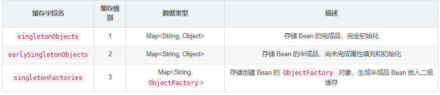
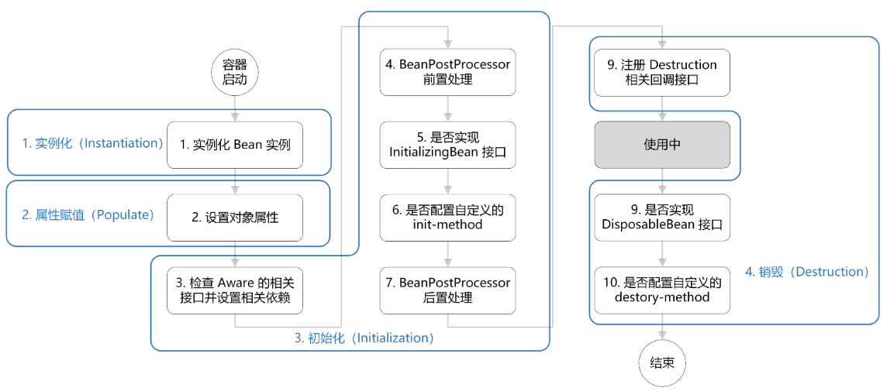

# Spring

## 自动装配

- SpringBoot自动装配是通过@SpringBootApplication注解实现的，@SpringBootApplication是一个组合注解，里面有@EnableAutoConfiguration，@EnableAutoConfiguration通过@Import注解，导入AutoConfigurationImportSelector类，这个类通过其中的SpringFactoriesLoader方法，扫描META-INF/spring.factories中符合条件的候选配置类，加载到IOC容器当中

- 符合条件的候选配置类：配置类上有@Configuration，内部对象中包含了@Bean注解，此外需要进行ConditionOnXXX条件过滤（如@ConditionOnClass，判断该类的路径是否存在；@ConditionOnMissingBean，判断容器中是否没有特定的Bean）

## 循环依赖

- Spring构建三级缓存
  

  - 第一级缓存存的是完全初始化好的Bean
    - SingleTonObject

  - 第二级缓存存的是已经创建好但没有初始化的Bean（代理对象/普通对象，取决于对象是否被AOP）
    - EarlySingleTonObject

  - 第三级缓存存的是创建bean的工厂对象（lambda表达式）
    - SingleTonFactories

- creating set：用来标志谁正在创建的过程中

- 场景：A中需要注入B，B中需要注入A

- Spring通过反射获取构造器，去实例化A对象，把A的名字放到creating set里面，将对象A的lambda表达式放到第三级缓存（关键），然后需要依赖注入B，但是此时一级缓存（单例池）当中还没有B的bean，所以进入B的创建流程

- Spring通过反射获取构造器，去实例化B对象，把B的名字放到creating set当中，将对象B的lambda表达式放到第三级缓存，然后需要依赖注入A，这就出现了循环依赖

  - 此时B去一级缓存找A，找不到就去二级缓存找A，找不到就只能去第三级缓存中去获取A对象的lambda表达式，执行该表达式，获取A的代理对象（lambda表达式中定义了提前AOP的逻辑），然后将A代理对象注入到B里面，注入成功。

  - 然后将这个代理对象A放到第二级缓存中，删除掉B的三级缓存，然后对B进行bean的初始化操作，B经过AOP过后生成了B的代理对象，并且初始化完成，因此B的代理对象已经是一个完整的bean，放到一级缓存当中。B的创建周期结束，B从creating set中移出

- 继续执行A依赖注入的流程。A现在可以在一级缓存中发现B，因此依赖注入完成，然后对A进行bean的初始化操作，经过AOP后生成B的代理对象，并且初始化完成，此时A是完整的bean，放到一级缓存中，A的创建周期结束，A从creating set中移出

### 为什么不是二级缓存

- 避免重复，如果只有1，3两级缓存，那么当A雪要BC而BC都需要A的时候，BC就会同时调用A的创建工厂，生成两份A，导致重复创建

- spring希望代理和bean的生命周期要分开，如果一开始就直接调用创建工厂创建bean的话，那么所有拥有aop的bean就会直接进行动态代理，但是spring希望在bean完成初始化之后再生成最终代理。如果不分开的话，也就是说不需要3级缓存，1级存放bean，2级存放实例化后的bean，所有的bean直接调用创建工厂创建并且放在二级缓存，那么也是没问题的。

## bean生命周期

  

- 一个 Bean 从 “出生” 到 “退休”，总共分为四个步骤。

- 第一步是实例化，Spring 会通过反射获取Bean的创建方法创建 Bean 对象。如果 Bean 的构造器里面有依赖，那在这个阶段，这些依赖也会顺带注入进来。

- 第二步是属性注入，也就是我们熟悉的依赖注入，像 @Autowired 注解注入、setter 方法注入，都是在这个阶段完成
的。到这一步，之前的 “毛坯房” 就开始真正装修起来了。

- 第三步是初始化，这一步可是面试拉开差距的关键，因为它是一个 “三明治” 结构。

  - 最先执行的是一堆 Aware 接口的方法，比如 BeanNameAware、BeanFactoryAware 等，通过这些接口，Bean 能知道自己的名字、所在的 Bean 工厂等信息；

  - 接着，Spring 会给 Bean 第一次 “动手术” 的机会，也就是执行 BeanPostProcessor 的 before 方法（postProcessBeforeInitialization）；

  - 然后才轮到 Bean 自己的初始化逻辑，比如 @PostConstruct 注解标注的方法、实现 InitializingBean ，还有在配置中指定的 init-method 方法；

  - 最后，Spring 会给 Bean 第二次 “动手术” 的机会，执行 BeanPostProcessor 的 after 方法（postProcessAfterInitialization），很多 AOP 动态代理的逻辑就是在这个时候完成的，所以你最后拿到的 Bean，可能已经是经过动态代理处理、相当于 “换过心脏” 的代理对象了。

- 第四步是销毁，当 Spring 容器关闭时，Spring 会调用相关的销毁逻辑帮 Bean 释放资源、优雅收尾，比如 @PreDestroy 注解标注的方法、实现 DisposableBean 接口重写的 destroy 方法，以及在配置中指定的 destroy-method 方法。
