# 基础

## ArrayList 的底层实现原理

- ArrayList的底层是用动态的数组实现的，初始容量为0，第一次添加数据是会初始化容量为10，后续每次扩容的时候，容量都变为原来的1.5倍，并且每次扩容都需要拷贝数组

## ArrayList list = new ArrayList(10) 中的list扩容几次

- 此处只是声明了list的容量，未扩容

## 如何实现数组和List之间的交换

- 数组转List，使用JDK中的Arrays工具类的asList方法

  - 数组转List后，如果修改数组的内容，list会受影响，因为Arrays.asList底层是通过ArrayList来构造这个集合，并且传入的是数组的地址，所以最终指向的地址是相同的。

- List转数组，使用list.toArray方法，无参返回的是Object数组，指定长度和对象返回的是对象数组

  - List转数组后，如果修改List内容，数组不会受影响，因为toArray方法底层是对list数据的拷贝，与原数据无关

## ArrayList 和 LinkedList 的区别是什么

- ArrayList底层是动态的数组，内存连续，节省内存LinkedList底层是双向链表，需要维护一个数据和两个节点，更占用内存，并且二者都是线程不安全

- 增删改查效率不同

## CopyOnWriteArrayList 实现原理

- 原理是CopyOnWrite，即写时复制的COW机制，当往以恶搞容器里添加元素时，先copy新的容器，修改元素都在副本容器上进行，修改完之后，再用新容器替换掉原来的容器

- CopyOnWriteArrayList在读数据时不上锁，在增、删、改时上锁

- 适用于读多写少的并发场景，读写分离

## HashMap 的实现原理

- HashMap使用的hash表数据结构，就是数据+链表或者红黑树

## HashMap 的put方法的具体流程

- 首先判断数组是否为空/null，为空的话需要通过resize扩容或初始化，通过key计算hash值得到数组索引，如果索引为空，新建一个节点添加，如果不为空，先判断首个节点的key是否一样，一样则覆盖value，不一样则需要遍历红黑树或者链表，找到相同的key则覆盖，没有相同的key就需要在树中/链表的尾部插入新的节点，插入后判断链表长度是否大于8，是否需要转成红黑树。操作完成后，判断实际存在的键值对数量是否超过最大容量（size * threshold负载因子），超过则需要扩容

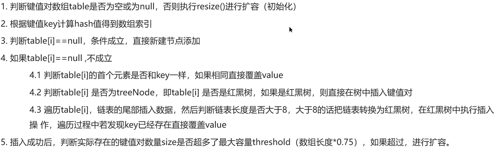  

## HashMap 的扩容机制

- 第一次添加数组时初始化长度为16，以后每次扩容发生在达到扩容阈值时，扩到之前的两倍。扩容创建了一个新的数组，需要把老数组移动到新数组中。

- 对于没有hash冲突的节点，通过e.hash & (newCap - 1) （等价于e.hash%newCap，哈希值对新的数组容量取模）计算该节点在新数组的索引位置，用位运算是因为更快

- 对于红黑树，走红黑树的添加逻辑

- 对于链表，则需要遍历链表进行拆分，jdk1.7中会通过e.hash & (newCap - 1)进行rehash找到新的索引位置，jdk1.8中先判断hash&oldCap是否为0，若为0则判定为是高位元素，索引不变，不为0则判定为低位元素，需要将原索引加上扩容的量作为新的索引（原始位置+增加的数组大小）

## HashMap 的jdk1.7和jdk1.8的区别

- hash函数的计算，jdk1.8将哈希值的高16位和低16位异或

- 对于hashmap底层的数据结构jdk1.7，hashmap采用的是拉链法，通过数据+链表的形式来存储，1.8之后采用数组 + 链表 + 红黑树的形式，如果链表长度大于8并且数组长度大于64，则会从链表转化为红黑树，红黑树元素小于6的时候会变成链表

- 对于hashmap扩容后链表的拆分，jdk1.7中会通过e.hash & (newCap - 1)进行rehash找到新的索引位置，jdk1.8中先判断hash&oldCap是否为0，若为0则判定为是高位元素，索引不变，不为0则判定为低位元素，需要将原索引加上扩容的量作为新的索引（原始位置+增加的数组大小）

- jdk1.7会出现多线程死循环的问题，因为jdk1.7中扩容时链表的移动是通过头插法，若1、2两线程同时对hashMap进行扩容，链表的原始顺序是A->B，线程2执行到一半时间片耗尽休眠，此时线程1通过头插法扩容后链表的顺序为B->A，但线程2中头结点head指向的是A，head.next指向的是B，就会导致死循环。这个问题在jdk1.8得到解决，从头插法更新为尾插法，避免了环形结构

- 但是jdk1.8依然存在线程不安全的问题，会发生数据覆盖的情况，若1，2两线程同时对hashMap进行put操作，并且两个数据哈希冲突，线程1判断hash值索引位置为null后被挂起，线程2插入数据，线程1恢复后就会直接覆盖掉线程2的数据

## HashMap 链表与红黑树转化

- 链表长度大于8并且数组长度大于64的时候才会转为红黑树，当数组长度比较小时需要尽量避开红黑树，因为红黑树需要进行各种操作来保持平衡，当数组长度小于64时，使用数组+链表比红黑树的查询要快，效率更高

- 红黑树本身会占内存，链表长度不长的时候，转成红黑树的优势也不大，理想情况下链表长度符合泊松分布，长度为8的概率是非常小的，超过8转化为红黑树的设计是保证极端情况下的查询效率，防止用户自定义哈希算法导致链表过长

- 红黑树在元素少的时候，效率并不比链表要好，但是又不能使结构频繁的链表化/树化，因为设定一个区间6-8

## HashMap 为什么用 String 作为 key

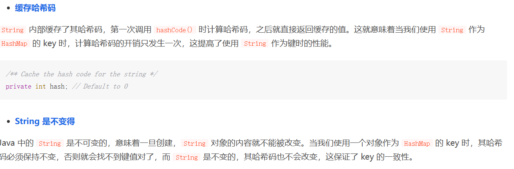  

## HashMap 寻址算法

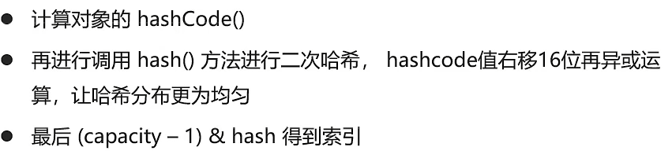  

## 为什么 HashMap 的数组长度一定是 2 的 n 次幂

- 计算时索引效率更高，2的n次幂就可以直接使用位运算来代替取模，并且扩容时链表拆分的效率更高，hash & oldCap同样是代替了位运算

## HashMap 中的 hash 方法为什么要右移16位异或

- 绝大部分情况下，数组长度n的值都小于2^16，小于16位，所以计算索引位置时的(hash&(n-1))始终都是hash值的低16位在参加运算，这就会导致计算出来的索引都比较集中，key的三裂度较低。所以可以将key的hash值右移16位，再用原hash值与位移后的hash值进行异或运算，就把高位和低位的特征进行了组合，降低了hash冲突的概率，提升了性能。

## HashMap 元素是否可以为 null

- HashMap对象的key、value值均可为null
- HashTable、ConcurrentHashMap是线程安全的，对象的key、value值均不可为null

(多线程安全的数据结构都不支持值为null)
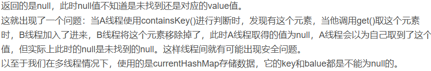  

## HashMap 和 HashTable 的区别

| |HashMap | HashTable（基本被淘汰） |
|--|--|--|
|线程安全|不安全|安全（经过 synchronize 修饰）|
|效率|高|低|
|对 null key 和 null value 的支持|支持（可以有1个 null 键多个 null 值）|不支持|
|初始容量（不指定容量）|16|11|
|初始容量（指定容量）|扩充为2的幂次|给定容量|
|每次扩容|变为原来2倍|变为原来2*n+1|
|底层数据结构|存在链表和红黑树转换机制|无类似机制|
|哈希函数实现|通过扰动处理减少冲突|直接用 hashCode() 值|

## HashSet 特点、数据结构、构造方法、add方法

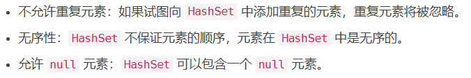  

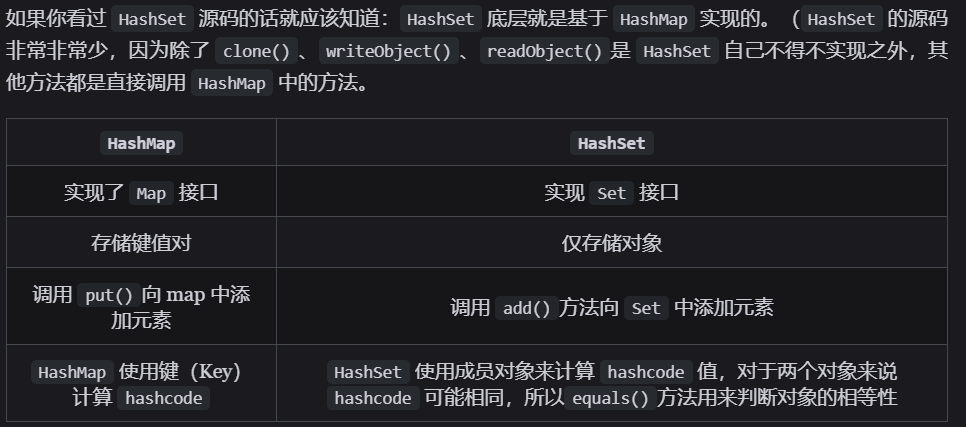  

## HashSet 和 HashMap 是如何去重的

- `HashSet` 和 `HashMap` 都是通过 `equals()` 方法和 `hashcode()` 方法来去重的

  

## 为什么要有 ConcurrentHashMap

- `HashMap` 不支持多线程并发，而 `ConcurrentHashMap` 支持

## ConcurrentHashMap 的结构

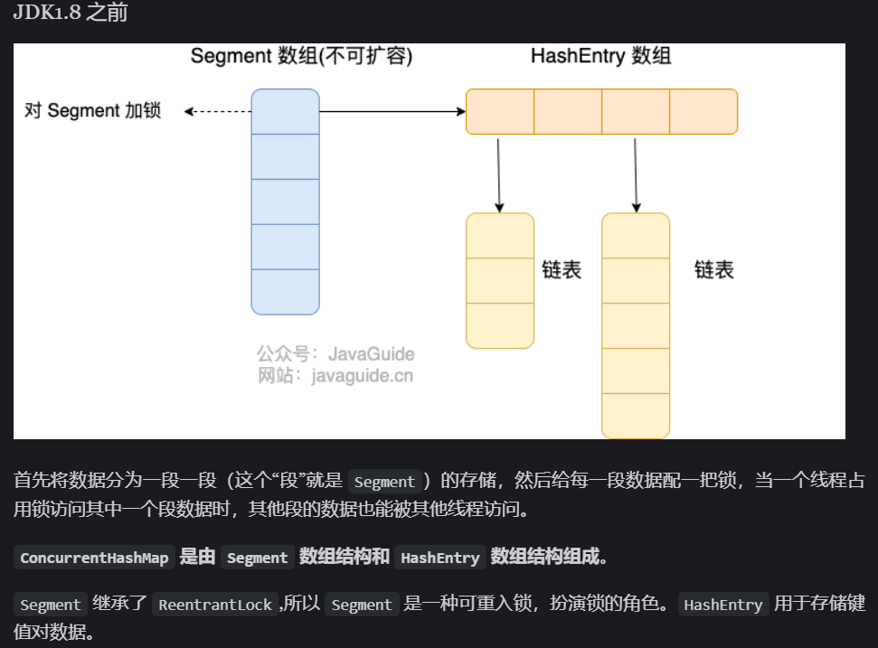  

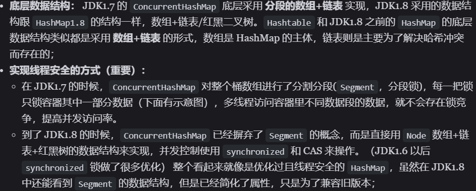  

## ConcurrentHashMap 并发度

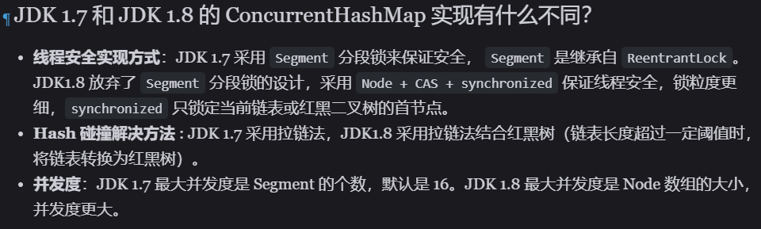  

## 为什么 ConcurrentHashMap 中的 key 不能为 null

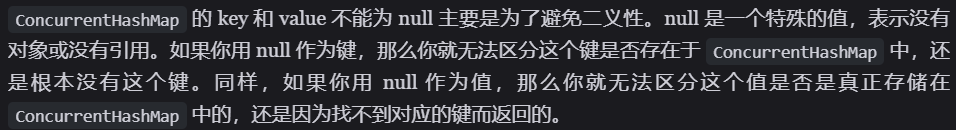  

  

## 为什么 ConcurrentHashMap1.8 用 lock 锁而不是 sync 锁？

## 各种集合的时间复杂度

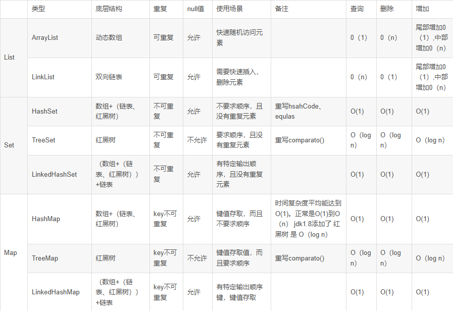  
