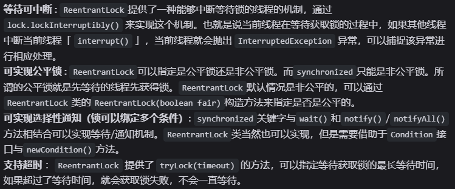

# 锁

## 乐观锁和悲观锁

- 乐观锁认为共享资源的每次访问都不会出问题，线程可以不停执行，无需加锁，只需在提交修改时验证对应资源是否被其他线程修改。具体通过版本号机制和CAS来实现（原子变量类）

  - 通过版本号机制来实现，用版本标识来确定读到的数据是否与提交修改时读到的数据版本一致，提交后修改版本标识，不一致时可以再次尝试或丢弃修改

  - CAS，compareAndSwap，多个线程更新同一个变量的值时，仅有一个线程可以更新成功，其他线程更新失败后可以重试 

- 悲观锁认为共享资源每次访问都会出问题，因此每次访问资源都会上锁，其他线程访问该资源就会被阻塞，直到锁被释放，让下一个线程占有（如synchronized、reentrantLock）

- 悲观锁用于写多读少（竞争多）的情况，乐观锁用于读多写少（竞争少）的情况，频繁加锁本身会影响性能

## 公平锁与非公平锁

- 公平锁是锁被释放后，先申请的线程会先得到锁，性能差一些但是能保证时间上的绝对顺序

- 非公平锁是锁被释放后，后申请的线程可能先获取锁，锁是随机分配或按照其他优先级排序的，性能更高但可能导致有线程永远无法获取锁

## synchronized 主要解决的问题

  

## synchronized（重量级锁状态时） 底层原理

- synchronized通过互斥的方式，让同一时刻最多只有一个线程持有锁，底层由monitor实现，monitor是jvm级别的对象，由c++实现，线程获得锁需要对象关联monitor，monitor内部有三个属性：owner、entryList和waitList，owner是关联的获得锁的线程，entryList关联的是处于阻塞态的线程，waitList关联的是处于等待态的线程

- synchronized锁代码块（类）的实现使用的是monitorenter和monitorexit指令，一个指向语句块开始的位置，一个指向结束的位置。

- synchronized修饰方法用的是ACC_SYNCHRONIZED标识，指明该方法是一个同步方法

## synchronized 底层如何实现加锁、解锁、可重入锁

- 当执行monitorenter指令时，线程试图获取锁也就是获取对象监视器monitor的持有权。如果锁的计数器为0则表示锁可以被获取，获取后将锁计数器设为1也就是加1。如果获取对象锁失败，那当前线程就要阻塞等待，直到锁被另外一个线程释放为止。

- 对象锁的的拥有者线程才可以执行monitorexit指令来释放锁。在执行monitorexit指令后，将锁计数器设为0，表明锁被释放，其他线程可以尝试获取锁。

- 每一个锁关联一个线程持有者和一个计数器，计数器位0表示该锁未被持有，某一线程请求成功后JVM会记下锁的持有线程并且将计数器置为1，此时其他线程要拿锁就得等待，若线程持有者需要再次请求这个锁，就可以再次拿锁，计数器递增，线程退出同步代码块时计数器递减，减到0释放锁

## monitor 对象保存在锁对象的什么地方，二者是如何关联的

- `monitor` 对象锁就是重量级锁，保存在锁对象的对象头中的 `Mark Word` 字段中，该字段的锁标志位为 `10` ,其中指针指向的是 `monitor` 对象的起始地址

## synchronized锁升级

- synchronized在jdk1.6做了锁升级，减少阻塞，就可以减少底层操作系统从用户态切换到内核态，提高性能。大部分时间一个资源去抢锁的线程不多，为了提高低并发时的性能，就做了锁升级

- 锁升级的过程就是应对并发量越来越高，竞争越来越激烈的过程。最开始系统是无锁状态，当有第一个线程来访问资源时，JVM将对象头的mark word锁标志位设置为偏向锁，将线程id记录到mark word里面

- 第二个线程来抢锁时升级为轻量级锁，拿不到锁就不断通过CAS+自旋的方式重新拿到锁，而阻塞线程需要操作系统从用户态切换到内核态，开销比较大，所以在线程持有资源时间短、线程竞争少的情况下，不阻塞线程，让线程自旋等待锁释放（减少了线程上下文切换的开销）

- 短时间的自旋性能还不错，但长时间自旋让cpu空转，浪费cpu。所以当第二个线程自旋了一段时间依然获取不到锁，或者有更多的线程来抢锁了，长时间的自旋或者大量线程的自旋都会很浪费cpu，为了避免这一情况就会升级为重量级锁。重量级锁加锁就需要调用操作系统底层的mutex，所以每次切换、阻塞线程都需要操作系统切换为内核态，开销很大。

## monitor

- 升级为重量级锁的时候，对象头mark word的指针就指向锁监视器monitor

- 锁监视器负责记录锁的拥有者、锁的重入次数，负责线程的阻塞和唤醒，锁监视器本身是一个对象，升成重量级锁就会发挥作用。

- monitor有owner、waitSet、entryList、recursions几个字段，其中owner表示持有锁的线程，recursions表示锁的重入次数，synchronized在实现可重入锁、加锁、解锁时都是通过这个字段来实现的；重量级锁状态，线程拿到锁之后，owner记录了拿到锁的线程，没有拿到锁的线程被阻塞，进入blocking状态放入锁池entryList；如果拿到锁的线程调用wait方法，该线程就会释放锁进入waiting状态，进入等待池waitSet中，当某个线程调用notify唤醒这个waiting的线程，这个线程就从waiting变为blocking状态，进入锁池当中，等待锁释放重新去抢锁

## CAS 与 synchronized 的区别

- `CAS` 是基于乐观锁的思想，`synchronized` 是基于悲观锁的思想

## CAS 底层是如何实现的

- CAS，compare and swap，两步操作，得保证它的原子性。CAS实现是通过unsafe类里CompareAndSwapInt等方法实现的，这是本地方法，c++写的，这些个方法依赖的是cpu的原子指令，在x86架构下有一个指令compare and exchange（CMPXCHG），由硬件支持确保原子性，硬件执行时锁定总线，避免其他的cpu来访问总线资源，或者锁定缓存行。

- 因此从硬件角度来看，CAS的实现其实也是加了锁的，悲观锁，但是硬件操作性能很高，不阻塞线程；从软件层面来看它没有操作系统层面的mutex原语，因此就是无锁的

## CAS 的缺点

- ABA问题：一个变量一开始时A值，线程1和线程2同时观测，线程2将数据改变为B再改回A（如用户先买单再退单），线程1看到的依然是A，认为数据没有发生改变。需要通过给数据加时间戳或版本号的方式来解决

- CAS用自旋来尝试，不成功就会一直循环执行直到成功，一直自旋给cpu带来的开销很大。通过升级重量级锁的方式来解决

## AQS

## ReentrantLock 和 Synchronized 的区别

  

- 二者都是可重入锁
- `synchronized` 依赖于 JVM 而 `ReentrantLock` 依赖于 API
- `ReentrantLock` 增加了高级功能

  
