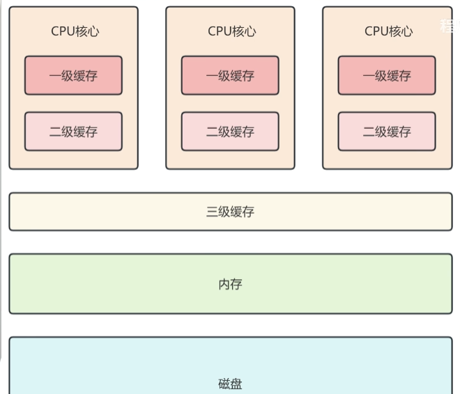
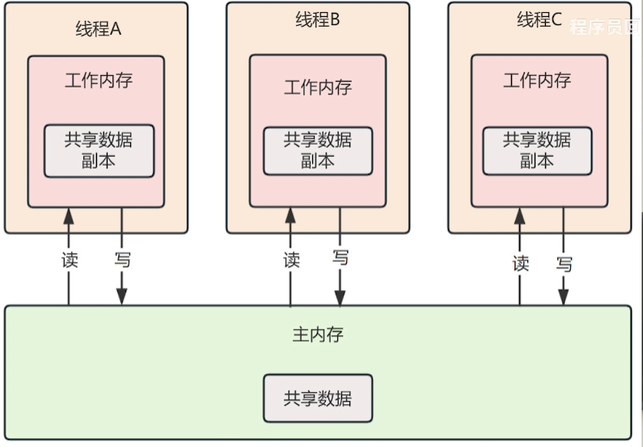

# 锁

## 乐观锁和悲观锁

- 乐观锁认为共享资源的每次访问都不会出问题，线程可以不停执行，无需加锁，只需在提交修改时验证对应资源是否被其他线程修改。具体通过版本号机制和CAS来实现（原子变量类）

  - 通过版本号机制来实现，用版本标识来确定读到的数据是否与提交修改时读到的数据版本一致，提交后修改版本标识，不一致时可以再次尝试或丢弃修改

  - CAS，compareAndSwap，多个线程更新同一个变量的值时，仅有一个线程可以更新成功，其他线程更新失败后可以重试 

- 悲观锁认为共享资源每次访问都会出问题，因此每次访问资源都会上锁，其他线程访问该资源就会被阻塞，直到锁被释放，让下一个线程占有（如synchronized、reentrantLock）

- 悲观锁用于写多读少（竞争多）的情况，乐观锁用于读多写少（竞争少）的情况，频繁加锁本身会影响性能

## 公平锁与非公平锁

- 公平锁是锁被释放后，先申请的线程会先得到锁，性能差一些但是能保证时间上的绝对顺序

- 非公平锁是锁被释放后，后申请的线程可能先获取锁，锁是随机分配或按照其他优先级排序的，性能更高但可能导致有线程永远无法获取锁

## synchronized（重量级锁状态时） 底层原理

- synchronized通过互斥的方式，让同一时刻最多只有一个线程持有锁，底层由monitor实现，monitor是jvm级别的对象，由c++实现，线程获得锁需要对象关联monitor，monitor内部有三个属性：owner、entryList和waitList，owner是关联的获得锁的线程，entryList关联的是处于阻塞态的线程，waitList关联的是处于等待态的线程

- synchronized锁代码块（类）的实现使用的是monitorenter和monitorexit指令，一个指向语句块开始的位置，一个指向结束的位置。

- synchronized修饰方法用的是ACC_SYNCHRONIZED标识，指明该方法是一个同步方法

## synchronized 底层如何实现加锁、解锁、可重入锁

- 当执行monitorenter指令时，线程试图获取锁也就是获取对象监视器monitor的持有权。如果锁的计数器为0则表示锁可以被获取，获取后将锁计数器设为1也就是加1。如果获取对象锁失败，那当前线程就要阻塞等待，直到锁被另外一个线程释放为止。

- 对象锁的的拥有者线程才可以执行monitorexit指令来释放锁。在执行monitorexit指令后，将锁计数器设为0，表明锁被释放，其他线程可以尝试获取锁。

- 每一个锁关联一个线程持有者和一个计数器，计数器位0表示该锁未被持有，某一线程请求成功后JVM会记下锁的持有线程并且将计数器置为1，此时其他线程要拿锁就得等待，若线程持有者需要再次请求这个锁，就可以再次拿锁，计数器递增，线程退出同步代码块时计数器递减，减到0释放锁

## monitor 对象保存在锁对象的什么地方，二者是如何关联的

- `monitor` 对象锁就是重量级锁，保存在锁对象的对象头中的 `Mark Word` 字段中，该字段的锁标志位为 `10` ,其中指针指向的是 `monitor` 对象的起始地址

## synchronized锁升级

- synchronized在jdk1.6做了锁升级，减少阻塞，就可以减少底层操作系统从用户态切换到内核态，提高性能。大部分时间一个资源去抢锁的线程不多，为了提高低并发时的性能，就做了锁升级

- 锁升级的过程就是应对并发量越来越高，竞争越来越激烈的过程。最开始系统是无锁状态，当有第一个线程来访问资源时，JVM将对象头的mark word锁标志位设置为偏向锁，将线程id记录到mark word里面

- 第二个线程来抢锁时升级为轻量级锁，拿不到锁就不断通过CAS+自旋的方式重新拿到锁，而阻塞线程需要操作系统从用户态切换到内核态，开销比较大，所以在线程持有资源时间短、线程竞争少的情况下，不阻塞线程，让线程自旋等待锁释放（减少了线程上下文切换的开销）

- 短时间的自旋性能还不错，但长时间自旋让cpu空转，浪费cpu。所以当第二个线程自旋了一段时间依然获取不到锁，或者有更多的线程来抢锁了，长时间的自旋或者大量线程的自旋都会很浪费cpu，为了避免这一情况就会升级为重量级锁。重量级锁加锁就需要调用操作系统底层的mutex，所以每次切换、阻塞线程都需要操作系统切换为内核态，开销很大。

## monitor

- 升级为重量级锁的时候，对象头mark word的指针就指向锁监视器monitor

- 锁监视器负责记录锁的拥有者、锁的重入次数，负责线程的阻塞和唤醒，锁监视器本身是一个对象，升成重量级锁就会发挥作用。

- monitor有owner、waitSet、entryList、recursions几个字段，其中owner表示持有锁的线程，recursions表示锁的重入次数，synchronized在实现可重入锁、加锁、解锁时都是通过这个字段来实现的；重量级锁状态，线程拿到锁之后，owner记录了拿到锁的线程，没有拿到锁的线程被阻塞，进入blocking状态放入锁池entryList；如果拿到锁的线程调用wait方法，该线程就会释放锁进入waiting状态，进入等待池waitSet中，当某个线程调用notify唤醒这个waiting的线程，这个线程就从waiting变为blocking状态，进入锁池当中，等待锁释放重新去抢锁

## CAS 与 synchronized 的区别

- `CAS` 是基于乐观锁的思想，`synchronized` 是基于悲观锁的思想

## CAS 底层是如何实现的

- CAS，compare and swap，两步操作，得保证它的原子性。CAS实现是通过unsafe类里CompareAndSwapInt等方法实现的，这是本地方法，c++写的，这些方法依赖的是cpu的原子指令，在x86架构下有一个指令compare and exchange（CMPXCHG），由硬件支持确保原子性，硬件执行时锁定总线，避免其他的cpu来访问总线资源，或者锁定缓存行。

- 因此从硬件角度来看，CAS的实现其实也是加了锁的，悲观锁，但是硬件操作性能很高，不阻塞线程；从软件层面来看它没有操作系统层面的mutex原语，因此就是无锁的

## CAS 的缺点

- ABA问题：一个变量一开始时A值，线程1和线程2同时观测，线程2将数据改变为B再改回A（如用户先买单再退单），线程1看到的依然是A，认为数据没有发生改变。需要通过给数据加时间戳或版本号的方式来解决

- CAS用自旋来尝试，不成功就会一直循环执行直到成功，一直自旋给cpu带来的开销很大。通过升级重量级锁的方式来解决

## AQS

- 怎么表示共享资源正在被占有或访问？这就需要一个状态变量 state，state 为 0 表示资源空闲，为 1 表示资源被占有，这也是独占锁的思想。但state不能因此设置成布尔类型，因为有些共享资源可能允许多个线程同时访问，比如最多支持 3 个线程访问，这时 state 最多该为 3，这就是 Semaphore 的设计思想；还有递归调用场景，当前线程需多次访问共享资源，访问一次 state 加 1，释放一次 state 减 1，直到 state 为 0 代表资源空闲，这就是可重入锁的设计思想。

  - 考虑到这些情况，state 不能是布尔类型，得设为 int 类型。而且多线程访问 state 要保证可见性，所以得加 volatile；多个线程修改 state 要保证原子性，就得用 CAS 来修改 state 状态。

- 当一个线程通过 CAS 修改 state 成功，就能访问共享资源；要是修改失败，总不能一直自旋吧？长时间自旋会浪费 CPU，所以得把修改失败的线程阻塞，等资源空闲了再唤醒。可修改失败的线程可能有很多，怎么高效管理这些等待的线程呢？可以把线程包装成 Node 节点，用节点组成双向链表，基于链表实现先进先出的等待队列。CAS 修改 state 失败后，把线程加入队列并阻塞；资源释放时，唤醒队列里的节点，让其重新尝试修改 state，修改成功就能访问共享资源了。

- AQS设计：比如有的业务只想尝试获取共享资源，获取不到就做其他操作，针对这种场景可以设计 tryAcquire 方法，返回 true 或 false 表示成功或失败；还有的业务必须获取到资源才能继续，否则就一直等，这时可以设计 acquire 方法，没有返回值，获取不到就阻塞，直到其他线程释放资源自己获取成功为止。

- AQS 源码定义了获取共享资源的方法但没实现，直接抛异常，为啥这么设计？因为并发工具类在不同场景下获取资源的方式可能不同，AQS 不定义具体获取方式，而是开放给上层业务重写该方法，自己只关心获取资源成功与否。再看 acquire 方法，它先调用 tryAcquire 获取资源，获取不到就把节点入队并阻塞，这其实是模板方法模式的简单使用。

- AQS 基于双向链表实现等待队列，你有没有想过为啥要这么做？除了队列插入删除操作复杂度是 O (1)、实现简单方便，还有个重要原因是为了实现公平策略。作为并发工具，起码要支持公平和非公平策略：公平策略就是线程按先来后到的顺序访问共享资源，而队列是先进先出的，AQS 的队列结构为实现公平策略提供了基础。AQS 的实现类只需重写 tryAcquire 方法，就能自定义公平或非公平策略，ReentrantLock 就是这么做的，它有 FairSync 和 NonfairSync 两个子类，都重写了 AQS 的 tryAcquire 方法：FairSync 依赖 AQS 的队列结构，实现先来先获取锁；NonfairSync 允许新线程插队抢锁，这就是 ReentrantLock 公平锁和非公平锁的实现。

- AQS 有独占和共享两种模式。共享模式允许多个线程共享资源，适用于多个线程协作的场景，比如 Semaphore 或 CountDownLatch。对 Semaphore 来说，state 代表许可证数量，比如某个资源允许 3 个线程同时访问，state 就初始化为 3，线程获取资源时 state 递减，减到 0 新线程就只能进等待队列；线程释放资源时 state 递增。CountDownLatch 同理，state 代表剩余任务数，调用 countDown 时 state 递减，state 为 0 时唤醒所有 await 的线程。
  - semaphore：同时访问某个资源的线程数量
  - countdownLatch：等待多个线程完成某个操作之后再继续执行

- 独占模式只允许单线程独占资源，适用于互斥场景，比如 ReentrantLock。独占模式通过 acquire 和 tryAcquire 获取资源，对应 ReentrantLock 的 lock 和 tryLock 方法：state 为 0 表示资源空闲，加锁时用 CAS 把 state 改为 1，代表加锁成功；加锁失败就进 AQS 等待队列。state 还能代表重入次数，重入一次加 1，释放一次减 1，减到 0 就完全释放，释放后唤醒等待队列里的线程重新抢锁。

- AQS 为啥不直接用操作系统的 mutex 限制多线程访问共享资源，而是自己定义这么多东西？首先，直接用操作系统的 mutex 会涉及内核态和系统调用，每次加锁解锁都要从用户态切换到内核态，开销很大；而 AQS 通过用户态的 CAS 和队列管理，能在一定程度上减少开销。其次，AQS 是抽象的并发操作工具，允许子类自定义公平策略、共享或互斥模式等，Java 代码能灵活拓展；但操作系统的 mutex 没办法在 Java 层面灵活拓展。

## 面试常问 ReentrantLock 和 synchronized 有啥区别，答案这不就来了？

- ReentrantLock 基于 AQS，AQS 有 tryAcquire，所以 ReentrantLock 有 tryLock 尝试加锁，加锁失败能做其他操作，而 synchronized 没有。

- 所以 ReentrantLock 基于 AQS 的等待队列实现了公平锁和非公平锁，而 synchronized 都是非公平的。

- synchronized 的锁监视器里有锁池和等待池：锁池存放获取锁失败的线程，等待池存放线程通信时主动放弃锁的线程。那用 ReentrantLock 时，没拿到锁的线程放到 AQS 的等待队列，拿到锁的线程若需要等待资源到位，调用 await 主动放弃锁后该放哪儿？这就涉及到 Condition 了，Condition 用来管理条件队列，调用 await 的线程会被放到 Condition 的条件队列中。而且还能 new 多个 Condition，配合不同 Condition 对象的 signal 方法，能实现更精细的唤醒通知，这又是 ReentrantLock 和 synchronized 的另一个区别。

## ReentrantLock 和 Synchronized 的区别（总结版）

- 从底层来说：synchronized是关键词，是依赖于JVM实现的，reentrantLock是jdk层面的接口，是一个工具类

- 从锁来说
  - 锁性质：synchronized只能公平锁，reentrantLock可以公平锁也可以非公平锁（通过FairSync和NonFairSync子类），所以它也可以在tryAcquire中重写获取锁的逻辑（非公平策略）
  - synchronized无法判断是否获取到锁，reentrantLock可以通过tryLock()判断
  - synchronized自动释放锁，reentrantLock手动释放
  - synchronized没有拿到锁就阻塞，reentrantLock没有拿到锁去排队：synchronized锁池等待池，reentrantLock等待队列和condition队列
  - synchronized有锁升级，reentrantLock没有：一个涉及用mutex一个没有

  

## CountDownLatch和CyclicBarrier的区别

- CountDownLatch允许线程阻塞在一个地方，直到所有线程任务执行完毕，但CountDownLatch是一次性的，计数器的值只能在构造方法中被初始化一次，计数器从N到0并且不可逆

- CyclicBarrier是可循环使用的屏障，让一组线程达到一个屏障点时被阻塞，直到最后一个线程达到屏障才会开门，计数器从0到N并且可逆

- 语义上：CountDownLatch是等待线程完成任务后，主线程（或其他线程）再继续执行，而CyclicBarrier是多个线程到达一个点后共同推进

## ThreadLocal

### ThreadLocal存储方式

- 每个线程内部都有一个 ThreadLocalMap，它本质是个 HashMap，底层用 Entry 数组存数据。Entry 的 key 是 ThreadLocal 的弱引用，value 就是要保存的资源。调用 set 方法时，会以当前 ThreadLocal 对象为 key、要保存的资源为 value，把键值对放到这个 ThreadLocalMap 里；调用 get 方法时，就以当前 ThreadLocal 对象为 key，从 ThreadLocalMap 中取值。开发中我们一般把 ThreadLocal 声明为 static 变量，这时 ThreadLocal 对象是所有线程共享的，但ThreadLocalMap 是每个线程私有的，每个线程都有各自的 ThreadLocalMap，即便 key 相同，从不同 ThreadLocalMap 里取出来的 value 也肯定不一样。

### key的弱引用

- 为什么 key 要设计成弱引用呢？这是为了避免 key 的内存泄漏。平时我们很少提内存泄漏，可一说到 ThreadLocal 就会说它容易出现，这是为啥？正常 new 一个对象，大多是局部变量，方法执行完 GC 就会回收；但如果有个全局的 Map 或 List，一直往里面存东西还不清理，就会出现内存泄漏，不过一般第三方库会处理好这种情况，不用开发人员操心。

- 可 ThreadLocal 的内存泄漏不一样，得开发人员自己留意。如果正常 new Thread，用完后正常销毁，Thread 类中的 ThreadLocalMap 属性也会被 GC 回收，不会有内存泄漏；但项目中没人直接 new Thread，都是用线程池，Spring Boot 处理请求也是从线程池拿线程，线程池里的线程不会销毁，会一直复用，这就会形成一条引用链：Thread→ThreadLocalMap→Entry→key→ThreadLocal。即便我们不想用 ThreadLocal 了，把它设为 null，这条引用链还在，Entry 对 key 的引用也还在，没用的 ThreadLocal 对象没法被 GC 回收，所以要把 key 设为弱引用，GC 时就能直接回收（唯一的一条引用链在threadLocal处是弱引用），从而避免内存泄漏。

- 可要是 key 是弱引用，GC 之后 key 就一定能被回收、一定会变成 null 吗？不一定。弱引用被 GC 回收的前提是，对象只有弱引用关联，没有其他引用。如果 ThreadLocal 对象没被设为 null，就还有强引用指向它，这时候 GC 没法回收，只有把 ThreadLocal 对象设为 null，强引用断开，只剩 Entry 的 key 对它的弱引用，GC 才能自动回收。

- 那 ThreadLocalMap 会不会出现大量 key 为 null 的数据？你能想到的，JDK 开发人员早就想到了。当我们调用 ThreadLocal 的 get、set 或 remove 方法时，会遍历 Entry 数组，清理掉 key 为 null 的无效 Entry，再通过线性探测法重新处理哈希冲突。

  - 线性探测法：当一个数据要放入数组，发现对应位置已有数据（发生哈希冲突），就往数组下一个位置放，下一位有数据就再往下，直到找到空位置。

### value的强引用

- 说完 key 是弱引用，再说说为啥 value 不是弱引用。我们把数据存到 value 里，是为了后面使用，如果 value 是弱引用，代码里暂时没用到 value、没有强引用指向它时，GC 就可能错误地把 value 回收了，可后续可能还要获取使用 value，所以 value 不能被 GC 随意回收，必须是强引用。
可 value 是强引用也有问题：后续业务代码不用 value、不引用 value 了，还是会存在 Thread→ThreadLocalMap→Entry→value 的引用链，value 没法被回收，导致 value 的内存泄漏。那怎么办？所以使用完 ThreadLocal 后，必须调用 remove 方法，手动断开 value 的强引用，让 GC 能回收它。

### 解决死锁

- 虽然 ThreadLocal 和锁都是为了解决并发安全问题，但思路不一样。锁的思想是共享资源只有一份，强制多个线程互斥访问；ThreadLocal 的思想是把资源复制多份，每个线程一个副本，各自操作自己的，互不冲突。其实 ThreadLocal 的思想也是处理死锁的一种思路。学过操作系统就知道，死锁有四个必要条件：互斥、不可剥夺、请求保持、循环等待。互斥条件是说共享资源必须互斥访问，不能同时被访问，而 ThreadLocal 让每个线程操作自己的数据副本，一人一个、各管各的，刚好破坏了互斥条件。
- 请求保持条件也很有意思，它是说多个线程各自占有一份资源，还在请求其他线程的资源，又不愿意放弃自己的资源，从而互相等待形成死锁。比如线程一和线程二都需要获取锁 A 和锁 B 才能继续执行，线程一持有锁 A 还尝试获取锁 B，线程二持有锁 B 还尝试获取锁 A，双方互相等待就可能产生死锁。

## jmm

- 在多核CPU架构中，每个CPU都有自己的寄存器和多级缓存。

- 此时获取数据就有两种方式，第一种方式是直接去操作主内存，但是效率比较低，因为主存和CPU的速度差很多倍。第二种方式就是从缓存中读取，此时性能就非常高，所以CPU肯定是使用第二种方式读取。
-   

- 这时候就有问题了，假如有一个共享变量，此时共享变量放在主内存里面的，比如有多线程同时去操作它，而且这两个线程分别在不同的CPU上运行，那么更新缓存的话也都是往自己这一块CPU上的缓存更新(其实CPU和缓存都是焊在一块的)，所以这两个线程对共享遍历变量的操作是不可见的，所以就会线程安全问题。
而JMM的出现就是为了解决不同的CPU之间操作共享变量不可见的问题。

- JMM就是Java Memory Mode也就是Java内存模型。JMM是一种规范，并不是具体实现(注意)。

  

- JMM定义了JVM虚拟机和计算机内存(RAM)的工作（交互）方式。把内存分成主内存以及工作内存，主内存就是计算机内存(RAM)，工作内存就是缓存。并且规定操作一个变量的时候不能直接在主内存里面去改，因为直接在主内存里面去改性能比较低，所以操作共享变量的时候首先得把共享变量复制一份放到工作内存里面，因为在工作内存里面进行操作的话性能是比较高的。操作完了之后还要保证必须把操作这个共享变量刷新到主内存里面让其他的CPU能够看到共享变量的修改。其实就是规范了一个线程如何以及何时可以看到其他线程修改过的共享变量的值，以及在必要时如何同步访问共享变量。

### JMM解决了什么问题？

- 可见性。更改共享变量其他的线程也要看见，使用的就是volatile
- 有序性。插入内存屏障保证指令不被重排
- 原子性。可以使用synchronized解决

- JMM通过内存屏障去保证了CPU的可见性和有序性，内存屏障是一种CPU指令，LoadLoad、StoreStore、LoadStore和StoreLoad。AB表示禁止该屏障前的A操作和该屏障后的B操作重排序

### happens-before规则？

这个就是规定了对共享变量的写操作对其他线程的读操作可见，以及执行顺序的保障。
如果A线程在B线程执行之前执行，那就是A happens before B，这个时候就需要保证可见性，也就是B能读取到A最新修改的值。然后保证了顺序性，不管编译器怎么样去优化，不管处理器怎么样去重排序，都不能影响A先执行然后再执行B这个原则。
注意JMM是一种规范，而happens before是规则。讲清楚一点就是，JMM是一个规范，而happens-before是遵循这个规范之后表现出来的规则。
